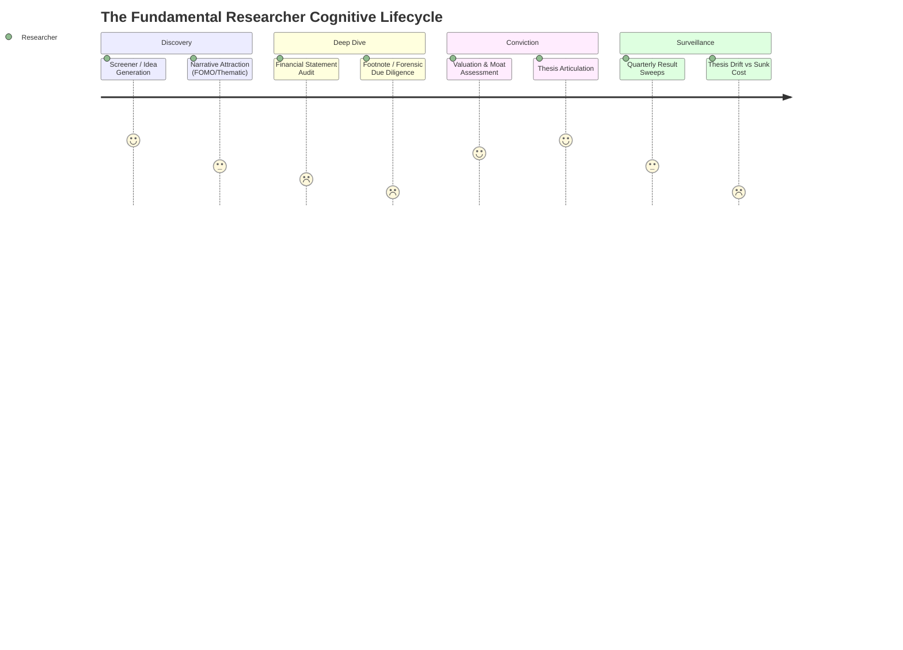
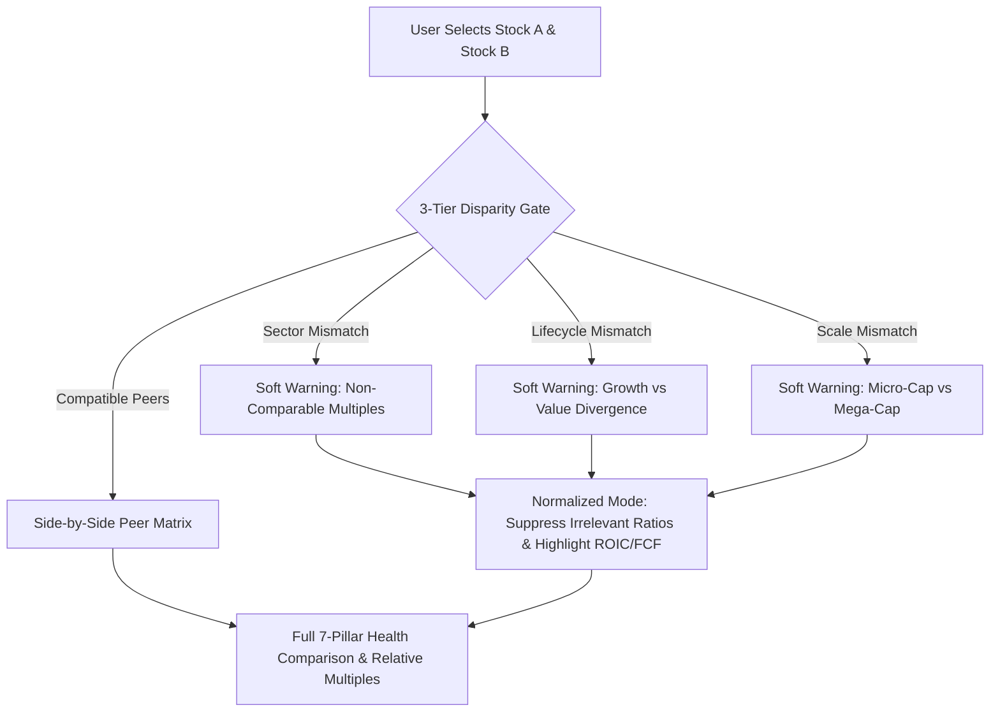

# Deep Behavioral Research: Equity Researcher Psychology, Workflows & High-Impact Platform Features

---

## Executive Summary

Fundamental equity researchers do not struggle with an **absence of data**; they struggle with **cognitive overload, narrative seduction, and post-investment bias**. 

In the Indian equity landscape (BSE/NSE), market participants range from DIY retail investors and family office analysts to buy-side portfolio managers. While quantitative data (CMP, P/E, 52W range) is commoditized, the behavioral mechanisms required to **synthesize information objectively, audit risks ruthlessly, and prevent value-trap paralysis** remain almost entirely underserved by mainstream platforms (e.g., Screener.in, Moneycontrol, Trendlyne).

This research paper outlines:
1. **Behavioral Archetypes** of stock researchers & investment managers.
2. **Cognitive Biases** that lead to capital destruction.
3. **High-Impact Behavioral Features** designed to act as cognitive prosthetics.
4. **Actionable Implementation Matrix** mapped to our platform's 7-pillar architecture.

---

## 1. Behavioral Archetypes of Fundamental Researchers & Investment Managers

### Archetype A: The "Forensic Sceptic" (Risk-First Analyst)
* **Core Motivation:** Capital preservation; avoiding corporate governance blow-ups.
* **First Action:** Does not look at price or PE; looks at **Cash Flow from Operations vs Net Profit**, related-party transactions, and promoter share pledges.
* **Pain Point:** Footnotes, contingent liabilities, and auditor qualification remarks in Indian annual reports are intentionally buried in 300+ page PDFs.

### Archetype B: The "Quality Compounder" (Moat & Capital Allocation Focused)
* **Core Motivation:** Finding businesses with durable competitive advantages (high ROCE/ROIC > 20%, low leverage, high pricing power).
* **First Action:** Examines gross margin stability across raw material cycles and reinvestment rates.
* **Pain Point:** Distinguishing between **transient cyclical margin expansion** (e.g., commodity upcycles) and **structural pricing power**.

### Archetype C: The "Relative Value & Peer Arbitrageur"
* **Core Motivation:** Identifying mispricings within an industry basket (e.g., TCS vs INFY, HDFC Bank vs ICICI Bank).
* **First Action:** Direct side-by-side multiple and operational comparison.
* **Pain Point:** **False Equivalence** — comparing companies with non-identical business models (e.g., asset-heavy NBFC vs asset-light fintech) using standard multiples.

### Archetype D: The "Post-Investment Monitor" (The Retaining Investor)
* **Core Motivation:** Knowing when to hold, trim, or cut a position.
* **First Action:** Reading quarterly earnings releases, board meeting announcements, and BSE corporate filings.
* **Pain Point:** **Thesis Drift & Sunk Cost Paralysis** — moving the goalposts when a business deteriorates because the stock price has dropped 30%.

---

## 2. Cognitive Biases in Stock Research & Their Solutions

| Cognitive Bias | Behavioral Manifestation in Market | Platform Solution / Feature Intervention |
| :--- | :--- | :--- |
| **Confirmation Bias & Narrative Seduction** | Researcher falls in love with a growth story (e.g. EV, Solar, AI) and actively ignores debt accumulation or promoter dilution. | **"The Inversion Engine" (Charlie Munger Pre-Mortem):** A mandatory counter-thesis section forcing 3 concrete scenarios where the business fails. |
| **Anchoring Bias** | Fixating on the 52-week high or purchase price (*"It fell from ₹2,000 to ₹1,200, so it must be cheap!"*). | **"Valuation De-Anchoring & Multiple Percentiles":** Displaying 5-year/10-year valuation bands rather than price levels; decoupling market price from business intrinsic worth. |
| **Cognitive Fatigue & Footnote Blindness** | Skipping 200 pages of notes to accounts, missing auditor changes, qualified opinions, or rising contingent liabilities. | **"Forensic Red-Flag Sweeper":** Automated extraction of auditor resignations, tax dispute reserves, and promoter share pledges from BSE filings. |
| **Sunk Cost Fallacy & Thesis Drift** | Holding a dying business because selling crystallizes a loss; rationalizing deterioration as "long-term investing." | **"Thesis Integrity Checkpoint":** Compares current quantitative fundamentals against baseline quarterly snapshots to identify *Value Traps*. |
| **False Equivalence (Comparison Paralysis)** | Comparing P/E or EV/EBITDA of fundamentally disparate business models (e.g. Banks vs SaaS). | **"3-Tier Disparity Gate":** Warns users before comparing non-analogous sectors, and normalizes comparison to universal cash metrics (ROIC, FCF). |
| **Information Overload & Alert Fatigue** | Constant notifications of minor press releases cause emotional panic or impulsive intraday trading. | **"Signal-to-Noise Filtering":** Distilling corporate announcements into actionable impact categories (Material, Governance, Valuation) with 1-click dossier loading. |

---

## 3. High-Impact Feature Taxonomy for Stock Research App

### Pillar I: Anti-Thesis & Forensic Integrity (Pre-Investment)

#### 1. The Charlie Munger "Inversion Engine" (Pre-Mortem Audit)
* **Psychological Need:** Investors naturally suffer from confirmation bias. They search for reasons why their thesis is right.
* **Functionality:**
  * For every analyzed stock, the AI engine dynamically models the **Top 3 Failure Modes**:
    1. *Customer / Supplier Concentration Risk* (e.g. $>30\%$ revenue from single client).
    2. *Regulatory / Policy Vulnerability* (e.g. price capping, export duties, PLI scheme expiration).
    3. *Balance Sheet Sensitivity* (e.g. impact of a 200 bps interest rate hike or a 15% raw material spike on interest coverage).
  * Forces the researcher to confront the bear case before articulating conviction.

#### 2. Forensic Quality of Earnings Scanner
* **Psychological Need:** Identifying accounting manipulation before it becomes public news.
* **Functionality:**
  * **Cash Flow vs EBITDA Variance:** Highlights when reported Net Profit grows at 20% while Operating Cash Flow is flat or negative over 3 consecutive years (working capital trap).
  * **Promoter Pledge Tracker:** Real-time BSE alerts whenever promoter pledged shares tick upward.
  * **Auditor Stability Metric:** Flags recent auditor resignations or mid-term statutory changes.

---

### Pillar II: Normalized Cross-Stock Comparison (Decision Making)

#### 3. Cross-Company Normalized Comparator with Disparity Gates
* **Psychological Need:** Researchers want to compare competitors (TCS vs INFY, Titan vs Kalyan, DMart vs Trent) without falling into ratio traps.
* **Functionality:**
  * **Dynamic Peer Benchmark:** Automated recommendation of closest BSE-listed peers by sector/market cap.
  * **Disparity Gate:** An overrideable soft banner when comparing divergent business models (e.g. Banking vs FMCG).
  * **Head-to-Head 7-Pillar Visual Matrix:** Direct side-by-side color card comparing Moat, Governance, and Financial Health.

---

### Pillar III: Discipline Enforcement & Thesis Drift (Post-Investment)

#### 4. The "Thesis Integrity Tracker" & Sunk-Cost Interrupter
* **Psychological Need:** Preventing the psychological pain of cutting losses when a company's fundamentals break.
* **Functionality:**
  * Uses our existing `report_revisions` multi-quarter differential engine.
  * When a new quarterly filing arrives, the platform evaluates whether the **initial investment thesis has drifted**:
    * Did ROCE drop permanently below the cost of capital?
    * Did debt-to-equity breach historical safety levels?
    * Did the company issue a surprise non-core diversification?
  * Triggers an explicit prompt: *"Your baseline thesis for this stock was [High Moat / Low Debt]. Current metrics show [Moat Compression]. Would you buy this stock at today's price with today's data?"*

#### 5. Executive Incentive & Alignment Metric
* **Psychological Need:** Ensuring management interests are aligned with minority shareholders.
* **Functionality:**
  * Tracking Promoter Holding percentage changes over 8 quarters.
  * Executive Remuneration as a percentage of Net Profit (SEBI limit compliance audit).

---

## 4. Prioritized Feature Roadmap for Implementation

| Priority | Feature Concept | Behavioral Problem Solved | Technical Feasibility |
| :---: | :--- | :--- | :---: |
| **P1** | **Normalized Cross-Stock Comparator** | False equivalency when comparing peers; ratio misapplication | **High** (Builds directly on existing 7-pillar engine) |
| **P2** | **"Inversion / Bear Case" Pre-Mortem** | Confirmation bias & narrative seduction | **High** (Gemini structured prompt extension) |
| **P3** | **Sunk Cost & Thesis Drift Prompter** | Value trap paralysis; reluctance to sell broken businesses | **Medium** (Leverages `report_revisions` differentials) |
| **P4** | **Forensic Cash Flow Quality Card** | Footnote fatigue & aggressive revenue recognition blind spots | **Medium** (Requires 3-year Cash Flow statement historical parsing) |
| **P5** | **Promoter & Insider SAST Disparity Tracker** | Management misaligned with retail shareholders | **Low/Medium** (BSE Insider SAST feed ingestion) |

---

## Conclusion & Next Step
Building these behavioral guardrails elevates the platform from a standard "financial dashboard" into an **institutional decision-support engine** that protects investors from their own cognitive vulnerabilities.
