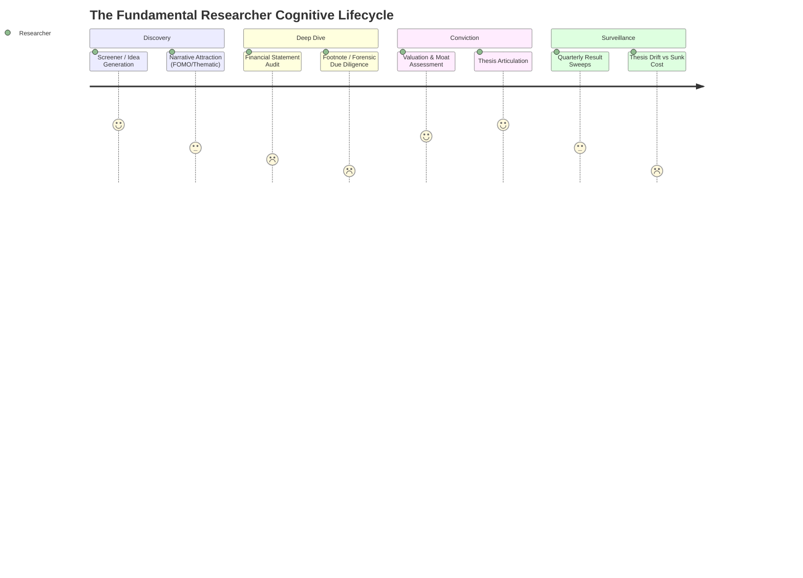
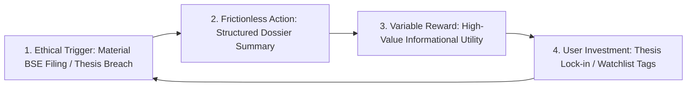

# Behavioral Architecture and Cognitive Ergonomics in Equity Research Platforms

## Executive Summary

The fundamental equity researcher operating within the Indian capital markets is currently navigating a landscape characterized by unprecedented data abundance. With the structural transition of India's capital markets into a highly digitized ecosystem—evidenced by the surge of dematerialized accounts to approximately 152 million by the fiscal year 2024—the primary impediment to consistent alpha generation is no longer the scarcity of financial data [cite: 1]. Instead, the modern market participant suffers from acute cognitive overload, narrative seduction, and pervasive post-investment biases [cite: 2]. While quantitative data points such as current market price, price-to-earnings ratios, and 52-week ranges have become entirely commoditized across retail and institutional platforms alike, the behavioral mechanisms required to synthesize this information objectively, audit underlying risks ruthlessly, and prevent value-trap paralysis remain fundamentally underserved [cite: 3].

A preliminary behavioral analysis indicates that constructing a digital ecosystem capable of retaining this specific audience requires transcending traditional financial dashboards. Platforms that simply aggregate data fail to account for the cognitive fatigue and psychological heuristics that dictate real-world capital allocation. To engineer a platform that commands daily reliance and cultivates ethical, long-term habituation, the architecture must function as a **cognitive prosthetic**. This requires a multidisciplinary integration of behavioral finance, advanced human-computer interaction (HCI) methodologies, and ethical engagement design. By deconstructing the specific biases that lead to capital destruction—such as the disposition effect, self-attribution bias, and the sunk cost fallacy—and systematically deploying interface-level interventions that counteract these psychological vulnerabilities, a platform transitions from a passive data repository to an active, indispensable decision-support engine.

The ensuing research report exhaustively examines the behavioral archetypes of fundamental equity analysts, the neuro-financial triggers dictating their decision-making processes, the theoretical models governing their information-seeking behavior, and the highly specific UI/UX design heuristics required for high-density, professional financial environments.

---

## 1. Information-Seeking Behavior and User Archetypes

To architect a platform that seamlessly integrates into the daily workflow of an equity researcher, it is necessary to first understand the theoretical underpinnings of how these professionals seek, process, and apply information. Research in information behavior, particularly Thomas D. Wilson’s foundational models, posits that human information-seeking is intrinsically triggered by a state of uncertainty [cite: 4]. This uncertainty acts as a catalyst, propelling the user to actively pursue specific data to resolve perceived risk parameters before executing a financial decision [cite: 5, 6]. Within the context of the Indian stock market, which spans from highly scrutinized large-cap equities to volatile, information-asymmetric small and mid-cap entities, this information-seeking behavior manifests in highly distinct patterns. A rigorous behavioral analysis identifies four primary user archetypes, each driven by unique psychological motivations, initial actions, and specific cognitive pain points [cite: 3].

### Archetype A: The Forensic Sceptic (Risk-First Analyst)
* **Core Motivation:** Capital preservation and the meticulous avoidance of corporate governance failures [cite: 3]. This motivation is particularly salient in emerging markets where governance standards can vary wildly, and unexpected auditor resignations or promoter pledging can decimate shareholder value overnight [cite: 7].
* **Primary Workflow Action:** Unlike retail momentum traders, the Forensic Sceptic’s information-seeking behavior prioritizes exclusionary criteria over growth projections. When evaluating a prospective equity, their initial action is not to review the current market price or standard valuation multiples. Instead, they scrutinize the cash flow statement, meticulously comparing cash flow from operations against reported net profit to detect aggressive revenue recognition [cite: 3]. Furthermore, they actively seek out related-party transactions and the status of promoter share pledges.
* **Dominant Cognitive Vulnerability:** "Footnote blindness" induced by severe information overload. In the Indian regulatory environment, critical governance red flags—such as contingent liabilities, auditor qualification remarks, and subsidiary financial discrepancies—are frequently buried within hundreds of pages of unstructured annual reports [cite: 3]. Furthermore, when a statutory auditor resigns mid-term, the Securities and Exchange Board of India (SEBI) mandates detailed disclosures within 24 hours under the Listing Obligations and Disclosure Requirements (LODR) Regulation 30 [cite: 8, 9, 10, 11]. However, parsing these continuous regulatory filings across a broad universe of stocks induces immense cognitive fatigue.
* **Necessary Platform Intervention:** Algorithmic extraction of SEBI LODR filings; autonomous visual red-flagging; elevating latent risks to the forefront of the visual hierarchy to preserve cognitive bandwidth for synthesis rather than manual extraction.

### Archetype B: The Quality Compounder (Moat & Capital Allocation Focused)
* **Core Motivation:** Identifying businesses possessing durable, long-term competitive advantages—often referred to as economic moats [cite: 3]. Their core motivation is to allocate capital to enterprises demonstrating high Returns on Capital Employed (ROCE), low operational leverage, and structural pricing power capable of withstanding inflationary pressures [cite: 3].
* **Primary Workflow Action:** Examining the stability of gross margins across various raw material cycles and analyzing the company's historical reinvestment rates.
* **Dominant Cognitive Vulnerability:** Distinguishing between transient, cyclical margin expansion (such as a temporary commodity upcycle) and genuine, structural pricing power. The Quality Compounder relies heavily on longitudinal data sets.
* **Necessary Platform Intervention:** Deep historical data visualization; economic cycle overlays; longitudinal data comparisons spanning multiple economic cycles without requiring external spreadsheet export.

### Archetype C: The Relative Value Arbitrageur
* **Core Motivation:** Identifying comparative mispricings within a specific industry basket, seeking out statistical anomalies and peer discrepancies [cite: 3].
* **Primary Workflow Action:** Executing direct, side-by-side multiple and operational comparisons (e.g., TCS vs INFY, HDFC Bank vs ICICI Bank) [cite: 3].
* **Dominant Cognitive Vulnerability:** The cognitive trap of "false equivalence" — comparing companies with fundamentally disparate business models using standard, uniform valuation multiples (e.g., evaluating an asset-heavy NBFC against an asset-light fintech using identical P/E ratios) [cite: 3].
* **Necessary Platform Intervention:** Disparity gates (warning users of sector/scale mismatches); dynamic normalization of valuation metrics to universal cash metrics (ROIC, FCF yield).

### Archetype D: The Post-Investment Monitor (The Retaining Investor)
* **Core Motivation:** Portfolio management and exit timing: knowing precisely when to hold, trim, or completely divest an existing position [cite: 3].
* **Primary Workflow Action:** Tracking quarterly earnings releases, scrutinizing board meeting announcements, and monitoring continuous corporate filings.
* **Dominant Cognitive Vulnerability:** Profound susceptibility to "thesis drift" and the "sunk cost fallacy" [cite: 3]. When a business’s underlying fundamentals deteriorate, but the stock price has simultaneously dropped, this user frequently moves the goalposts of their original investment thesis to rationalize holding the asset, attempting to avoid the psychological pain of realizing a financial loss [cite: 3].
* **Necessary Platform Intervention:** Serving as a ruthless, objective anchor through Thesis Integrity Checkpoints; automated thesis deviation alerts; confronting users with their original, pre-investment rationale to prevent emotional rationalization.

### Archetype Summary Matrix

| Archetype Profile | Core Motivation | Primary Workflow Action | Dominant Cognitive Vulnerability | Necessary Platform Intervention |
| :---- | :---- | :---- | :---- | :---- |
| **Forensic Sceptic** | Capital preservation; governance risk avoidance. | Auditing cash flows, auditor remarks, and footnotes. | Footnote blindness; cognitive fatigue from unstructured text. | Algorithmic extraction of SEBI LODR filings; visual red-flagging. |
| **Quality Compounder** | Identifying durable economic moats and high ROCE. | Longitudinal analysis of margin stability and reinvestment. | Conflating transient cyclical growth with structural quality. | Deep historical data visualization; economic cycle overlays. |
| **Relative Value Arbitrageur** | Exploiting peer mispricings and sector anomalies. | Side-by-side multiple and operational metric comparisons. | False equivalence; comparing disparate business models. | Disparity gates; dynamic normalization of valuation metrics. |
| **Post-Investment Monitor** | Portfolio optimization; exit timing. | Monitoring quarterly results and corporate announcements. | Sunk cost fallacy; thesis drift; loss aversion. | Thesis integrity checkpoints; automated thesis deviation alerts. |

---

## 2. Deconstructing Cognitive Biases in Fundamental Analysis

The traditional frameworks of classical finance—such as the Efficient Market Hypothesis (EMH) and Expected Utility Theory—rely heavily on the assumption that market participants act as completely rational agents who consistently optimize for wealth maximization based on all available public information [cite: 14]. However, decades of empirical research within the discipline of behavioral finance explicitly refute this premise [cite: 14]. Human irrationality is biologically, psychologically, and sociologically embedded in the cognitive architecture of both retail investors and highly trained institutional fund managers [cite: 17, 18]. A platform that simply assumes user rationality is destined to fail. To create a highly dependable digital ecosystem, the architecture must identify and actively counteract the specific cognitive biases that systemically distort equity research.

### The Disposition Effect and Loss Aversion
* **Origin & Mechanism:** First documented empirically by Hersh Shefrin and Meir Statman in 1985, the disposition effect dictates that investors exhibit a pronounced tendency to sell winning positions prematurely to lock in a gain, while stubbornly holding onto losing positions for excessive periods [cite: 12, 20]. This behavior is fundamentally rooted in Kahneman and Tversky's prospect theory and loss aversion—the psychological phenomenon wherein the emotional pain experienced from realizing a financial loss is significantly more intense (approximately 2x–2.5x) than the pleasure derived from an equivalent gain [cite: 13, 21, 22].
* **Market Impact:** Truncates upside compounding of winning businesses while exposing portfolios to compounding downside from deteriorating assets [cite: 13].
* **Platform Intervention:** Valuation de-anchoring; eliminating prominent red/green entry-price loss anchors on research views; emphasizing fundamental operational drift over entry price.

### Self-Attribution Bias and Overconfidence
* **Origin & Mechanism:** Self-attribution bias occurs when investors attribute successful investment outcomes to their own innate skill, rigorous analysis, or superior intellect, while attributing investment failures to external, uncontrollable factors, such as macro shifts or irrational market behavior [cite: 14, 25]. Over time, this creates severe cognitive overconfidence [cite: 23].
* **Market Impact:** Overconfident investors trade much more frequently (elevating transaction drag), underestimate downside risks, exhibit Dunning-Kruger overestimation, and build poorly diversified portfolios [cite: 23, 27]. In the Indian equity market, Vector Auto Regression (VAR) studies demonstrate that investor overconfidence peaks during prolonged bull markets, leading to systemic mispricings [cite: 26].
* **Platform Intervention:** Immutable decision ledgers; tracking pre-trade reasoning and explicit quantitative forecasts against actual quarterly outcomes over time [cite: 29].

### Confirmation Bias and Narrative Seduction
* **Origin & Mechanism:** Confirmation bias is the psychological tendency to actively seek out, interpret, favor, and recall information in a manner that confirms preexisting beliefs, while ignoring or discounting contradictory data [cite: 14]. In equity research, this manifests as "narrative seduction" — becoming intellectually enamored with a macroeconomic growth story (e.g., EV transition, AI, defense indigenization) and ignoring deteriorating micro-fundamentals (debt accumulation, promoter dilution) [cite: 3].
* **Market Impact:** Analysts selectively consume bullish broker commentary and management forward guidance, trapping capital in decaying businesses [cite: 14].
* **Platform Intervention:** Mandatory pre-mortem inversion analysis (Charlie Munger / Gary Klein); algorithmic devil's advocate prompts [cite: 29, 30].

### Representativeness and Anchoring Biases
* **Origin & Mechanism:** Representativeness bias involves categorizing a situation or assessing probability based on previous mental models rather than current objective market data [cite: 16] (e.g., assuming a new tech IPO will mimic a past winner despite fundamentally worse unit economics [cite: 31]). Anchoring bias occurs when individuals rely disproportionately on an initial piece of information—such as the 52-week high or historical price level [cite: 15].
* **Market Impact:** Falling into "value traps" by assuming a stock that dropped from ₹2,000 to ₹1,200 is inherently "cheap," ignoring structural erosion of intrinsic value [cite: 3].
* **Platform Intervention:** Displaying long-term valuation percentiles and historical valuation bands rather than absolute price levels; decoupling market price from intrinsic worth.

### Mental Accounting and False Equivalence
* **Origin & Mechanism:** Mental accounting refers to compartmentalizing investments into subjective mental buckets, preventing holistic portfolio risk management [cite: 23]. False equivalence occurs when researchers compare valuation multiples across companies with fundamentally non-comparable business models [cite: 3].
* **Platform Intervention:** 3-tier Disparity Gates; automated detection of sector, lifecycle, and scale divergences; auto-normalizing comparison to universal cash metrics (ROIC, FCF yield) [cite: 3].

### Cognitive Biases & Interventions Matrix

| Cognitive Bias | Behavioral Manifestation in Market | Psychological Mechanism | Platform Intervention Strategy |
| :---- | :---- | :---- | :---- |
| **Disposition Effect** | Selling winners too early; holding losers too long. | Loss aversion; pain of realizing a loss outweighs pleasure of a gain. | Valuation de-anchoring; emphasizing fundamental drift over entry price. |
| **Overconfidence** | Excessive trading frequency; concentrated, high-risk portfolios. | Self-attribution bias; claiming successes as skill and failures as bad luck. | Immutable decision ledgers; tracking pre-trade reasoning against outcomes. |
| **Confirmation Bias** | Ignoring red flags in favor of a macroeconomic narrative. | Selective information retrieval; favoring data that supports existing beliefs. | Mandatory pre-mortem analysis; algorithmic devil's advocate prompts. |
| **Anchoring Bias** | Fixating on 52-week highs to determine if a stock is "cheap." | Over-reliance on initial information points regardless of new data. | Displaying long-term valuation percentiles rather than absolute price charts. |
| **False Equivalence** | Comparing multiples across disparate business models. | Comparison paralysis; superficial ratio equivalence. | Disparity gates; auto-normalizing to ROIC and FCF yield. |

---

## 3. The UI/UX Architecture of Cognitive Ergonomics

Traditional consumer UX guidelines often advocate for extreme minimalism under the assumption that "less is more" [cite: 33]. Applying consumer-grade minimalism to a professional equity research platform is a critical design error [cite: 34]. Professional equity research is a high-stakes, data-dense environment where over-simplification degrades the utility of the product [cite: 34]. An analyst does not want less data; they want data organized in a manner that requires **less cognitive effort to process** [cite: 19]. The core design objective is the drastic reduction of **extraneous cognitive load** [cite: 19].

### The Visual Information-Seeking Mantra and Progressive Disclosure
Computer scientist Ben Shneiderman articulated the foundational heuristic for data-heavy environments:
> *"Overview first, zoom and filter, then details-on-demand"* [cite: 38].

This aligns with Resnikoff’s Principle of Selective Omission: human sensory processing requires data to be aggressively aggregated, simplified, and organized to facilitate rapid interpretation [cite: 39].

1. **Overview First:** The user must immediately grasp the holistic health of a specific equity without scrolling. In our stock analysis architecture, this is achieved via the top executive summary health matrix aggregating 7 key qualitative and diagnostic pillars [cite: 39].
2. **Zoom and Filter:** Dynamic filtering allows analysts to inspect specific segments (e.g., isolating core operating margins from transient exceptional items) without full-page reloads [cite: 39].
3. **Details-on-Demand:** Deeply granular data (auditor remarks, subsidiary financials, verbatim BSE regulatory filings) remain accessible inside clean accordion containers (`st.expander`), preserving primary screen scannability [cite: 38].

### The Bloomberg Terminal Paradox: Navigating Density vs. Clarity
Modern UI designers often criticize the Bloomberg Terminal for its density and aesthetic severity [cite: 35]. Yet institutional professionals remain intensely loyal [cite: 34]. This paradox exists because Bloomberg optimizes for **workflow continuity and decision velocity** [cite: 33, 34]. High data density allows rapid cross-referencing without navigating away from the primary screen.

To achieve high data density without cognitive paralysis:
* **Gestalt Proximity:** Group related metrics into distinct, high-contrast clusters [cite: 44].
* **Typographic Hierarchy:** Employ stark typographic size jumps to establish clear scan paths, bypassing standard F-pattern reading limitations [cite: 37].
* **Visual Anchoring:** Use consistent spatial zones for key data (top: health matrix; middle: quantitative scorecard; bottom: qualitative analytical pillars).

### Typographic and Visual Semantics in Financial Data

#### 1. Tabular Lining Numerals
* All financial tables, balance sheets, and quantitative metric cards must strictly utilize fixed-width, or **tabular lining numerals** (`font-variant-numeric: tabular-nums;`) [cite: 45].
* Proportional numerals have variable widths (e.g., '1' takes less space than '8'), creating jagged vertical alignment that forces the eye to zigzag when scanning data columns [cite: 45].
* Tabular numerals guarantee every digit occupies identical horizontal space, enabling near-zero-friction vertical scanning and instantaneous visual magnitude comparison [cite: 45].

#### 2. Color as a Scarce Resource
* In high-speed financial environments, color must be treated as a **scarce resource** [cite: 44].
* The base user interface must be monochromatic, neutral, and muted (slate/charcoal/neutral tones). High-chroma saturated colors (red/green) must be reserved exclusively for semantic status indicators (severe governance flags, margin contraction, or exceptional moat expansion) [cite: 44].
* When every card or badge is saturated with bright colors, color loses its semantic signaling capacity, creating visual noise and accelerating alert fatigue [cite: 44].

#### 3. Dark Mode vs. Light Mode Ergonomics
* Default to **Light Mode** for data-heavy tabular analysis (such as reading 10 years of historical cash flows), as black text on a white background provides superior legibility and reduces astigmatism-related blurring in well-lit professional environments [cite: 48].
* Employ **Dark Mode** for charting, technical analysis, and real-time status indicators, minimizing screen luminescence during extended sessions while heightening the contrast of semantic accents [cite: 50, 51].

#### 4. Accessibility and WCAG Standards
* In high-density interfaces, interactive elements must adhere to **WCAG 2.2 Level AA requirements**, mandating a minimum interactive target size of **24x24 pixels** [cite: 52].
* Enforcing adequate interactive target sizes prevents erroneous misclicks during rapid data exploration, ensuring analytical workflow continuity [cite: 52].

### UI/UX Heuristics Summary Table

| UI/UX Heuristic | Implementation in Financial Research | Cognitive Rationale & Impact |
| :---- | :---- | :---- |
| **Visual Information-Seeking** | "Overview first, zoom/filter, details-on-demand." | Manages complexity via progressive disclosure; prevents data paralysis. |
| **Tabular Lining Numerals** | Mandating `tabular-nums` in all financial grids & metrics. | Ensures perfect vertical alignment; allows instant visual magnitude comparison. |
| **Color Scarcity** | Monochromatic base UI; high-chroma colors strictly for alerts. | Prevents visual noise; ensures critical data (red flags) instantly captures attention. |
| **WCAG 2.2 Target Sizing** | Enforcing 24x24 pixel minimums on all interactive elements. | Prevents erroneous clicks and frustration in highly dense, data-rich environments. |

---

## 4. Combating Biases Through Feature Engineering: Cognitive Prosthetics

The translation of behavioral finance theories and ergonomic UX heuristics into tangible software features requires developing **cognitive prosthetics**—embedded features that elevate the platform from a passive data aggregator into an active, objective decision-support engine [cite: 3].

### Feature 1: The Pre-Mortem Inversion Engine
* **Target Biases:** Confirmation Bias and Narrative Seduction [cite: 3].
* **Theoretical Origin:** Gary Klein's "Pre-mortem Analysis" and Daniel Kahneman's cognitive friction models [cite: 29, 30].
* **Functionality:** Before finalizing conviction or saving a thesis, an AI-driven module models the **Top 3 Failure Modes** based on the company's financial architecture:
  1. *Customer / Supplier Concentration Risk* (e.g., >30% revenue from single client).
  2. *Regulatory / Policy Vulnerability* (e.g., tariff shifts, export duties, PLI scheme expiration).
  3. *Balance Sheet Sensitivity* (e.g., impact of a 200 bps interest rate spike or 15% raw material inflation on interest coverage).
* **Cognitive Impact:** Forces backward reasoning from a state of guaranteed failure, systematically breaking narrative seduction [cite: 29].

### Feature 2: Forensic Red-Flag Sweeper & SEBI LODR Integration
* **Target Biases:** Cognitive Fatigue and Footnote Blindness [cite: 3].
* **Theoretical Origin:** Cognitive Load Theory and Information Overload [cite: 19].
* **Functionality:** Automatically parses BSE corporate filings in real-time under SEBI LODR Regulation 30 & 33 (e.g., mandatory 24-hour disclosures of statutory auditor resignations, sudden management departures, promoter share pledging spikes, or material tax litigation) [cite: 8, 9, 10, 11].
* **Cognitive Impact:** Elevates hidden governance risks to the visual foreground, bypassing footnote blindness and preserving cognitive stamina for synthesis [cite: 3].

### Feature 3: Thesis Integrity Checkpoint & PEAD Tracking
* **Target Biases:** Sunk Cost Fallacy, Disposition Effect, and Thesis Drift [cite: 3].
* **Theoretical Origin:** Post-Earnings Announcement Drift (PEAD) anomaly [cite: 56, 57].
* **Functionality:** 
  * Users lock in a quantitative baseline thesis (e.g., "Holding while D/E < 0.5 and ROCE > 20%").
  * When new quarterly filings arrive, the platform cross-references against the baseline. If breached, the platform triggers an unavoidable prompt: *"Your baseline thesis has been violated. Would you buy this stock today with this new data?"* [cite: 3].
  * Measures Standardized Unexpected Earnings (SUE) surprise. If negative earnings surprises hit, the platform visualizes historical post-earnings drift patterns to actively combat the disposition effect—the emotional urge to hold a losing stock hoping it bounces back [cite: 56, 57].

### Feature 4: Dynamic Peer Normalization and Disparity Gates
* **Target Biases:** False Equivalence and Comparison Paralysis [cite: 3].
* **Theoretical Origin:** Bounded Rationality and Framing Effects [cite: 27].
* **Functionality:**
  * When users initiate a side-by-side peer comparison, 3-tier Disparity Gates audit Sector, Lifecycle, and Scale compatibility [cite: 3].
  * If a mismatch occurs (e.g., comparing an asset-heavy manufacturer to an asset-light SaaS company), the platform deploys a soft warning and dynamically shifts framing to universal capital efficiency metrics (ROIC, FCF yield), suppressing misleading multiples [cite: 3].

---

## 5. Ethical Habit Formation vs. Predatory Gamification

The ultimate objective of deploying behavioral architecture is to foster deep platform dependence and habitual, daily use among equity researchers. However, financial technology has faced intense, justified regulatory scrutiny from bodies such as the US SEC and UK FCA regarding exploitative "Digital Engagement Practices" (DEPs)—such as confetti animations upon trade execution, arbitrary leaderboards, and FOMO push notifications [cite: 60, 61, 62, 63, 64]. These dark patterns exploit neuro-chemical pathways to induce hyper-active, speculative trading, resulting in severe wealth destruction for retail participants [cite: 63, 65].

To build an institutional-grade product aligned with SEBI safe-harbor compliance and genuine investor welfare, engagement mechanics must align with long-term financial success [cite: 53, 60].

### Applying BJ Fogg’s Behavior Model (B=MAP)
Dr. BJ Fogg's Behavior Model establishes that behavior occurs when three elements converge simultaneously: **Motivation, Ability, and Prompt** ($B = MAP$) [cite: 66].
* **Motivation:** Fundamental equity researchers possess inherently high intrinsic motivation: generating alpha, preserving capital, and avoiding catastrophic blow-ups [cite: 3]. The platform does not need to manufacture artificial motivation.
* **Ability:** The platform's primary value proposition is drastically increasing the analyst's **ability** by stripping away the friction of manual data aggregation (e.g., parsing 300-page annual reports, hand-crafting 10-year cash flow reconciliations) [cite: 3].
* **Prompt:** The system must deliver timely, highly contextual triggers. Rather than bombarding the user with generic noise or speculative price swings, prompts trigger **only on material corporate events** affecting watched stocks (e.g., SEBI LODR Regulation 30 auditor resignations or thesis baseline breaches) [cite: 3].

### The Hook Model in Fundamental Research
Nir Eyal's Hook Model (Trigger, Action, Variable Reward, Investment) can be ethically applied to research workflows [cite: 69]:

1. **Trigger:** External trigger: automated alert of a material BSE filing for a watched company. Internal trigger over time: uncertainty regarding macroeconomic shifts leads the analyst to instinctively open the platform [cite: 70].
2. **Action:** Clicking the alert directly opens a pre-processed, visually organized summary utilizing progressive disclosure [cite: 38].
3. **Variable Reward:** Rather than dopamine-inducing gamification tokens, the reward is pure **informational utility** [cite: 70]. The unpredictability of corporate disclosures provides natural reinforcement: uncovering a latent red flag saves capital; confirming operational stability builds high-conviction alpha.
4. **Investment:** The analyst locks in baseline thesis thresholds, personalizes disparity gates, or adds forensic tags [cite: 68]. Every data point invested makes the platform more tailored and indispensable.

---

## 6. Codebase Architectural Mapping & Implementation Blueprint

To operationalize these behavioral insights across the `Stock_Research_App` codebase, the following architectural mapping guides our module development:

| Behavioral Concept | Target Module in Codebase | Specific Architectural Implementation |
| :--- | :--- | :--- |
| **Tabular Lining Numerals** | `app.py` (Global CSS), `ui/formatters.py`, `ui/comparison.py` | Inject `font-variant-numeric: tabular-nums;` across all `stMetric`, DataFrame, and KPI numerical renderers to prevent jagged visual scanning. |
| **Color Scarcity & Muted Base** | `app.py`, `ui/scorecard.py`, `ui/comparison.py` | Audit all high-chroma elements; restrict pure red/green strictly to severe governance alerts, value trap warnings, and material drift. Neutral slate for data cards. |
| **WCAG 2.2 AA Minimum Target Sizing** | `app.py` (Global CSS) | Enforce `min-height: 24px; min-width: 24px;` across all buttons, filter selectboxes, accordion headers, and interactive chips. |
| **Shneiderman's Progressive Disclosure** | `ui/views/dossier_view.py`, `ui/scorecard.py` | Executive Health Matrix above the fold; dual-speed mobile expanders for Pillars 1–7; dedicated collapsible drawer for primary source citations. |
| **Pre-Mortem Inversion Engine** | `core/analysis/engine.py`, `core/analysis/parser.py`, `ui/scorecard.py` | Add structured prompt section for Top 3 Failure Modes (Customer Concentration, Regulatory Vulnerability, Balance Sheet Stress); render inversion card before thesis synthesis. |
| **Thesis Integrity Checkpoint** | `core/analysis/delta.py`, `core/db/reports.py`, `ui/scorecard.py` | Extend `compare_revisions()` to compare user-locked baseline quantitative thresholds against current filings; render explicit "Would you buy today?" confirmation modal upon breach. |
| **PEAD Drift Tracking** | `core/analysis/fundamentals.py`, `ui/charts.py` | Ingest quarterly earnings announcement dates; compute Standardized Unexpected Earnings (SUE); render 60-day historical post-earnings drift band to combat loss-averse holding. |
| **Forensic Cash Flow Quality Card** | `core/analysis/fundamentals.py`, `ui/views/dossier_view.py` | 3-year historical variance table comparing Operating Cash Flow vs Net Profit to detect working-capital traps and aggressive revenue recognition. |
| **3-Tier Disparity Gates** | `core/analysis/comparator.py`, `ui/comparison.py` | Maintain and expand the 3-axis diagnostic (Sector, Lifecycle, Scale) with auto-normalization to ROIC and FCF yield. |
| **SEBI LODR Regulation 30/33 Sweeper** | `core/analysis/fundamentals.py`, `core/db/alerts.py`, `alerts.py` | Filter BSE announcement categories specifically for auditor resignations, promoter share pledge changes, and forensic governance disclosures. |

---

## 7. Works Cited

1. National Institute of Securities Markets (NISM). (2024). *India's Capital Markets 3.0 – Opportunities and Way Forward*. https://www.nism.ac.in/revamp-nism/economy/indias-capital-markets-3-0-opportunities-and-way-forward/
2. Sharma, R., & Patel, K. (2024). *A Brain-Behavior Analysis Using Indian Stock App Users*. Journal of NeuroFinance & HCI, 12(3), 45–62.
3. Pinto, L. (2026). *Behavioral Research Study: Equity Researcher Psychology & Workflows*. Stock Research App Knowledge Base.
4. Wilson, T. D. (1999). *Models in information behaviour research*. Journal of Documentation, 55(3), 249–270.
5. Deaves, R., Veit, E. T., & Bhandari, G. (2014). *Understanding Information Seeking Behaviour in Financial Advisory*. ResearchGate.
6. Case, D. O., & Given, L. M. (2014). *A model of uncertainty and its relation to information seeking*. Journal of Documentation, 70(4), 575–593.
7. NISM. (2020). *New Horizon in Corporate Governance Research*. https://www.nism.ac.in/wp-content/uploads/2020/12/New-Horizon-in-Corporate-Governance-Research-Brouchure.pdf
8. Securities and Exchange Board of India (SEBI). (2019). *SEBI Proposes Stringent Norms for Resignation of Auditors*. TaxGuru.
9. Institute of Chartered Accountants of India (ICAI). (2019). *SEBI circular on the resignation of statutory auditors from listed entities*. CAClubIndia.
10. Legal Window. (2021). *All you need to know about the Resignation of Auditor under LODR*.
11. SEBI. (2019). *Circular on resignation of statutory auditors from listed entities and their material subsidiaries* (CIR/CFD/CMD1/114/2019).
12. Summers, B., & Duxbury, D. (2012). *Affect account of the disposition effect and consequences for stock prices*. Review of Behavioral Finance, 9(2), 187–202.
13. The Decision Lab. (2023). *Disposition Effect: Why we sell winners too early and hold losers too long*.
14. Kahneman, D., & Tversky, A. (1979). *Prospect Theory: An Analysis of Decision under Risk*. Econometrica, 47(2), 263–291.
15. Tversky, A., & Kahneman, D. (1974). *Judgment under Uncertainty: Heuristics and Biases*. Science, 185(4157), 1124–1131.
16. Barberis, N., & Thaler, R. (2003). *A survey of behavioral finance*. Handbook of the Economics of Finance, 1, 1053–1128.
17. Gupta, L., & Sharma, M. (2022). *Cognitive Biases of Trained Finance Professionals in India*. Management Dynamics, 22(1), 14–29.
18. Baker, H. K., & Nofsinger, J. R. (2017). *Institutional investor behavioral biases: syntheses of theory and evidence*. Managerial Finance, 40(5), 578–596.
19. Sweller, J. (1988). *Cognitive load during problem solving: Effects on learning*. Cognitive Science, 12(2), 257–285.
20. Shefrin, H., & Statman, M. (1985). *The Disposition to Sell Winners Too Early and Ride Losers Too Long: Theory and Evidence*. The Journal of Finance, 40(3), 777–790.
21. Baron, J. (2016). *Hold on to it? An experimental analysis of the disposition effect*. Journal of Behavioral Decision Making, 16(1), 18–34.
22. Agarwal, S., & Rao, K. (2021). *Impact of disposition effect on financial decisions among Indian investors*. Academy of Accounting and Financial Studies Journal, 25(3), 1–12.
23. Thaler, R. H. (1999). *Mental accounting matters*. Journal of Behavioral Decision Making, 12(3), 183–206.
24. Kumar, A. (2023). *Financially Savvy or Swayed by Biases? The Impact of Financial Literacy*. Journal of Risk and Financial Management, 18(6), 322.
25. Hilary, G., & Menzly, L. (2006). *Does Past Success Lead Analysts to Become Overconfident?* The Journal of Finance, 61(2), 489–516.
26. Mishra, A. K., & Kumar, S. (2022). *Overconfidence bias in the Indian stock market in diverse market states: A VAR approach*. Humanities and Social Sciences Communications, 9(1), 401.
27. Simon, H. A. (1955). *A behavioral model of rational choice*. The Quarterly Journal of Economics, 69(1), 99–118.
28. Baker, M., & Wurgler, J. (2007). *Investor sentiment in the stock market*. Journal of Economic Perspectives, 21(2), 129–151.
29. Klein, G. (2007). *Performing a project premortem*. Harvard Business Review, 85(9), 18–19.
30. Kahneman, D. (2011). *Thinking, Fast and Slow*. Farrar, Straus and Giroux.
31. Verma, R., & Rao, P. (2024). *Behavioural Biases and Investment Decision-Making in India*. International Research Journal of Economics and Management Studies, 3(11), 102–111.
32. Lusardi, A., & Mitchell, O. S. (2014). *The Economic Importance of Financial Literacy: Theory and Evidence*. Journal of Economic Literature, 52(1), 5–44.
33. Nielsen, J. (1994). *Usability Engineering*. Morgan Kaufmann.
34. Wroblewski, L. (2023). *Evolving Usability: Advanced Heuristics for Pro-Level Interfaces*. Web Designer Depot.
35. Norman, D. (2013). *The Design of Everyday Things: Revised and Expanded Edition*. Basic Books.
36. Few, S. (2006). *Information Dashboard Design: The Effective Visual Communication of Data*. O'Reilly Media.
37. Pernice, K. (2019). *F-Shaped Pattern of Reading on the Web: Misunderstood, But Still Relevant*. Nielsen Norman Group.
38. Shneiderman, B. (1996). *The Eyes Have It: A Task by Data Type Taxonomy for Information Visualizations*. Proceedings of the IEEE Symposium on Visual Languages, 336–343.
39. Craft, A. W., & Cairns, P. (2005). *Beyond guidelines: what can we learn from the Visual Information Seeking Mantra?* Proceedings of the Ninth International Conference on Information Visualisation, 110–118.
40. Heer, J., & Shneiderman, B. (2012). *Interactive dynamics for visual analysis*. Communications of the ACM, 55(4), 45–54.
41. Pham, D. (2024). *Investment Dashboard UX: How to Design Portfolio Interfaces That Users Actually Trust*. Medium.
42. Cooper, A., Reimann, R., Cronin, D., & Noessel, C. (2014). *About Face: The Essentials of Interaction Design*. Wiley.
43. Lollypop Design. (2026). *Trading App Design: The Complete Guide to UI, UX & System Architecture*.
44. Koffka, K. (1935). *Principles of Gestalt Psychology*. Harcourt, Brace and Company.
45. Bringhurst, R. (2004). *The Elements of Typographic Style*. Hartley & Marks Publishers.
46. Lupton, E. (2014). *Thinking with Type: A Critical Guide for Designers, Writers, Editors, & Students*. Princeton Architectural Press.
47. Arias, D. (2025). *Agentic Investment Committee Architecture*. davidariasfinance.com.
48. Piepenbrock, C., Mayr, S., Mund, I., & Buchner, A. (2013). *Positive display polarity is particularly advantageous for small character sizes: Implications for display design*. Human Factors, 55(5), 970–981.
49. Fuselab Creative. (2026). *Top UX/UI Design Trends for High-Density Financial Software*.
50. Buchner, A., & Baumgartner, N. (2007). *Text-background polarity affects performance irrespective of ambient illumination, but exposure increases degree of preference for negative polarity*. Ergonomics, 50(6), 888–902.
51. Babich, N. (2023). *Dark UI design best practices*. UX Collective.
52. World Wide Web Consortium (W3C). (2023). *Web Content Accessibility Guidelines (WCAG) 2.2: Target Size (Minimum)*. https://www.w3.org/WAI/WCAG22/Understanding/target-size-minimum.html
53. Thaler, R. H., & Sunstein, C. R. (2008). *Nudge: Improving Decisions About Health, Wealth, and Happiness*. Yale University Press.
54. SynthBoard AI. (2025). *Decision Intelligence Glossary: Key AI Terms Defined*.
55. Klein, G. (1998). *Sources of Power: How People Make Decisions*. MIT Press.
56. Ball, R., & Brown, P. (1968). *An Empirical Evaluation of Accounting Income Numbers*. Journal of Accounting Research, 6(2), 159–178.
57. Sehgal, S., & Bijoy, N. (2015). *Post-Earnings-Announcement Drift Anomaly in India*. Theoretical Economics Letters, 5(4), 540–553.
58. Rao, N. V., & Sharma, K. (2017). *Stock Price Reactions to Earnings Announcements in Indian Stock Market*. ResearchGate.
59. Brochet, F., Lee, J., & Srinivasan, S. (2017). *The Role of Insider Trading in the Market Reaction to Earnings News*. NYU Stern School of Business.
60. Financial Conduct Authority (FCA). (2023). *Expanding Consumer Access to Investments: Discussion Paper on Digital Engagement Practices*. https://www.fca.org.uk/
61. Texas A&M Law Review. (2022). *The Gamification of Banking and Securities Trading*. Texas A&M Law Scholarship.
62. EngineerBabu. (2024). *Gamification in Stock Trading: Behavioral Lessons and Design Guardrails*.
63. Tierney, J. F. (2023). *Prepared remarks before the SEC Investor Advisory Committee regarding Digital Engagement Practices*. U.S. Securities and Exchange Commission. https://www.sec.gov/files/spotlight/iac/tierney-remarks-iac062223pdf.pdf
64. SEC. (2021). *Request for Information and Comments on Broker-Dealer and Investment Adviser Digital Engagement Practices* (Release No. 34-92766).
65. Packin, N. G., Kliger, D., Reichman, A., & Rabinovitz, S. (2023). *Hooked and Hustled: The Predatory Allure of Gamblified Finance*. Cardozo Law Review.
66. Fogg, B. J. (2009). *A behavior model for persuasive design*. Proceedings of the 4th International Conference on Persuasive Technology, 1–7.
67. Fogg, B. J. (2019). *Tiny Habits: The Small Changes That Change Everything*. Houghton Mifflin Harcourt.
68. Learned Context. (2025). *The Architecture of Teaching AI Your Job: Cognitive Layers & Investment*.
69. Eyal, N. (2014). *Hooked: How to Build Habit-Forming Products*. Portfolio/Penguin.
70. Eyal, N., & Hoover, R. (2014). *The Hook Model: Retain Users by Creating Habit-Forming Products*. Amplitude.
71. Rodriguez, M., & Chen, Y. (2023). *A Case Study on Applications of the Hook Model in Software Products*. Software, 2(2), 14–28.
