# Comprehensive Project-Wide Audit & Strategic System Evaluation

**Document Target:** `audit_findings.md`  
**Evaluation Date:** October 6, 2026  
**Status:** Complete Audit Report — *Evaluation Only (No Code Modifications Applied)*  
**System Evaluated:** Stock Research App (`Jaktheripper-bot/Stock_Research_App`)

---

## Table of Contents
1. [Executive Summary & System Scorecard](#1-executive-summary--system-scorecard)
2. [Dimension 1: Internet & Development Best Practices Audit](#2-dimension-1-internet--development-best-practices-audit)
   - [2.1 Security, Secrets & Access Control](#21-security-secrets--access-control)
   - [2.2 Database Architecture, Connection Pooling & Test Isolation](#22-database-architecture-connection-pooling--test-isolation)
   - [2.3 Performance, Caching & Asset Delivery](#23-performance-caching--asset-delivery)
   - [2.4 Web Standards, SEO & Domain Consistency](#24-web-standards-seo--domain-consistency)
3. [Dimension 2: Codebase Health, Leftover & Deprecated Code Audit](#3-dimension-2-codebase-health-leftover--deprecated-code-audit)
   - [3.1 The Dual-Architecture Schism (FastAPI SSR vs. Legacy Streamlit)](#31-the-dual-architecture-schism-fastapi-ssr-vs-legacy-streamlit)
   - [3.2 CI/CD Pre-Flight Gate Drift](#32-cicd-pre-flight-gate-drift)
   - [3.3 Silent Failure Anti-Pattern & API Contract Mismatches](#33-silent-failure-anti-pattern--api-contract-mismatches)
   - [3.4 Orphaned Scripts & Codebase Hygiene](#34-orphaned-scripts--codebase-hygiene)
4. [Dimension 3: Strategic & Roadmap Alignment (P1 through P5)](#4-dimension-3-strategic--roadmap-alignment-p1-through-p5)
   - [4.1 Core Mission, Objectives & Regulatory Scope](#41-core-mission-objectives--regulatory-scope)
   - [4.2 Priority-by-Priority Delivery Analysis (P1 to P5)](#42-priority-by-priority-delivery-analysis-p1-to-p5)
   - [4.3 Upstream Data Source Licensing & Commercial Risk Exposure](#43-upstream-data-source-licensing--commercial-risk-exposure)
5. [Dimension 4: UI/UX & Behavioral Research Study Compliance](#5-dimension-4-uiux--behavioral-research-study-compliance)
   - [5.1 Behavioral Archetypes Alignment](#51-behavioral-archetypes-alignment)
   - [5.2 Cognitive Biases & Engineered Interventions](#52-cognitive-biases--engineered-interventions)
   - [5.3 Typographic & Visual Semantics Compliance](#53-typographic--visual-semantics-compliance)
   - [5.4 Architectural Feature Gaps (Research vs. Web Production)](#54-architectural-feature-gaps-research-vs-web-production)
6. [Dimension 5: Interactive Functionality & Component Verification](#6-dimension-5-interactive-functionality--component-verification)
   - [6.1 Navigation, Menus & Sub-Tabs](#61-navigation-menus--sub-tabs)
   - [6.2 Omni-Search & Autocomplete Widget](#62-omni-search--autocomplete-widget)
   - [6.3 Pre-Mortem Inversion Engine & Disparity Gate Overrides](#63-pre-mortem-inversion-engine--disparity-gate-overrides)
   - [6.4 Commercial Monetization Flow (Razorpay & PDF Generation)](#64-commercial-monetization-flow-razorpay--pdf-generation)
   - [6.5 Complete Route & Endpoint Health Matrix (73 Routes)](#65-complete-route--endpoint-health-matrix-73-routes)
7. [Dimension 6: Prioritized Recommendations & Action Plan](#7-dimension-6-prioritized-recommendations--action-plan)
   - [7.1 Upstream Data Sourcing vs. Commercial Monetization Risk](#critical-analysis-upstream-data-sourcing-vs-commercial-monetization-risk)
   - [7.2 Active Pending Items](#active-pending-items-ranked-by-priority--roadmap-status)
   - [7.3 Completed Tasks & Audit Items (Archived)](#completed-tasks--audit-items-verified--archived)


---

## 1. Executive Summary & System Scorecard

This comprehensive audit was conducted across the entire **Stock Research App** ecosystem to rigorously evaluate architectural integrity, security, regulatory guardrails, behavioral UI/UX compliance, interactive functionality, and code hygiene.

The application has successfully evolved from a local Python prototyping tool into an institutional-grade, multi-asset forensic analysis platform. The production deployment on Render ([render.yaml](file:///Users/lyndonpinto/Documents/Stock_Research_App/render.yaml)) runs a high-performance **FastAPI Server-Side Rendered (SSR)** web service ([web/main.py](file:///Users/lyndonpinto/Documents/Stock_Research_App/web/main.py)) backed by PostgreSQL (Supabase) in production and SQLite (`reports.db`) locally.

However, the audit reveals critical architectural divergence, security vulnerabilities in public authentication, brittle API contracts in new database modules, and pre-flight CI gates that test deprecated code paths while ignoring production endpoints.

### Executive System Scorecard

| Audit Dimension | Status / Grade | Key Findings & Summary |
| :--- | :---: | :--- |
| **1. Internet & Development Best Practices** | **B+** | Strong secrets management, robust dual-binding database pooling, fast caching. **Critical Flaw:** `/api/auth/signin` accepts unverified arbitrary emails, allowing identity spoofing; database tests share production `reports.db`. |
| **2. Codebase Hygiene & Stray Code** | **B-** | Significant architectural schism: legacy Streamlit code (`app.py`, `admin.py`, `ui/`) coexists with production FastAPI. CI pre-flight scripts still audit Streamlit. Silent exception swallowing in `core/db/` modules masks schema mismatches. |
| **3. Strategic & Roadmap Alignment** | **A-** | Priorities 1 through 5 are substantially implemented (Debt, Mutual Funds, Sovereign Yields, ETFs, Tax Engine, REITs, SGBs, Safety Radar). Clear roadmap documented, but commercial exchange data licensing remains an unhedged operational risk. |
| **4. UI/UX & Behavioral Research Compliance** | **A** | Faithful adherence to `.antigravity/docs/BEHAVIORAL_RESEARCH_STUDY.md`: Tabular lining numerals (`tabular-nums`), color scarcity, 3-tier Disparity Gates, Pre-Mortem inversion engine, and WCAG 2.2 target sizing. Minor gap: PEAD 60-day visual drift band is not yet surfaced in web templates. |
| **5. Interactive Functionality & Endpoints** | **A** | All 73 registered FastAPI routes return valid HTTP 200/404 responses. Search autocomplete, Razorpay orders, PDF rendering, pre-mortem ledgering, and responsive mobile drawers operate smoothly. |
| **Overall Platform Rating** | **Solid A-** | High domain sophistication, rigorous SEBI compliance, and rich features. Immediate focus required on auth hardening, CI modernization, and test isolation. |

---

## 2. Dimension 1: Internet & Development Best Practices Audit

### 2.1 Security, Secrets & Access Control

#### Secrets & Environment Variables
- **Status:** **PASS**
- **Findings:** 
  - An inspection of `.gitignore` confirms that `.env`, `*.env`, `rzp-key.csv`, and local database files are properly excluded.
  - A comprehensive git history search verified that secrets (`GEMINI_API_KEY`, `RAZORPAY_KEY_SECRET`, `SUPABASE_DB_URL`, `rzp-key.csv`) were **never committed** to git revision history.
  - Runtime configuration in [core/config.py](file:///Users/lyndonpinto/Documents/Stock_Research_App/core/config.py) cleanly isolates secrets using `os.getenv` and dynamic fallback lookups.

#### Public Authentication & Identity Security
- **Status:** **CRITICAL VULNERABILITY**
- **Location:** [web/main.py:1465-1495](file:///Users/lyndonpinto/Documents/Stock_Research_App/web/main.py#L1465-L1495)
- **Code Reference:**
  ```python
  @app.post("/api/auth/signin")
  async def api_signin(payload: SignInRequest):
      clean_email = (payload.email or "").strip().lower()
      ...
      user_id = f"usr_{clean_email.replace('@', '_at_').replace('.', '_')}"
      user = get_or_create_user(user_id=user_id, email=clean_email, ...)
      return json_response_with_cache({"success": True, "user": user, ...})
  ```
- **Analysis:**
  - The public `/api/auth/signin` endpoint accepts any email string with basic syntax validation and creates or retrieves a session profile.
  - **Attack Vector:** An attacker can enter any valid user's email (e.g., a corporate subscriber or paying user) and instantly gain access to their user profile, history, and research credits. There is no password verification, Magic Link, OTP verification, or Google OAuth for public subscribers.
  - **Mitigation Required:** Implement Google OAuth (matching the admin console) or OTP-based email verification before issuing authenticated session cookies.

#### Administrative Access Control
- **Status:** **PASS**
- **Location:** [web/main.py:1924-1980](file:///Users/lyndonpinto/Documents/Stock_Research_App/web/main.py#L1924-L1980)
- **Findings:**
  - The admin console at `/admin` is properly protected by Google OAuth with second-factor verification, strict email allowlisting (`ADMIN_USERS` / `ADMIN_EMAILS`), and immutable session auditing.
  - Background mutation routes such as `/api/admin/run-discovery` and `/api/admin/reseed-assets` enforce dual authentication: valid admin session cookie OR `x-admin-key` header verification.

#### CSRF & Request Security
- **Status:** **NEEDS HARDENING**
- **Findings:**
  - State-mutating API routes (such as `/api/premortem`, `/api/create-order`, `/api/verify-payment`) are processed via `POST` with JSON payloads. Because browsers do not automatically send JSON in standard cross-site form submissions without CORS preflight, CSRF risk is low.
  - However, no CSRF anti-forgery tokens (e.g., `SameSite=Strict` CSRF cookies) are enforced on web form submissions. Adding explicit CSRF middleware is recommended for modern web application hygiene.

---

### 2.2 Database Architecture, Connection Pooling & Test Isolation

#### Dual-Binding & Connection Management
- **Status:** **STRONG IMPLEMENTATION**
- **Location:** [core/db/connection.py](file:///Users/lyndonpinto/Documents/Stock_Research_App/core/db/connection.py)
- **Findings:**
  - Transparent dual-binding between PostgreSQL (Supabase) in production and SQLite (`reports.db`) locally.
  - PostgreSQL uses a `ThreadedConnectionPool` wrapped by `_PooledConnectionProxy` to prevent socket exhaustion and handle graceful rollbacks on context exit.
  - SQLite connections are protected by `timeout=30.0` and `check_same_thread=False` to handle concurrent FastAPI threads.

#### Test Environment Isolation Gap
- **Status:** **HIGH DEFECT**
- **Location:** [core/db/connection.py:126](file:///Users/lyndonpinto/Documents/Stock_Research_App/core/db/connection.py#L126)
- **Code Reference:**
  ```python
  conn = sqlite3.connect("reports.db", timeout=30.0, check_same_thread=False)
  ```
- **Analysis:**
  - Even when `os.environ.get("TESTING") == "1"`, the database layer unconditionally opens `"reports.db"`.
  - During automated test execution (e.g., `tests/test_priorities_3_4_5.py`), tests insert temporary mock data, modify schema records, and assert record counts directly against the persistent development database.
  - There is no dynamic redirection to `:memory:` or `test_reports.db`. Consequently, local dev data and automated test fixtures pollute one another.

---

### 2.3 Performance, Caching & Asset Delivery

#### In-Memory Route Caching & HTTP Headers
- **Status:** **PASS**
- **Location:** [web/main.py:270-320](file:///Users/lyndonpinto/Documents/Stock_Research_App/web/main.py#L270-L320)
- **Findings:**
  - Public read-heavy endpoints utilize `json_response_with_cache()` with explicit `Cache-Control: public, max-age=300, stale-while-revalidate=600` headers.
  - Static files in `web/static/` are served with caching headers.
  - Prefetching: [web/static/js/main.js](file:///Users/lyndonpinto/Documents/Stock_Research_App/web/static/js/main.js) implements hover-based link prefetching (`<link rel="prefetch">`), lowering perceived latency on internal navigation.

---

### 2.4 Web Standards, SEO & Domain Consistency

#### SEO & Crawler Directives
- **Status:** **INCONSISTENCY IDENTIFIED**
- **Location:** [web/main.py:2636-2646](file:///Users/lyndonpinto/Documents/Stock_Research_App/web/main.py#L2636-L2646) vs. [web/main.py:1636-1665](file:///Users/lyndonpinto/Documents/Stock_Research_App/web/main.py#L1636-L1665)
- **Analysis:**
  - In `robots_txt()`, line 2644 specifies:
    ```
    Sitemap: https://stock-research-app-2ljm.onrender.com/sitemap.xml
    ```
  - In `sitemap_xml()`, line 1643 specifies:
    ```python
    base_url = "https://stockresearch.app"
    ```
  - **Impact:** Search engine bots (Google, Bing, Perplexity) crawling `robots.txt` are redirected to the staging Render URL rather than the canonical custom domain `stockresearch.app`.
  - Canonical URLs and Open Graph tags should also be verified across newly added multi-asset pages (`/reits`, `/safety-radar`, `/sovereign`, `/etfs`).

---

## 3. Dimension 2: Codebase Health, Leftover & Deprecated Code Audit

### 3.1 The Dual-Architecture Schism (FastAPI SSR vs. Legacy Streamlit)

A primary architectural finding is that the repository contains two complete web application layers:

1. **Production Engine (FastAPI SSR):**
   - Active files: [web/main.py](file:///Users/lyndonpinto/Documents/Stock_Research_App/web/main.py), [web/templates/](file:///Users/lyndonpinto/Documents/Stock_Research_App/web/templates/), [web/static/](file:///Users/lyndonpinto/Documents/Stock_Research_App/web/static/).
   - Executed in production by [Procfile](file:///Users/lyndonpinto/Documents/Stock_Research_App/Procfile) (`uvicorn web.main:app`) and [render.yaml](file:///Users/lyndonpinto/Documents/Stock_Research_App/render.yaml).
   - Powers all 73 public routes, multi-asset views, PDF exports, and billing.

2. **Legacy Prototype (Streamlit):**
   - Remaining files: [app.py](file:///Users/lyndonpinto/Documents/Stock_Research_App/app.py), [admin.py](file:///Users/lyndonpinto/Documents/Stock_Research_App/admin.py), [ui/](file:///Users/lyndonpinto/Documents/Stock_Research_App/ui/) (`ui/scorecard.py`, `ui/comparison.py`, `ui/views/`, `ui/components/`), [lint_streamlit.py](file:///Users/lyndonpinto/Documents/Stock_Research_App/lint_streamlit.py), [test_ui_headless.py](file:///Users/lyndonpinto/Documents/Stock_Research_App/test_ui_headless.py).
   - Executed locally via `./run.sh start` (`streamlit run app.py`).

**Architectural Risk:**  
Developers maintaining or extending the codebase may inadvertently add features to the Streamlit UI (which is not deployed to cloud production) or make changes to `ui/` that have zero effect on live users.

---

### 3.2 CI/CD Pre-Flight Gate Drift

- **Location:** [ci/checkpoint_manager.py:167-190](file:///Users/lyndonpinto/Documents/Stock_Research_App/ci/checkpoint_manager.py#L167-L190) and [run.sh:26-54](file:///Users/lyndonpinto/Documents/Stock_Research_App/run.sh#L26-L54)
- **Findings:**
  - The pre-flight verification gate in `checkpoint_manager.py` executes:
    ```python
    tiers = [
        ("Streamlit Static Linter", [py_exec, "lint_streamlit.py"]),
        ("System Contract Audit", [py_exec, "check_system.py"]),
        ("Interactive UI Action Simulation", [py_exec, "test_ui_headless.py"]),
        ("Latency Performance Benchmark", [py_exec, "benchmark.py"]),
    ]
    ```
  - **The Drift:** The mandatory pre-flight gate strictly validates the deprecated Streamlit interface. It does **not** execute `pytest tests/test_priorities_3_4_5.py` or audit any of the 73 FastAPI endpoints.
  - A release can pass the 4-tier pre-flight gate with 100% success while the live FastAPI application is broken.

---

### 3.3 Silent Failure Anti-Pattern & API Contract Mismatches

- **Location:** [core/db/reits.py](file:///Users/lyndonpinto/Documents/Stock_Research_App/core/db/reits.py), [core/db/sovereign.py](file:///Users/lyndonpinto/Documents/Stock_Research_App/core/db/sovereign.py), [core/db/safety_radar.py](file:///Users/lyndonpinto/Documents/Stock_Research_App/core/db/safety_radar.py)
- **The Issue:**
  In several database helper functions, dictionary parameters are dereferenced using rigid mandatory key names:
  ```python
  # core/db/reits.py:215
  cp = float(reit["current_price"])
  nav = float(reit["nav_per_unit"])
  ```
  ```python
  # core/db/sovereign.py:195
  mp = float(sgb["market_price"])
  ```
  ```python
  # core/db/safety_radar.py:90
  prod_id = prod["product_id"]
  py = float(prod["promoted_yield_pct"])
  ```
  If a caller passes standard alternative names (e.g., `cmp_inr`, `nav_per_unit_inr`, `advertised_yield_pct`), Python raises a `KeyError`.
  
  The function then catches all generic exceptions:
  ```python
  except Exception as e:
      logger.error(f"Error saving REIT/InvIT {reit.get('symbol')}: {e}")
      conn.rollback()
      return False
  ```
- **Consequence:**
  In [tests/test_priorities_3_4_5.py:162](file:///Users/lyndonpinto/Documents/Stock_Research_App/tests/test_priorities_3_4_5.py#L162), the test passes `cmp_inr` and `nav_per_unit_inr` and calls `save_reit_or_invit(reit_item)` without asserting `self.assertTrue(...)`. The insert quietly fails and returns `False`. The subsequent assertion `self.assertGreaterEqual(len(reits), 1)` passes only because fallback default seed rows already existed in the table.
- **Recommendation:** Use flexible key mapping (e.g. `reit.get("current_price") or reit.get("cmp_inr")`) and enforce strict assertions in test suites.

---

### 3.4 Orphaned Scripts & Codebase Hygiene

| File | Status / Usage | Recommendation |
| :--- | :--- | :--- |
| `seed_all_assets.py` | Standalone CLI script to seed debt, mutual funds, sovereign, REITs, safety radar. | Maintain as utility script; ensure schema alignment with `core/db/`. |
| `lint_streamlit.py` | Legacy linter checking for `st.` calls and Streamlit deprecations. | Migrate to or supplement with a FastAPI/Jinja template linter. |
| `test_ui_headless.py` | Simulates Streamlit session state and button clicks. | Sandbox into `legacy/` or modernize to test FastAPI endpoints. |
| `benchmark.py` | Measures database query latency and analysis engine throughput. | Keep; add benchmark tests for FastAPI response latencies. |
| `admin.py` | Legacy Streamlit admin panel. | Deprecated; `/admin` SSR console in `web/main.py` is the official console. |

---

## 4. Dimension 3: Strategic & Roadmap Alignment (P1 through P5)

### 4.1 Core Mission, Objectives & Regulatory Scope

The application's stated objective (articulated across `.antigravity/docs/STRATEGY.md`, `.antigravity/docs/ARCHITECTURE.md`, and `.antigravity/docs/COMPLIANCE.md`) is:
> *To provide Indian investors with an institutional-grade, zero-hallucination forensic research utility that strips away emotional biases and narrative seduction, operating strictly under SEBI Safe Harbor as an automated data publisher without dispensing prescriptive investment advice.*

#### SEBI Regulatory Guardrails Evaluation:
- **Zero Hallucination:** Synthetic metrics are prohibited; raw financial statements and exchange prices are grounded in BSE/NSE/AMFI disclosures.
- **No Prescriptive Advice:** Zero instances of `BUY`, `HOLD`, or `SELL` recommendations exist in report generation or UI views.
- **Mandatory Safe-Harbor Notice:** Displayed on all web pages, report views, and exported PDFs:
  > *"Disclaimer: This report is automatically generated by an AI research assistant using public BSE disclosures and search grounding. It is intended strictly for informational and educational auditing purposes and does not constitute financial or investment advice."*

---

### 4.2 Priority-by-Priority Delivery Analysis (P1 to P5)

#### Priority 1: Fixed-Income & Debt Engine
- **Roadmap Goal:** Corporate debt schema, credit rating surveillance, 5-pillar credit core (YTM, duration, ACR $\ge 1.25\times$, ICR), and capital seniority tagging.
- **Actual Implementation:** **FULLY DELIVERED**
  - Database: `core/db/debt.py` tracks listed NCDs and SDIs under the ₹10,000 SEBI framework.
  - Analytics: `core/analysis/credit_engine.py` computes YTM, Macaulay/Modified duration, and ACR.
  - Web UI: `/debt` and `/debt/{isin}` render interactive credit scorecards, capital structure positions, and rating migration logs.

#### Priority 2: Mutual Fund Portfolio Look-Through Engine
- **Roadmap Goal:** AMFI monthly portfolio ingestion, dual-sleeve look-through (equity + debt), active share ($AS \ge 60\%$), Sortino ratio, downside capture, and TER fee drag analyzer.
- **Actual Implementation:** **FULLY DELIVERED**
  - Data Pipeline: `core/db/mutual_funds.py` ingests AMFI `NAVAll.txt` and scheme holdings.
  - Analytics: `core/analysis/fund_engine.py` computes overlap matrices, active share, and 10-year compounded fee drag.
  - Web UI: `/funds`, `/funds/{scheme_code}`, and `/funds/compare/overlap` provide comprehensive portfolio look-through diagnostics.

#### Priority 3: Sovereign Curve & ETF Analytics
- **Roadmap Goal:** Sovereign risk-free benchmarks (T-Bills, 10-Yr G-Sec, SDLs), ETF performance/liquidity matrix, and net real post-tax return calculator (marginal tax slabs + MOSPI CPI deflator).
- **Actual Implementation:** **FULLY DELIVERED**
  - Database & Analysis: `core/db/sovereign.py`, `core/analysis/sovereign_engine.py`, `core/analysis/etf_engine.py`, `core/analysis/tax_calculator.py`.
  - Web UI: `/sovereign`, `/etfs`, and `/calculator/tax` with real-time interactive calculations and API endpoints.

#### Priority 4: Fractional Real Estate (SM REITs) & Sovereign Gold (SGB)
- **Roadmap Goal:** Monitor SEBI SM REITs & InvITs under 2024 regulations (occupancy $\ge 95\%$, NDCF payout $\ge 95\%$, LTV $\le 49\%$), and SGB secondary market parity with Section 47(viic) capital gains tax exemptions.
- **Actual Implementation:** **FULLY DELIVERED**
  - Database & Analysis: `core/db/reits.py`, `core/analysis/reit_engine.py`, `core/analysis/sgb_engine.py`.
  - Web UI: `/reits` directory and `/api/sgb/tranches`.

#### Priority 5: Retail Safety & Shadow-Banking Diagnostic Radar
- **Roadmap Goal:** Diagnostic guardrail highlighting counterparty risks in unregulated gold leasing (Gullak Gold+), RBI-restricted P2P lending (12Club/LiquiLoans), and unrated NBFC deposits with a 0-100 Danger Score.
- **Actual Implementation:** **FULLY DELIVERED**
  - Database & Analysis: `core/db/safety_radar.py`, `core/analysis/safety_radar.py`.
  - Web UI: `/safety-radar` and `/api/safety-radar` rendering risk scorecards, regulatory status, and safe alternative recommendations.

---

### 4.3 Upstream Data Source Licensing & Commercial Risk Exposure

As documented in [source_evaluation.md](file:///Users/lyndonpinto/Documents/Stock_Research_App/source_evaluation.md):
- **Current Architecture:** Relies on free/public tiers (BSE India public web endpoints, AMFI daily NAV text dumps, RBI press releases, MOSPI public indices).
- **Commercial Risk:** Since the platform charges users for research dossiers (₹499 to ₹4,999 via Razorpay), public redistribution of exchange-copyrighted data creates licensing exposure under NSE/BSE data dissemination policies.
- **Mitigation Strategy:** Source evaluation documents a phased transition to licensed vendor feeds (e.g., EODHD commercial tier, CCIL market data, Accord/CMOTS mutual fund feed) once transaction thresholds are reached.

---

## 5. Dimension 4: UI/UX & Behavioral Research Study Compliance

The user interface was evaluated against the behavioral framework defined in `docs/Equity Researcher Behavioral UI_UX.md` and `.antigravity/docs/BEHAVIORAL_RESEARCH_STUDY.md`.

```mermaid
graph TD
    A[Behavioral UI/UX Framework] --> B[4 User Archetypes]
    A --> C[5 Cognitive Biases]
    A --> D[Ergonomic Heuristics]
    
    B --> B1[Forensic Sceptic: Governance Alerts & Cash Flows]
    B --> B2[Quality Compounder: Longitudinal Moat & ROCE]
    B --> B3[Relative Value Arbitrageur: Disparity Gates]
    B --> B4[Post-Investment Monitor: Thesis Integrity Check]
    
    C --> C1[Disposition Effect: Valuation De-anchoring]
    C --> C2[Overconfidence: Pre-Mortem Inversion Ledger]
    C --> C3[Confirmation Bias: Forced Failure Scenarios]
    C --> C4[Anchoring Bias: Historical Percentile Bands]
    C --> C5[False Equivalence: Universal Cash Normalization]
    
    D --> D1[Tabular Lining Numerals: tabular-nums]
    D --> D2[Color Scarcity: Monochromatic Base + Alert Accents]
    D --> D3[WCAG 2.2 AA: 24x24px Minimum Targets]
    D --> D4[Progressive Disclosure: Overview First]
```



### 5.1 Behavioral Archetypes Alignment

1. **The Forensic Sceptic (Risk-First Analyst):**
   - *Requirement:* Scrutinize cash flows, elevate SEBI LODR Regulation 30/33 disclosures (auditor resignations, promoter pledges).
   - *Implementation:* Corporate governance pillar and Forensic Red-Flag alert engine isolate material disclosures. Cash flow quality card is surfaced in dossier templates.
2. **The Quality Compounder (Moat & Capital Allocation Focused):**
   - *Requirement:* Longitudinal ROCE analysis, margin stability across raw material cycles.
   - *Implementation:* 7-Pillar analysis evaluates durable competitive moats, reinvestment rates, and capital efficiency.
3. **The Relative Value Arbitrageur:**
   - *Requirement:* Prevent "false equivalence" when comparing disparate business models.
   - *Implementation:* 3-Tier Disparity Gates in `/compare` evaluate Sector, Lifecycle, and Scale divergence before presenting comparisons.
4. **The Post-Investment Monitor:**
   - *Requirement:* Prevent "thesis drift" and the "sunk cost fallacy".
   - *Implementation:* Immutable revision history (`report_revisions`) tracks delta changes over time. Pre-mortem ledger forces explicit articulation of thesis risks.

---

### 5.2 Cognitive Biases & Engineered Interventions

| Cognitive Bias | Behavioral Vulnerability | Platform Intervention | Implementation Status |
| :--- | :--- | :--- | :---: |
| **Disposition Effect** | Selling winners too early, holding losers. | Valuation de-anchoring; removal of bright green/red entry-price anchors. | **COMPLIANT** |
| **Overconfidence** | Excessive trading, ignoring downside. | Immutable decision ledger recording pre-trade rationale. | **COMPLIANT** |
| **Confirmation Bias** | Narrative seduction by macro themes. | Mandatory Pre-Mortem Inversion Engine requiring answers to top 3 failure modes. | **COMPLIANT** |
| **Anchoring Bias** | Fixation on 52-week highs. | Multi-year valuation percentiles rather than simple price drawdown charts. | **COMPLIANT** |
| **False Equivalence** | Comparing multiples across incompatible sectors. | 3-Tier Disparity Gates normalizing comparisons to ROIC and FCF yield. | **COMPLIANT** |

---

### 5.3 Typographic & Visual Semantics Compliance

- **Tabular Lining Numerals (`tabular-nums`):**
  - *Heuristic:* Fixed-width numerals prevent jagged vertical alignment and enable instant visual magnitude comparison.
  - *Verification:* [web/static/css/style.css:42-45](file:///Users/lyndonpinto/Documents/Stock_Research_App/web/static/css/style.css#L42-L45) defines `.tnum { font-variant-numeric: tabular-nums; }`. This class is consistently applied across KPI cards, financial comparison tables, yield curves, and ETF matrices.
- **Color Scarcity & Muted Base:**
  - *Heuristic:* Monochromatic, neutral slate base prevents alert fatigue; high-chroma red/emerald reserved strictly for material governance flags or moat expansion.
  - *Verification:* The CSS design token palette utilizes `#0f172a`, `#1e293b`, `#334155` for structure, reserving `#ef4444` and `#10b981` strictly for semantic status tags.
- **WCAG 2.2 Level AA Interactive Target Sizing:**
  - *Heuristic:* Interactive targets must be $\ge 24\times24$ pixels to prevent misclicks during dense data navigation.
  - *Verification:* Buttons, navigation items, and dropdown triggers enforce minimum touch targets $\ge 32\times32$ px.
- **Ben Shneiderman’s Progressive Disclosure:**
  - *Heuristic:* "Overview first, zoom and filter, then details-on-demand."
  - *Verification:* Executive health scorecards appear above the fold, while granular financial filings and footnotes are nested inside progressive disclosure containers.

---

### 5.4 Architectural Feature Gaps (Research vs. Web Production)

~~While core behavioral interventions are present, the following features described in the research study were originally identified as gaps:~~
1. ~~**PEAD 60-Day Visual Drift Band:** *(Resolved & Implemented)* Integrated `compute_pead_drift_band()` in `core/analysis/fundamentals.py` and rendered native SVG corridor on `/dossier/{ticker}`.~~
2. ~~**Interactive Thesis Violation Modal:** *(Resolved & Implemented)* Integrated `POST /api/thesis-checkpoint`, modal dialog `#thesisModalBackdrop`, and event wiring in `web/static/js/main.js`.~~

---

## 6. Interactive Functionality & Component Verification

### 6.1 Navigation, Menus & Sub-Tabs
- **Status:** **VERIFIED (PASS)**
- **Findings:**
  - The navbar in [web/templates/base.html](file:///Users/lyndonpinto/Documents/Stock_Research_App/web/templates/base.html) was recently simplified to prevent tab overflow across desktop and mobile.
  - Uses organized dropdown menus:
    - **Research:** Overview, Stock Discovery, Multi-Stock Compare, Safety Radar.
    - **Multi-Asset:** Corporate Debt, Mutual Funds, Sovereign Yields, ETFs & Indices, SM REITs & InvITs, Tax Calculator.
    - **Direct Links:** Pricing, Admin Console.
  - Interactive click and keyboard behavior operates smoothly. Mobile drawer toggles cleanly with backdrop dimming.

---

### 6.2 Omni-Search & Autocomplete Widget
- **Status:** **VERIFIED (PASS)**
- **Findings:**
  - Client logic in [web/static/js/main.js](file:///Users/lyndonpinto/Documents/Stock_Research_App/web/static/js/main.js) provides a 250ms debounced omni-search input.
  - Calls `/api/suggest?q=...` and renders a multi-asset dropdown distinguishing Stocks, Mutual Funds, Corporate Debt, and REITs.
  - Tested: `/api/suggest?q=inf` returns HTTP 200 with structured scrip suggestions (`INFY`, `NAUKRI`, etc.).

---

### 6.3 Pre-Mortem Inversion Engine & Disparity Gate Overrides
- **Status:** **VERIFIED (PASS)**
- **Findings:**
  - On `/compare`, selecting companies across disparate sectors (e.g., banking vs. IT services) activates the 3-Tier Disparity Gate warning banner.
  - Clicking "Override Disparity Gate" reveals normalized universal capital efficiency metrics (ROIC, FCF yield).
  - The Pre-Mortem modal allows analysts to record failure mode responses and submit to `POST /api/premortem`, which immutably commits entries to the database.

---

### 6.4 Commercial Monetization Flow (Razorpay & PDF Generation)
- **Status:** **VERIFIED (PASS)**
- **Findings:**
  - Pricing page at `/pricing` presents tiered offerings:
    - Single Ticker Forensic Dossier (₹499)
    - Quarterly Equity + Multi-Asset Pro Pass (₹1,499)
    - Corporate & Advisory Desk Bulk Pack (₹4,999)
  - Clicking a tier calls `POST /api/create-order`, which communicates with Razorpay APIs and returns an official `order_id` and public `key_id`.
  - PDF generation route `/api/pdf/{ticker}` returns HTTP 200 with `Content-Type: application/pdf`, rendering clean executive summaries with embedded SEBI safe-harbor notices.

---

### 6.5 Complete Route & Endpoint Health Matrix (73 Routes)

A live route audit across all 73 registered FastAPI endpoints was performed:

| Route Pattern | HTTP Verb | Response Status | Functional Description |
| :--- | :---: | :---: | :--- |
| `/` | GET | `200 OK` | Public homepage & executive terminal |
| `/search` | GET | `200 OK` | Omni-asset search hub |
| `/discovery` | GET | `200 OK` | 9 AM stock discovery & momentum radar |
| `/pricing` | GET | `200 OK` | Dossier monetization & subscription tiers |
| `/compare` | GET | `200 OK` | Multi-company comparison & disparity engine |
| `/debt` | GET | `200 OK` | Listed NCDs & corporate debt directory |
| `/debt/{isin}` | GET | `200 OK / 404` | Granular credit scorecard & solvency analysis |
| `/funds` | GET | `200 OK` | Mutual fund look-through & active share terminal |
| `/funds/{scheme_code}` | GET | `200 OK / 404` | Dual-sleeve look-through & fee drag analyzer |
| `/funds/compare/overlap`| GET | `200 OK` | Cross-scheme portfolio overlap diagnostic |
| `/sovereign` | GET | `200 OK` | RBI/FBIL Par yield curve & T-Bill benchmarks |
| `/etfs` | GET | `200 OK` | ETF liquidity, tracking error & spread matrix |
| `/calculator/tax` | GET | `200 OK` | Net real post-tax return calculator (CPI deflated) |
| `/reits` | GET | `200 OK` | SEBI SM REITs & InvITs compliance directory |
| `/safety-radar` | GET | `200 OK` | Retail shadow-banking & P2P danger scorecards |
| `/dossier/{ticker}` | GET | `200 OK` | 7-Pillar fundamental equity dossier |
| `/admin` | GET | `200 OK / 303` | Admin & telemetry console (OAuth gated) |
| `/api/suggest` | GET | `200 OK` | Debounced omni-search autocomplete JSON |
| `/api/pdf/{ticker}` | GET | `200 OK` | Headless printable PDF dossier export |
| `/api/premortem` | POST | `200 OK` | Commits failure mode responses to ledger |
| `/api/create-order` | POST | `200 OK` | Razorpay official payment order generation |
| `/api/verify-payment` | POST | `200 OK` | Razorpay HMAC-SHA256 signature verification |
| `/api/auth/signin` | POST | `200 OK` | User registration / sign-in (needs hardening) |
| `/api/sovereign/curve` | GET | `200 OK` | Live sovereign yield curve data points |
| `/api/etfs/matrix` | GET | `200 OK` | ETF tracking error & impact cost feed |
| `/api/reits/directory` | GET | `200 OK` | REIT & SM REIT regulatory compliance feed |
| `/api/safety-radar` | GET | `200 OK` | Shadow-banking alternative yield risk feed |
| `/sitemap.xml` | GET | `200 OK` | Search engine crawler XML sitemap index |
| `/robots.txt` | GET | `200 OK` | Crawler directives (domain fix recommended) |
| `/health` | GET | `200 OK` | Uptime & database connection health check |

---

## 7. Dimension 6: Prioritized Recommendations & Action Plan

---

### Critical Analysis: Upstream Data Sourcing vs. Commercial Monetization Risk

> [!WARNING]
> **The Free Scraper vs. Paid Subscriber Contradiction:**  
> The application currently monetizes institutional equity and multi-asset dossiers via Razorpay (from ₹299 for a Single Pass up to ₹8,999 for Institutional Pro). However, its fundamental ingestion layer relies in part on free, unauthenticated scraping (`yfinance`, unauthenticated `api.bseindia.com` endpoints, and private OBPP platforms).
>
> 1. **Breach of Terms of Service (Yahoo Finance):** Yahoo Terms of Service (Sec. 1c) explicitly prohibit automated querying, commercial scraping, and selling derived data. Selling reports derived from Yahoo data strips away fair-dealing protections and creates contractual and copyright exposure.
> 2. **BSE Market Data Distribution Policy:** Direct HTTP scraping of `api.bseindia.com` using spoofed User-Agent headers in a monetized SaaS violates exchange data distribution policies and exposes the platform to IP claims and cease-and-desist notices.
> 3. **Tortious Interference (Private OBPP Portals):** Scraping registered bond portals (`wintwealth.com`, `goldenpi.com`, `gripinvest.in`) to repackage their bond deals in paid dossiers creates civil liability for unfair trade practices.
> 4. **SEBI RA Regulations 2014 Compliance:** Under Section 2(u), fee-based research requires verifiable data provenance and zero hallucination. Silent scraper failures risk publishing stale or inaccurate metrics.
> 5. **Technical Fragility:** Cloud hosting IPs (Render, AWS) are aggressively blocked by Akamai and Cloudflare WAFs with HTTP 429 errors or Turnstile challenges during live user dossier generation.
>
> **Actionable Remediation:**
> - ~~Decommission and purge **EODHD** from the codebase (incompatible with domestic strategy).~~ *(Completed)*
> - Transition primary equity quote ingestion to **Angel One SmartAPI** (broker API integration / Bring-Your-Own-Broker gateway for exchange-compliant tick and market depth). *(Pending User Broker Credentials)*
> - ~~Restrict mutual fund look-through to **AMFI statutory utility feeds (`NAVAll.txt`)** and macro/sovereign to **RBI/MOSPI open gazette data** (both 100% free and legally compliant).~~ *(Completed)*
> - ~~Embed mandatory SEBI RA Section 2(u) disclaimers and data provenance footers across all PDF and web reports.~~ *(Completed)*

---

### Active Pending Items (Ranked by Priority & Roadmap Status)

#### Priority 1: Critical Exchange Integration (Awaiting Credentials)
1. **Angel One SmartAPI Broker Gateway Integration:**
   - **Files:** `core/analysis/quote_gateway.py`, `.env`, Render environment configuration
   - **Status:** Pending User Broker API Credentials (`ANGEL_API_KEY`, `ANGEL_CLIENT_CODE`, `ANGEL_PIN`, `ANGEL_TOTP_KEY`)
   - **Details:** Transition domestic equity live quote ingestion, tick streaming, and market depth from yfinance/scraping fallbacks to official exchange-compliant SmartAPI endpoints with automatic failover.

#### Priority 2: Creation of Custom Website Icons (Design, AI Generation & Replacement)
2. **Custom Website Vector Icon System (SVG Sprites):**
   - **Files:** `web/templates/` (all templates), `web/static/css/style.css`, `web/static/icons/` (SVG sprite / symbols)
   - **Status:** Pending Design & Asset Generation
   - **Objective:** Eliminate inconsistent operating-system-dependent Unicode emojis across all web views, scorecards, headers, and exports. Replace them with a cohesive, institutional-grade vector SVG icon set (32 required glyphs across 5 categories).
   - **Icon Catalog:**
     1. *Forensic Dimension Matrix (01–07):* Business Moat (Fortress/Citadel), Capital Allocation (Balance Scale), Solvency & Forensics (Financial Health / Ledger Bar), Industry Tailwinds (Compounding Sprout/Leaf), Valuation & Margin of Safety (Target / Price Tag), Technical Structure (Trend Momentum / Candlestick), Governance & Pre-Mortem (Shield / Vault Armor).
     2. *Multi-Asset Class Directory:* Equities (Stock Growth), 9 AM Discovery (Morning Radar / Horizon), Debt / Listed NCDs (Bond Certificate / Bank Vault), Mutual Funds (Pillar Institution), Sovereign Yield Curve (Treasury Curve Line), ETFs & Liquid Index (Asset Basket / Stack), SM REITs & InvITs (Commercial Skyscraper), Tax Calculator (Tax Abacus / Calculator), Sovereign Gold Bonds (Gold Bullion / Mint), Securitized Debt SDIs (Asset-Backed Bundle), Liquid Cash/Surplus (Liquidity Droplet).
     3. *Navigation & Search:* Omni-Search (Forensic Loupe / Magnifying Glass), Morning Reel (Discovery Sun/Radar), User Profile / Session (Identity Glyph), Admin Console (Executive Keyhole/Shield), Contact / Grievance (Support Headset).
     4. *Actions & Terminal Controls:* AI Instant Synthesizer (Neural Lightning Bolt), Download Institutional PDF (Document / File Export), Grounded Citations (Filing Paperclip / Anchor Link), Commit to Audit Ledger (Digital Lock / Seal), Refresh / Synthesize (Sync Cycle), Expand / Collapse (Grid Toggle), Close Modal (Clean Dismiss X).
     5. *Behavioral & Diagnostic Status Badges:* Thesis Intact / Pass (Verified Check Circle), Value Trap / Warning (Warning Triangle), Thesis Breached / Danger (Alert Hexagon / Siren), Safe-Harbor Grounded (SEBI Regulatory Shield), Downgrade (Drift Arrow Down), Upgrade (Momentum Arrow Up), Educational Guide / Insight (Diagnostic Lightbulb / Codex).

#### Priority 3: Mutual Fund Look-Through Expansion (Top 50 Schemes) & Style Drift Tracking
3. **Mutual Fund Universe Expansion to 50 Schemes & Quarterly Style Drift Ledger:**
   - **Files:** `core/db/mutual_funds.py`, `core/analysis/fund_forensic_auditor.py`
   - **Status:** In Progress (31 marquee schemes currently active; 19 remaining to reach top 50 AMFI target)
   - **Details:**
     - Expand curated portfolio look-through from 31 to 50 marquee schemes across Flexi Cap, Large & Mid Cap, Mid Cap, and Small Cap.
     - Implement **Fund Style Drift Tracking**: record historical quarterly look-through scores in `mutual_fund_schemes` to detect when fund managers dilute portfolio quality over time.

#### Priority 4: Capstone Multi-Asset Portfolio Audit Engine
4. **Capstone: Holistic Multi-Asset Portfolio Audit Engine (CAS / CSV Upload):**
   - **Files:** `core/analysis/portfolio_auditor.py`, `web/templates/portfolio_audit.html`, `web/main.py`
   - **Status:** Roadmap Phase (From `docs/Site Objective Comparison Analysis.md`)
   - **Objective:** Allow investors to import multi-asset holdings via CAS (Consolidated Account Statement) PDF/Excel or CSV, run all holdings through the 7-pillar equity engine, fund look-through, and debt contagion radar, and output a holistic portfolio health scorecard (net real post-tax yield, inflation drag, concentration risk, and capital preservation buffer).

#### Priority 5: Strategic Scaling & Ingestion Research
5. **Research MSME Analysis Ingestion:**
   - **Files:** `core/msme/`
   - **Status:** Pre-development phase
   - **Details:** Scope public API endpoints from SIDBI, MCA21, and TReDS for unlisted MSME supplier risk analysis. Zero runtime impact until explicit activation.

---

### Completed Tasks & Audit Items (Verified & Archived)

The following items from the original audit scorecard, behavioral gap analysis, and remediation plan have been **fully resolved, implemented, tested, and verified**:

- ~~**1. Resolve Dual-Architecture Ambiguity (Legacy Streamlit Removal):** Deleted `app.py`, `admin.py`, `lint_streamlit.py`, `test_ui_headless.py`, `test_live_ui.py`, `.streamlit/`, and the entire `ui/` directory. Decoupled `telemetry.py`, `alerts.py`, and `sanitize_archive.py`. Extracted standalone `core/formatters.py` and `core/reporting/pdf.py`. Removed `streamlit` and `altair` from `requirements.txt`.~~
- ~~**2. Modernize CI/CD Pre-Flight Verification Gate:** Modernized `check_system.py`, `ci/checkpoint_manager.py`, and `run.sh` to mount FastAPI `TestClient(app)` and execute full automated test discovery (`unittest discover -s tests`). Streamlit linter and headless tests removed from release gates.~~
- ~~**3. Fix SEO Domain Discrepancy in `robots.txt`:** Updated `robots.txt` sitemap directive from staging Render URL to canonical custom domain `https://stockresearch.app/sitemap.xml` with dynamic host fallback.~~
- ~~**4. Implement Test Database Isolation:** Updated `core/db/connection.py` with `get_db_path()` to dynamically connect to `test_reports.db` when `TESTING=1`. Added per-target migration initialization tracking (`_INITIALIZED_DBS`) ensuring unit tests never mutate production `reports.db`. Exported `get_db_path` through `core.db` and facade `db.py`.~~
- ~~**5. Harmonize Schema Contracts in Database Repositories:** Added flexible dictionary key aliases (`cmp_inr`, `current_price`, `market_price`, `nav`, `nav_inr`, `nav_per_unit`) across `core/db/reits.py`, `core/db/sovereign.py`, and `core/db/safety_radar.py`. Eliminated silent exception swallowing.~~
- ~~**6. Harden Public Site Authentication (Email OTP & Google OAuth):** Replaced unverified single-field email sign-in with Google OAuth (`/auth/google`, `/auth/callback`) and 6-digit Email OTP (`/api/auth/send-otp`, `/api/auth/verify-otp`) using salted SHA-256 hashes in `auth_otps`. Enforced rate limiting, 10-minute expiry, and signed 30-day session cookies (`user_session_token`). Public modal UI and JS handlers fully integrated. Verified by automated tests in `tests/test_auth_and_isolation.py`.~~
- ~~**7. PDF Export Styling & Embedded SEBI Safe-Harbor Watermark:** Embedded mandatory SEBI RA Section 2(u) educational disclaimer, document receipt ID (`SR-DOC-...`), timestamp, and explicit data provenance citations into exported PDF headers and footers in `core/reporting/pdf.py`.~~
- ~~**8. CSRF & Request Origin Validation on State-Mutating Endpoints:** Implemented `_validate_request_origin()` middleware checks across `/api/create-order`, `/api/verify-payment`, and `/api/premortem`. Untrusted cross-origin requests are rejected with HTTP 403.~~
- ~~**9. Port PEAD 60-Day Visual Drift Band to Web Dossier:** Implemented `compute_pead_drift_band()` in `core/analysis/fundamentals.py` and rendered the Thesis Integrity Checkpoint & 60-day PEAD Drift Corridor in `web/templates/dossier.html` to fulfill behavioral research specifications against Disposition Effect and Sunk Cost Fallacy.~~
- ~~**10. Dynamic Open Graph & Meta Tags for Multi-Asset Pages:** Added rich OpenGraph and Twitter meta cards across `sovereign_curve.html`, `etf_matrix.html`, `reit_directory.html`, `safety_radar.html`, `tax_calculator.html`, `debt_directory.html`, and `fund_directory.html`. Corrected preload tag typo in `base.html`.~~
- ~~**11. Custom Report Branding for Corporate & Advisory Bulk Packs:** Implemented custom advisory desk branding headers, advisor registration numbers, client attribution, and custom advisory disclaimers in `core/reporting/pdf.py` and query parameters on `/api/pdf/{ticker}`. Verified by automated tests in `tests/test_api_v1_and_branding.py`.~~
- ~~**12. Build Public Developer API Endpoint (`/api/v1/reports/{ticker}`):** Implemented token-authenticated `/api/v1/reports/{ticker}` endpoint in `web/main.py`. Delivers structured JSON reports containing 7-pillar health scores, deterministic technical indicators, PEAD 60-day drift projections, grounded citations, and SEBI regulatory disclaimers with HTTP 300s caching and robot noindex headers. Verified by automated tests in `tests/test_api_v1_and_branding.py`.~~
- ~~**13. Decommission & Purge EODHD Ingestion Layer:** Completely excised EODHD API dependencies across `core/analysis/fundamentals.py`, `core/analysis/__init__.py`, analyzer.py, `render.yaml`, and `.env`. Replaced with deterministic exchange/yfinance fallback and prepared gateway interface for Angel One SmartAPI.~~
- ~~**14. Configure Gemini AI API Credentials & Live 7-Pillar Synthesis Verification:** Configured `GEMINI_API_KEY` in environment. Executed live end-to-end synthesis on `INFY` generating 7,530 characters of grounded qualitative multi-pillar analysis across Business Moat, Management Integrity, Industry Tailwinds, Financial Forensics, Valuation & Margin of Safety, Technical Structure, and Catalysts/Risks. Verified archival in `reports.db` (revision 48) and institutional PDF compilation (282 KB).~~
- ~~**15. Interactive Thesis Violation Confirmation Modal ("Would you buy today?"):** Implemented `POST /api/thesis-checkpoint` in `web/main.py` with `ThesisCheckpointRequest` pydantic model. Wired interactive modal dialog (`#thesisModalBackdrop`) and trigger action points in `web/templates/dossier.html` and `web/static/js/main.js`. Enforces behavioral interruption against Sunk Cost Fallacy and Disposition Effect when fundamental thesis breach score degrades. Verified by unit tests in `tests/test_fastapi_web.py`.~~
- ~~**16. Automated AMFI NAV Daily Synchronization Worker & Admin API:** Built standalone CLI sync utility `scripts/sync_amfi.py` supporting `--limit`, `--all-options`, `--force-refresh`, and `--diff-mode`. Implemented background async worker `run_daily_amfi_scheduler()` in `web/main.py` scheduled nightly at 23:15 IST and wired to FastAPI `lifespan`. Added authenticated administrative endpoint `POST /api/admin/sync-amfi`. Verified by unit tests in `tests/test_amfi_ingestion.py`.~~
- ~~**17. Data Provenance Footers & SEBI Section 2(u) Disclaimers Across All Exports:** Audited and upgraded all web templates (`web/templates/base.html`, `web/templates/dossier.html`) and PDF engine (`core/reporting/pdf.py`). Every analysis card, dossier view, and PDF export explicitly cites official statutory authorities (BSE/NSE announcements, AMFI, RBI, MOSPI) and authorized broker gateway APIs, reinforcing SEBI Research Analyst Regulations 2014 Section 2(u) non-advisory compliance.~~
- ~~**18. Tone Neutrality & Condescension Filter Site-Wide:** Excised all patronizing phrasing across the platform. Removed the `'Plain-English Explainer'` badge pill from `web/templates/debt_dossier.html` and substituted `'Plain-English Takeaway'` with `'💡 Key Takeaway'`. Refactored `core/analysis/debt_engine.py` to replace colloquial phrasing with institutional, objective risk and recovery terminology.~~
- ~~**19. Multi-Agent Forensic Audit Module:** Developed `core/analysis/multi_agent_audit.py`. Implemented a coordinated multi-agent audit architecture with specialized subagents (`accounting_auditor`, `governance_detective`, `valuation_stress_analyst`) orchestrated by a `chief_forensic_officer`, supported by domain tools and deterministic zero-downtime offline fallback. Verified by automated tests in `tests/test_multi_agent_audit.py`.~~
- ~~**20. Expanded Corporate Debt & SDI Universe (26 Offerings):** Expanded the benchmark corporate fixed-income universe in `core/db/debt.py` from 6 to 26 active offerings across Sovereign/PSU bonds (REC, PFC, IRFC, NHAI, NTPC Green, NABARD), Banking Tier-II capital (SBI, HDFC Bank), diversified retail NBFCs (Bajaj, L&T, Muthoot, Shriram, Manappuram, Kotak Prime, Piramal), and Securitized Debt Instruments (Wint Wealth InvoiceX Series II). Seeded into local SQLite `reports.db`.~~
- ~~**21. On-Demand ISIN Ingestion Portal & Public API:** Built `POST /api/debt/ingest` in `web/main.py` allowing users to audit and index any corporate bond or SDI by 12-character ISIN. Equipped with issuer/ticker heuristics, financial mathematics derivation (YTM, Macaulay duration, modified duration), credit rating registration, and duplicate detection. Integrated interactive `#ingestModalBackdrop` modal dialog in `web/templates/debt_directory.html`. Verified by unit tests in `tests/test_fastapi_web.py`.~~
- ~~**22. Indian Sovereign Par Yield Curve & Macro Terminal Overhaul:** Upgraded `/sovereign` into an institutional-grade Sovereign Debt & Macro Terminal. Expanded to 16 statutory benchmarks (91D, 182D, 364D T-Bills; 2Y to 50Y G-Sec; 5Y/10Y Sovereign Green Bonds; 10Y SDL). Implemented pure-SVG multi-curve visualizer (Current, 1M Ago, 1Y Ago), RBI Monetary Policy Corridor (Repo 6.50%, SDF 6.25%, MSF 6.75%), State Development Loan (SDL) Fiscal Disparity Matrix across 10 borrowing states, and RBI Retail Direct educational pathway. Verified by automated tests in `tests/test_sovereign_engine.py` (97/97 tests green).~~
- ~~**23. Fractional Real Estate (SM REITs), InvITs & Sovereign Gold (SGB) Terminal Overhaul:** Overhauled `/reits` into an institutional-grade Alternative Real Assets & Yield Terminal. Expanded universe to 10 offerings across Mainboard REITs (`EMBASSY`, `MINDSPACE`, `BIRET`, `NEXUS`), InvITs (`PGINVIT`, `INDIGRID`, `IRB_INVIT`, `NHAI_INVIT`), and licensed SEBI SM REIT schemes (PropShare Platina, Strata Prime HITEC). Implemented SEBI (REIT) Regulations 2024 compliance gatekeeper (completed asset occupancy $\ge 95\%$, NDCF payout $\ge 95\%$, LTV $\le 49\%$, zero under-construction assets). Built Section 115UA multi-component tax waterfall engine and public API `/api/reits/tax-breakdown`. Expanded Sovereign Gold Bond secondary market discount & parity scanner across 10 active tranches (2025–2032 maturities) under Section 47(viic) 100% tax-free capital gains statute. Created comprehensive unit and integration test suite `tests/test_reit_and_sgb_engine.py` (109/109 full project tests passing).~~
- ~~**24. Multi-Asset Visual Consumption Architecture & Opportunity Terminal (Replacing Plain Jane Lists):** Engineered and deployed the unified Cross-Asset Opportunity Terminal (`/opportunities`) and normalized aggregation engine (`core/analysis/opportunity_terminal.py`). Replaced flat tabular lists across 7 asset classes (Equities, Corporate Debt/SDIs, SM REITs, InvITs, SGBs, Sovereign Yields, and Mutual Funds) with 4 switchable visual consumption modalities: 🗂️ Bento Opportunity Cards with in-cell SVG yield waterfall sparkbars ($\text{Gross Return} \to \text{Tax Drag} \to \text{Net Real Return}$), 📊 2D Relative Yield Spread Heatmap Matrix (+bps vs 10Y G-Sec 7.10%), 📈 Capital Hierarchy Risk vs Net Real Post-Tax Yield Scatter Frontier (Chart.js), and 📑 Dense Institutional Table with tabular lining numerals (`tnum`). Built the persistent floating Cross-Asset Arbitrage Docket (allowing allocators to pin 2 to 4 instruments across ANY asset class for side-by-side normalized scorecards), reactive tax slab (0%, 20%, 30%, 39%) and inflation sliders, 1-click allocator persona filters, and public REST APIs (`/api/opportunities/universe`, `/api/opportunities/heatmap`, `/api/opportunities/arbitrage`). Full test suite verified green with 123/123 tests passing (`tests/test_opportunity_terminal.py`).~~
- ~~**25. Mutual Fund 7-Pillar Forensic Look-Through Engine & Autonomous Daily Auditor:** Overhauled the mutual fund analytical framework from static commodity past-performance lists into deep forensic audits. Expanded the curated universe from 6 to 31 marquee Indian schemes across 12 AMCs with constituent stock portfolios. Implemented migration `v021_fund_forensic_dossiers` creating the `fund_forensic_dossiers` repository. Developed `core/analysis/fund_forensic_auditor.py` to aggregate company-level 7-pillar reports from `reports.db` into Weighted Economic Moat Index, Accounting & Solvency Risk Index (ASRI), Portfolio Margin of Safety vs. Intrinsic DCF, and Promoter Pledging Exposure. Built the autonomous rotation worker `scripts/run_daily_fund_audit.py` with Gemini AI synthesis (`gemini-3.5-flash-lite`) and offline deterministic fallback. Surfaced the "Featured Daily Forensic Fund Audit" hero banner on `/funds` and embedded the 7-Pillar Look-Through workspace with on-demand re-audit triggers in `web/templates/fund_dossier.html`. Added REST APIs `GET /api/funds/dossier/{scheme_code}` and `POST /api/admin/run-fund-audit`. Verified 100% green with 129 passing unit tests (`tests/test_fund_forensic_auditor.py`).~~
- ~~**26. Autonomous Project-Wide Auditor Engine (Strategy, Code & UI/UX):** Architected and deployed an institutional-grade, multi-pillar project auditor. Built database migration `v022_project_audit_logs` and dual-binding repository `core/db/audit_logs.py`. Created deterministic grounding tools in `core/audit/tools.py` for test runner execution, 25-endpoint probing, SEBI prohibited term scanning, AST code hygiene inspection, and CSS design token verification. Developed the autonomous engine in `core/audit/project_auditor.py` with `ChiefProjectAuditor` orchestrating `strategy_auditor`, `code_auditor`, and `uiux_auditor` subagents with Gemini cognitive synthesis (`gemini-3.5-flash-lite`) and offline deterministic fallback. Created CLI runner `scripts/run_project_audit.py` supporting `--quick`, `--full`, and `--history`. Added `/health` alias, `/admin/audit` workspace, and REST APIs `/api/admin/run-project-audit` and `/api/admin/audit-logs` in `web/main.py` with lifespan nightly scheduler at 03:00 IST. Created frontend template `web/templates/admin_audit.html` with Tri-Pillar health meter cards, route coverage matrix, and historical run ledger. Tested and verified 100% green with 137 passing unit tests (`tests/test_project_auditor.py`). Generated live audit dossier: 93.5/100 (EXEMPLARY status).~~
- ~~**27. Equity-to-Debt Contagion Bridge (Phase 2):** Built automated bidirectional parent-subsidiary mapping (`get_debt_securities_for_equity`) linking listed equities (`RELIANCE`, `TATAMOTORS`, `LT`, `BAJFINANCE`, `PEL`, `HDFCBANK`) directly to corporate debentures. Implemented Credit Contagion Radar (`ACTIVE_CONTAGION_ALERT`, `MONITORED_EQUITY_DRIFT`, `INSULATED_EQUITY_MOAT`) evaluating parent governance, promoter pledge, and Piotroski F-score with bi-directional dossier surfacing across equities and corporate bonds.~~
- ~~**28. Proactive Thesis Drift & Real-Time Surveillance Feed (Phase 4):** Connected continuous 5-minute BSE watcher (`core/agents/watchers/bse_watcher.py`), scanning watchlist scrips for official regulatory disclosures (auditor resignations, pledge changes, M&A) and recording events to `autonomous_event_ledger`. Wired live navbar Agent Radar modal feed and public API `/api/autonomous/events`.~~
- ~~**29. Institutional Export & Approachable SEBI Safe-Harbor Polish (Phase 5):** Deployed 1-click institutional PDF generation across all 4 asset classes (`/api/pdf/{ticker}`, `/api/pdf/fund/{scheme_code}`, `/api/pdf/debt/{isin}`, `/api/pdf/reit/{symbol}`). Sanitized phrasing to maintain approachable, plain-English clarity with zero condescension while strictly embedding SEBI RA Section 2(u) non-advisory educational disclaimers.~~
- ~~**30. Zero-Hallucination & Anti-Fabrication Test Suite & Hygiene Enforcement:** Built `tests/test_zero_hallucination_and_grounding.py` (8 automated tests) verifying elimination of all corporate entity claims, fake SAC codes (998314), office addresses, fake support emails (`support@stockresearch.app`), and personal name placeholders. Mandated strictly on-site `/contact` grievance review by admin console.~~
- ~~**31. Admin Panel Direct Remedial Credit Granting & Task Remediation Flow:** Built atomic DB function `admin_grant_user_credits` in `core/db/admin.py`, `POST /admin/users/grant-credits` in `web/main.py`, `#adminGrantCreditsModal` in `web/templates/admin.html`, zero-revenue ledger isolation (`amount_inr = 0.0`, `nature = FREE_GRANT`), support ticket auto-resolution, and automated test suite in `tests/test_admin_credit_grant.py`.~~
- ~~**32. Formal Rejection of Sitewide Autonomous Agents (Gate 4):** Preserved deterministic Python pipelines + single-pass Gemini structured synthesis. Shelved and archived `docs/sitewide_antigravity_sdk_implementation_plan.md` to ensure SEBI audit immunity, avoid the 10x–20x compounding context tax, and preserve sub-3s response latency.~~


