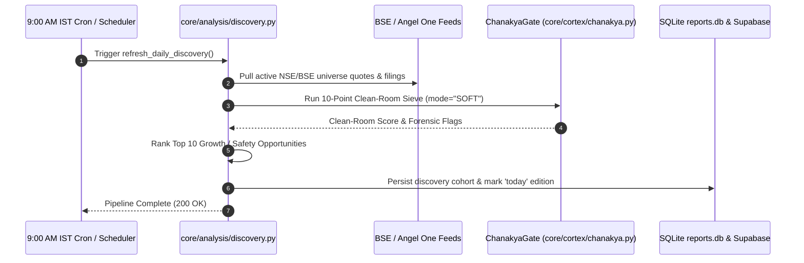
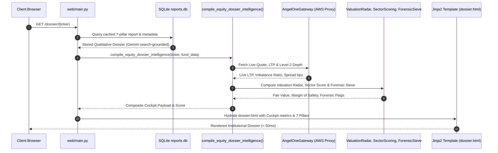
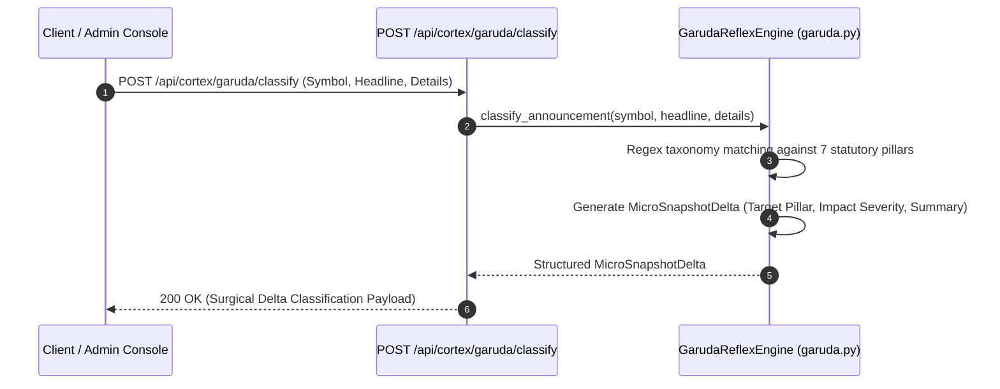
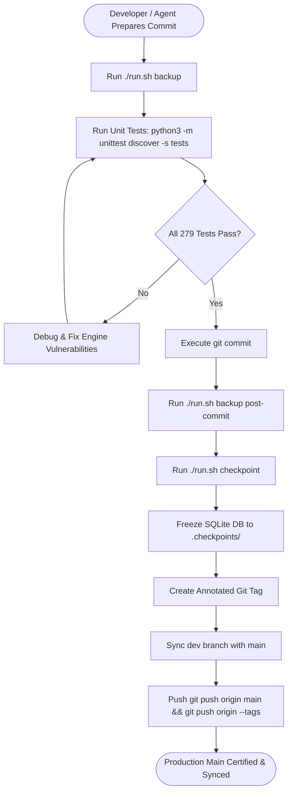

# Master Engineering Manual & Architecture Specification
**Stock Research App — Institutional Multi-Asset Research Platform**  
*Document Version: 2.5.0 | Target Branch: `main` | Last Updated: 2026-10-10*

---

## Executive Summary & System Philosophy

**Stock Research App** is an autonomous, institutional-grade equity and multi-asset intelligence platform engineered specifically for Indian capital markets (NSE/BSE, AMFI, RBI Sovereign, and SEBI-registered REITs/InvITs). 

The platform is designed around four core non-negotiable architectural tenets:
1. **SEBI Safe Harbor & Zero-Hallucination Compliance:** Strictly provides descriptive, non-advisory operational diagnostics, forensic sieves, and deterministic financial ledgers. Zero algorithmic buy/sell/hold recommendations.
2. **Exchange-Grounded Data Provenance:** Ingests live Level-2 market depth, quotes, and historical candles via official exchange APIs (Angel One SmartAPI) routed through dedicated AWS static proxy egress, combined with direct BSE corporate filings and AMFI NAV feeds.
3. **Dual-Binding Database Persistence:** High-performance local SQLite fast-path (`reports.db`) paired with immutable, cloud-replicated PostgreSQL (Supabase REST API) and append-only historical audit revision ledgers.
4. **Deterministic Cortex Sieve Architecture:** High-speed mathematical engines (DuPont decomposition, reverse DCF solvers, 10-point forensic clean rooms) compress data prior to LLM qualitative synthesis, eliminating 90% of token overhead and reducing dossier render latencies to sub-second speeds.

---

## 1. Complete Site Inventory & Functional Directory

The platform provides a comprehensive suite of institutional research and asset comparison views:

```
                                      SITE SITEMAP TOPOLOGY
  ┌─────────────────────────────────────────────────────────────────────────────────────────────┐
  │                                                                                             │
  │  EQUITY RESEARCH & DISCOVERY              MULTI-ASSET & FIXED INCOME     PORTFOLIO & TOOLS  │
  │  ├── / (Landing Page)                     ├── /debt (Bonds, NCDs & SDIs) ├── /calculator/tax│
  │  ├── /discovery (Stock Discovery @9AM)    ├── /sovereign (Sovereign Curve├──   (Net Real Tax│
  │  ├── /dossier/{ticker}                    │     & T-Bills)               │    Calculator)   │
  │  │     (Institutional Equity Dossier)     ├── /funds (Mutual Funds & ETFs├── /safety-radar  │
  │  └── /opportunities (Opportunity Terminal)├── /funds/compare/overlap     │    (Retail Radar)│
  │                                           │     (Fund Overlap Auditor)   ├── /compare       │
  │                                           ├── /reits (SM REITs, InvITs   │   (Peer Compare) │
  │                                           │     & SGBs)                  └── Watchlist Modal│
  │                                           ├── /etfs (National ETF Matrix)    (/api/watchlist│
  │                                           └── /msme (Unlisted MSME &                        │
  │                                                Emerging SME Directory)                      │
  │                                                                                             │
  │  USER & SUBSCRIPTION MANAGEMENT           ADMINISTRATION & AUDIT         LEGAL & COMPLIANCE │
  │  ├── /pricing (Pro Plans & Checkout)      ├── /admin (Control Console)   ├── /terms         │
  │  ├── /api/create-order (Razorpay Gateway) ├── /admin/audit (Project Log) ├── /disclaimer    │
  │  └── Sitewide Auth Modal (/api/auth/*)    ├── /admin/setup-2fa           └── /contact       │
  │                                           └── /admin/verify-2fa                             │
  │                                                                                             │
  └─────────────────────────────────────────────────────────────────────────────────────────────┘
```

### Detailed Route & Feature Breakdown

| Route / View | UI Template | Primary Functional Objective |
| :--- | :--- | :--- |
| **Home / Landing** (`/`) | [`index.html`](file:///Users/lyndonpinto/Documents/Stock_Research_App/web/templates/index.html) | Modern dark-glassmorphism overview highlighting institutional research capabilities, 7-Pillar methodology, asset class coverage, and omni-search bar. |
| **Stock Discovery @9AM** (`/discovery`) | [`discovery.html`](file:///Users/lyndonpinto/Documents/Stock_Research_App/web/templates/discovery.html) | Curated candidate screening engine updated daily at 9:00 AM IST before exchange market open. Ranks stocks by growth velocity, capital efficiency, and forensic safety. |
| **Institutional Equity Dossier** (`/dossier/{ticker}`) | [`dossier.html`](file:///Users/lyndonpinto/Documents/Stock_Research_App/web/templates/dossier.html) | Deep-dive equity thesis across 7 statutory pillars. Features the **Institutional Intelligence Cockpit**: Level-2 Order Depth, Valuation Radar, Sector Scorecard, Forensic Sieve, and 60-Second Bull/Bear Thesis. |
| **Opportunity Terminal** (`/opportunities`) | [`opportunity_terminal.html`](file:///Users/lyndonpinto/Documents/Stock_Research_App/web/templates/opportunity_terminal.html) | Interactive valuation and growth matrix visualizing multi-asset asymmetry across capital markets. |
| **Bonds, NCDs & SDIs** (`/debt`, `/debt/{symbol}`) | [`debt_directory.html`](file:///Users/lyndonpinto/Documents/Stock_Research_App/web/templates/debt_directory.html), [`debt_dossier.html`](file:///Users/lyndonpinto/Documents/Stock_Research_App/web/templates/debt_dossier.html) | Indian corporate debt directory tracking Senior Secured NCDs, yields to maturity (YTM), credit rating migrations, and default spreads under SEBI ₹10,000 Face Value Framework. |
| **Sovereign Curve & T-Bills** (`/sovereign`) | [`sovereign_curve.html`](file:///Users/lyndonpinto/Documents/Stock_Research_App/web/templates/sovereign_curve.html) | Real-time Indian Government 10Y Benchmark G-Sec, Treasury Bills, and State Development Loans (SDL) yield curve and policy rate wedges. |
| **Mutual Funds & ETFs** (`/funds`, `/funds/{key}`) | [`fund_directory.html`](file:///Users/lyndonpinto/Documents/Stock_Research_App/web/templates/fund_directory.html), [`fund_dossier.html`](file:///Users/lyndonpinto/Documents/Stock_Research_App/web/templates/fund_dossier.html) | AMFI-ingested scheme explorer providing underlying company look-through, expense drag audits, and manager style drift tracking. |
| **Fund Overlap Auditor** (`/funds/compare/overlap`, `/api/funds/overlap`) | [`fund_overlap.html`](file:///Users/lyndonpinto/Documents/Stock_Research_App/web/templates/fund_overlap.html) | Detects hidden duplicate equity holdings across paired mutual fund schemes to eliminate redundant AMC management fees. |
| **SM REITs, InvITs & SGBs** (`/reits`) | [`reit_directory.html`](file:///Users/lyndonpinto/Documents/Stock_Research_App/web/templates/reit_directory.html) | Directory of all Indian listed commercial REITs (Embassy, Mindspace, Brookfield, Nexus) and SM REITs with Sec 115UA tax-exempt distribution breakdowns and Sovereign Gold Bond parity. |
| **National ETF Matrix** (`/etfs`) | [`etf_matrix.html`](file:///Users/lyndonpinto/Documents/Stock_Research_App/web/templates/etf_matrix.html) | Low-cost index tracker analyzing tracking error, cash-equivalent liquidity, and intraday NAV spreads. |
| **Unlisted MSME & Emerging SME Directory** (`/msme`) | [`msme_directory.html`](file:///Users/lyndonpinto/Documents/Stock_Research_App/web/templates/msme_directory.html) | Statutory registry intelligence covering verified unlisted manufacturing enterprises and SME growth champions under the MSMED Act 2020. Features turnover tiers (Micro, Small, Medium), industrial clusters, real-time multi-facet filtering, and dossier inspection modals. |
| **Net Real Tax Calculator** (`/calculator/tax`) | [`tax_calculator.html`](file:///Users/lyndonpinto/Documents/Stock_Research_App/web/templates/tax_calculator.html) | Multi-asset purchasing power deflator factoring in MOSPI CPI inflation, Section 50AA debt slab taxation, Section 112A equity LTCG, and Section 47(viic) SGB exemptions. |
| **Retail Safety Radar** (`/safety-radar`) | [`safety_radar.html`](file:///Users/lyndonpinto/Documents/Stock_Research_App/web/templates/safety_radar.html) | Cross-asset risk matrix comparing capital hierarchy seniority, default risks, and liquidation recovery rank. |
| **Peer Comparison** (`/compare`) | [`compare.html`](file:///Users/lyndonpinto/Documents/Stock_Research_App/web/templates/compare.html) | Side-by-side fundamental, forensic, and valuation comparison between 2 or 3 Indian listed equities. |
| **Forensic Intelligence Desk** (Sitewide Slide Drawer & Dock) | [`partials/copilot_modal.html`](file:///Users/lyndonpinto/Documents/Stock_Research_App/web/templates/partials/copilot_modal.html) | Interactive slide-drawer forensic assistant delivering grounded contextual explanations, formula derivations, and deterministic analysis. Accessible via `⌘K` / `Ctrl+K` and ambient floating dock. |
| **User Watchlist** (Modal & API) | [`partials/auth_modal.html`](file:///Users/lyndonpinto/Documents/Stock_Research_App/web/templates/partials/auth_modal.html), `/api/watchlist` | Localized and authenticated user portfolio and watchlist tracking. |
| **Pricing & Billing** (`/pricing`, `/api/create-order`) | [`pricing.html`](file:///Users/lyndonpinto/Documents/Stock_Research_App/web/templates/pricing.html) | Subscription management integrated with Razorpay payment gateway for Pro access tiers and single-report unlock credits. |
| **Admin Console & Audit** (`/admin`, `/admin/audit`) | [`admin.html`](file:///Users/lyndonpinto/Documents/Stock_Research_App/web/templates/admin.html), [`admin_audit.html`](file:///Users/lyndonpinto/Documents/Stock_Research_App/web/templates/admin_audit.html) | Restricted console with 2FA protection (`/admin/setup-2fa`, `/admin/verify-2fa`) for auditing telemetry, user credits, automated test runs, AST hygiene, and regulatory term scans. |
| **Regulatory & Support** (`/terms`, `/disclaimer`, `/contact`) | [`terms.html`](file:///Users/lyndonpinto/Documents/Stock_Research_App/web/templates/terms.html), [`disclaimer.html`](file:///Users/lyndonpinto/Documents/Stock_Research_App/web/templates/disclaimer.html), [`contact.html`](file:///Users/lyndonpinto/Documents/Stock_Research_App/web/templates/contact.html) | SEBI Safe Harbor disclosures, terms of use, privacy policy, and on-site feedback/complaints form. |

---

## 2. Architecture & Component Mechanics

The platform operates across 5 layered subsystems:

```
  ┌────────────────────────────────────────────────────────────────────────┐
  │ 1. INGESTION & GATEWAY LAYER                                           │
  │    • Angel One SmartAPI (Egress via AWS Lightsail Static IP Proxy)     │
  │    • Pure Python RFC 6238 TOTP Generator                               │
  │    • BSE Direct Announcement Scraper & AMFI NAV Feeds                  │
  │    • Ministry of MSME / Udyam Gazette Open Data & Canonical Cluster Seed│
  │    • Secondary Fallback: yfinance fast_info Gateways                   │
  └───────────────────────────────────┬────────────────────────────────────┘
                                      │
  ┌───────────────────────────────────▼────────────────────────────────────┐
  │ 2. CORTEX & ANALYTICAL ENGINES                                         │
  │    • Chanakya: 10-Point Deterministic Clean-Room Forensic Filter       │
  │    • Varan: Multi-Year XBRL Delta & 3-Stage DuPont ROE Engine          │
  │    • Setu: Cross-Asset Capital Hierarchy & Inversion Detector          │
  │    • Garuda: Event-Driven BSE Regulatory Micro-Snapshot Reactor        │
  │    • Sutra: Multi-Asset Mutual Fund Look-Through Concentration Engine  │
  │    • Valuation Radar: 2-Stage DCF + Historical PE + EPV Sieve          │
  │    • Sector Scoring: Tailored BFSI, IT, Infra, Pharma, FMCG Sieves     │
  │    • Institutional Flow: 5-Tier Level-2 Order Imbalance & Circuit Locks│
  └───────────────────────────────────┬────────────────────────────────────┘
                                      │
  ┌───────────────────────────────────▼────────────────────────────────────┐
  │ 3. DUAL-BINDING PERSISTENCE & CACHING LAYER                            │
  │    • Local High-Speed SQLite Cache: reports.db                         │
  │    • Cloud Database Mirror: Supabase PostgreSQL (REST API)             │
  │    • Immutable Audit Trail: report_revisions (Append-Only Ledgers)     │
  │    • Disaster Recovery Snapshots: .checkpoints/ (Frozen SQLite DBs)    │
  └───────────────────────────────────┬────────────────────────────────────┘
                                      │
  ┌───────────────────────────────────▼────────────────────────────────────┐
  │ 4. APPLICATION & API ROUTER (FastAPI on Uvicorn)                       │
  │    • web/main.py: Endpoints, Jinja2 SSR, Context Ingestion, Rate Limits│
  │    • Rest APIs: /api/dossier/intel/{sym}, /api/cortex/*, /api/msme/*   │
  │    • Background Workers: 9:00 AM Cron Discovery Refresher              │
  └───────────────────────────────────┬────────────────────────────────────┘
                                      │
  ┌───────────────────────────────────▼────────────────────────────────────┐
  │ 5. PRESENTATION & BEHAVIORAL CLIENT LAYER                              │
  │    • Vanilla CSS Design System: web/static/css/style.css               │
  │    • Strict Affordance Separation: Squircle 8px Buttons vs Dark Badges │
  │    • Decluttered 2-Zone 7-Pillar Accordions & Executive Lead Styling   │
  │    • Modern Glassmorphism, 100% Viewport Zoom Lock, Inter Typography   │
  │    • Client Prefetching & Micro-Animations: web/static/js/main.js      │
  │    • Forensic Intelligence Desk: copilot.js & partials/copilot_modal   │
  └────────────────────────────────────────────────────────────────────────┘
```

### Component Breakdown

#### A. Ingestion Layer (`core/ingestion/`)
* **Angel One SmartAPI Gateway ([`angel_one.py`](file:///Users/lyndonpinto/Documents/Stock_Research_App/core/ingestion/angel_one.py)):**
  * **Static Proxy Routing:** Angel One requires whitelisted static IP egress. The gateway routes exclusively through an authenticated forward proxy running on an AWS Lightsail Ubuntu instance (`13.54.76.134:8888`), leaving all other traffic (Supabase, Gemini) unproxied.
  * **Zero-Dependency RFC 6238 TOTP:** Pure Python standard library implementation (`hmac`, `hashlib`, `struct`, `base64`) generating valid 6-digit TOTP tokens from seed keys without third-party dependencies (`pyotp`).
  * **Market Depth Ingestion:** Fetches real-time best 5 bid/ask price tiers and quantities, computing order imbalance ratios and bid-ask spreads in basis points.
  * **Seamless Fallback:** If credentials or proxy are offline, it fails gracefully without raising exceptions, allowing secondary market data providers to resolve seamlessly.

#### B. Cortex & Analytical Engines (`core/cortex/` & `core/analysis/`)

> **UI Presentation & Cognitive Clarity Principle:**
> On the public website, HTML templates, badges, summaries, and user documentation, arbitrary engine brand names and broker-specific naming are strictly omitted. Users are presented with clear, simple, descriptive titles (e.g. *10-Point Forensic Clean-Room Sieve*, *Cross-Asset Capital Structure Matrix*, *Event-Driven Corporate Announcement Classifier*, *Multi-Asset Portfolio Look-Through Engine*, and *Official Exchange Live Feed*) to prevent cognitive overload and maintain approachable clarity. Internal Python class symbols (`ChanakyaGate`, `SetuMatrixEngine`, etc.) and ingestion modules are preserved strictly for architectural traceability and developer tooling.

* **10-Point Forensic Clean-Room Sieve** (Internal: [`ChanakyaGate`, `chanakya.py`](file:///Users/lyndonpinto/Documents/Stock_Research_App/core/cortex/chanakya.py)):
  10-point deterministic forensic sieve executing:
  1. $CFO / EBITDA$ operating cash realization check ($> 0.35$).
  2. Statutory tax wedge / phantom profit check (Effective Tax Rate $> 15\%$).
  3. Promoter pledge acceleration ($< 20\%$ total, QoQ surge $< 3\%$).
  4. Auditor stability ($< 2$ replacements in trailing 3 years).
  5. Contingent liabilities drag ($< 50\%$ of net worth).
  6. Related-Party Transactions (RPT) leakage ($< 15\%$ of revenues).
  7. Receivables expansion vs sales growth ($DSO \text{ premium} < 30\%$).
  8. Solvency and debt service coverage ($ICR \ge 1.75\times$, $D/E \le 2.0\times$).
  9. Tangible capital and retained earnings preservation.
  10. Institutional liquidity and market cap threshold ($\ge ₹25\text{ Cr}$).
* **Multi-Year Financial & DuPont Ledger** (Internal: [`VaranEngine`, `varan.py`](file:///Users/lyndonpinto/Documents/Stock_Research_App/core/cortex/varan.py)):
  Deterministic ledger computing multi-year CAGRs, 3-Stage DuPont ROE decomposition ($\text{Margin} \times \text{Turnover} \times \text{Leverage}$), and Cash Conversion Cycles (CCC). Formats structured `DeltaPacket` payloads for analytical evaluation. *(Note: Live qualitative report synthesis in `core/analysis/engine.py` currently synthesizes directly via search grounding; inline prompt injection of the Varan DeltaPacket is architected as an upcoming token-compression optimization).*
* **Cross-Asset Capital Structure Matrix** (Internal: [`SetuMatrixEngine`, `setu.py`](file:///Users/lyndonpinto/Documents/Stock_Research_App/core/cortex/setu.py)):
  Relational capital hierarchy linking Common Equity FCF yield to Senior Secured NCD yields, Indian 10Y Benchmark G-Secs, and Commercial REIT distributions. Automatically diagnoses **Capital Structure Inversions** (where equity yields less than senior secured debt). Exposed via `GET /api/cortex/capital-matrix/{ticker}` (alias: `/api/cortex/setu/{ticker}`).
* **Event-Driven Corporate Announcement Classifier** (Internal: [`GarudaReflexEngine`, `garuda.py`](file:///Users/lyndonpinto/Documents/Stock_Research_App/core/cortex/garuda.py)):
  Ingests BSE corporate disclosures, classifies announcements via deterministic regex taxonomy to specific 7-Pillar segments, and generates surgical `MicroSnapshotDelta` packets. Exposed via `POST /api/cortex/announcement-classifier` (alias: `/api/cortex/garuda/classify`).
* **Multi-Asset Portfolio Look-Through Engine** (Internal: [`SutraLookThroughEngine`, `sutra.py`](file:///Users/lyndonpinto/Documents/Stock_Research_App/core/cortex/sutra.py)):
  Deconstructs mutual fund schemes down to underlying equities to uncover hidden single-stock concentration and sector crowding across combined investor portfolios. Exposed via `POST /api/cortex/portfolio-look-through` (alias: `/api/cortex/sutra/audit`).
* **Equity Dossier Intelligence Coordinator ([`equity_dossier_intelligence.py`](file:///Users/lyndonpinto/Documents/Stock_Research_App/core/analysis/equity_dossier_intelligence.py)):**
  The central runtime orchestrator for Category 1 Institutional Cockpits. Ingests live quotes and level-2 depth from `AngelOneGateway`, executes `valuation_radar`, `sector_scoring`, `institutional_flow`, `forensic_sieve`, and `bull_bear`, and computes the composite cockpit score ($0-100$) rendered on `/dossier/{ticker}` and `/api/dossier/intel/{ticker}`.
* **Valuation Radar ([`valuation_radar.py`](file:///Users/lyndonpinto/Documents/Stock_Research_App/core/analysis/valuation_radar.py)):**
  Triangulates intrinsic fair value range combining a 5-Year Historical Median P/E multiple (35%), a 2-Stage conservative DCF (40%), and Graham Earnings Power Value (EPV, 25%). Computes Margin of Safety % against current exchange quotes.
* **Sector-Native Scoring ([`sector_scoring.py`](file:///Users/lyndonpinto/Documents/Stock_Research_App/core/analysis/sector_scoring.py)):**
  Replaces one-size-fits-all scoring with sector-tailored sieves (BFSI Net Interest Margin/RoA/NPAs, IT FCF/ROCE, Capital Goods Asset Turnover).
* **Institutional Flow Engine ([`institutional_flow.py`](file:///Users/lyndonpinto/Documents/Stock_Research_App/core/analysis/institutional_flow.py)):**
  Quantifies institutional accumulation vs distribution pressure from Level-2 order books, computes true bid-ask spread bps, and calculates lower/upper circuit freeze buffers.
* **Forensic Sieve Engine ([`forensic_sieve.py`](file:///Users/lyndonpinto/Documents/Stock_Research_App/core/analysis/forensic_sieve.py)):**
  A 6-point statutory forensic sieve executing checks on Tax Wedge / ETR, CFO/EBITDA realization, promoter integrity, leverage, return stability, and auditor qualifications.
* **Bull/Bear Thesis Engine ([`bull_bear.py`](file:///Users/lyndonpinto/Documents/Stock_Research_App/core/analysis/bull_bear.py)):**
  Synthesizes deterministic 60-second Bull vs. Bear structural cases using primary financial inputs, operating leverage, and capital efficiency metrics.

#### C. Authentication & Security Services (`core/auth/`)
* **Email OTP Verification ([`core/auth/otp.py`](file:///Users/lyndonpinto/Documents/Stock_Research_App/core/auth/otp.py)):** Generates, hashes, and validates 6-digit email OTPs with 10-minute expiry and exponential throttling.
* **Admin 2FA Security Gate ([`core/auth/totp.py`](file:///Users/lyndonpinto/Documents/Stock_Research_App/core/auth/totp.py)):** Pure Python RFC 6238 TOTP implementation for admin setup and second-factor verification (`/admin/setup-2fa`, `/admin/verify-2fa`).

#### D. Database Dual-Binding & Persistence Layer (`core/db/`)
* **Local Fast-Path:** SQLite database [`reports.db`](file:///Users/lyndonpinto/Documents/Stock_Research_App/reports.db) serves high-throughput reads in single-digit milliseconds.
* **Cloud Persistence:** Every insert or update replicates asynchronously to Supabase cloud PostgreSQL.
* **Immutable Auditing:** Table `report_revisions` retains complete historical qualitative snapshots, timestamps, and LLM prompts.

#### E. Presentation, Visual Affordance & Forensic Desk Layer (`web/static/css/`, `web/static/js/`, `templates/`)
* **Strict Affordance & Geometry Separation (`style.css`):**
  * **Interactive Action Buttons (`.btn`, `.btn-primary`, `.btn-secondary`, `.btn-hero-ai`):** Engineered with strict squircle 8px geometry (`var(--radius-sm)`), tactile active depress (`translateY(1px)`), luminous cyan/blue fills with drop shadows (`box-shadow: 0 4px 16px rgba(14, 165, 233, 0.25)`), and elevated slate backdrops for secondary triggers.
  * **Informational Status Badges (`.badge`, `.status-dot`):** Rendered with dark matte fills (`rgba(15, 23, 42, 0.75)`), flat low-saturation borders, default cursor (`cursor: default; pointer-events: none;`), zero hover lift/glow, and colored status dots (`.status-dot-emerald`, `.status-dot-cyan`, `.status-dot-amber`, `.status-dot-slate`) indicating real-time system telemetry rather than clickable actions.
* **Forensic Intelligence Desk (Rebranded Hero Assistant):**
  * Rebranded sitewide assistant from "Copilot" to **"Forensic Intelligence Desk"** (short form: **"Forensic Desk"**).
  * Elevated with dedicated hero action buttons (`.btn-hero-ai`) featuring dynamic gradient borders and ambient glow.
  * Sitewide persistent floating launcher dock (`#forensicDeskFloatingDock` / `.forensic-desk-fab`) in bottom-right corner featuring a live pulsing emerald telemetry indicator and keyboard shortcut badge `[ ⌘K ]`.
  * Global keyboard listeners for `⌘K` / `Ctrl+K` and `/` hotkeys across equity, mutual funds, debt, and opportunity terminals.
* **7-Pillar Accordion & Reading Rhythm Balancing (`core/analysis/parser.py`, `style.css`):**
  * **Decluttered Summary Header:** `<summary>` restructured into a clean two-zone flex layout (`.pillar-summary-left` with number pill and title; `.pillar-summary-right` with animated chevron). Relocated exchange filings link from `<summary>` into an inner executive grounding strip (`.pillar-citation-strip`) inside the opened body with an explicit action button (`.btn-secondary`).
  * **Executive Lead Styling:** Opening paragraph of each pillar (`.pillar-body > p:first-of-type`) styled with a 3px cyan callout bar, 15px font size, and elevated line height for instant executive takeaways without altering underlying content.
  * **Typographic Rhythm:** Increased body paragraph vertical spacing to 20px, boosted bold financial terms to high-contrast `#ffffff`, custom styled luminous cyan bullet markers (`▹`), and upgraded blockquotes.


> [!NOTE]
> **Complete Report Evaluation Frameworks Specification:**  
> For the comprehensive mathematical formulations, evaluation criteria, and authoritative data source matrices for all 11 reports created on the platform, refer to [`docs/REPORT_EVALUATION_FRAMEWORKS.md`](file:///Users/lyndonpinto/Documents/Stock_Research_App/docs/REPORT_EVALUATION_FRAMEWORKS.md) and [`.antigravity/docs/EVALUATION_FRAMEWORKS.md`](file:///Users/lyndonpinto/Documents/Stock_Research_App/.antigravity/docs/EVALUATION_FRAMEWORKS.md).

---

## 3. Operational Process Flows for Audit Verification

Auditors evaluating whether production on `main` complies with standards can trace these 6 deterministic workflows:

### Process Flow 1: Morning 9:00 AM Discovery & Ingestion Pipeline


### Process Flow 2: Live Equity Dossier Request Flow (`GET /dossier/{ticker}`)


### Process Flow 3: Event-Driven Announcement Classification Flow (Garuda API)


### Process Flow 4: Pre-Commit & Checkpoint Verification Gate


---

## 4. Code-to-Feature / Process Navigation Directory

Use this matrix to locate the responsible code files, functions, and remedies for any feature or incident:

| Feature / System Module | Route / Entry Point | Primary Backend Implementation | Frontend Template / JS | Known Failure Modes & Diagnostic Fixes |
| :--- | :--- | :--- | :--- | :--- |
| **Angel One SmartAPI Gateway (Procedural)** | `core/ingestion/angel_one.py` | `AngelOneGateway.get_stock_quote`, `get_quote_with_depth` | `web/main.py:943`, `web/main.py:3255` | • Proxy 403: Verify Lightsail proxy daemon (`tinyproxy`) on port 8888.<br>• TOTP error: Check `ANGEL_TOTP_KEY` base32 format in `.env`. |
| **Equity Dossier Coordinator** | `GET /dossier/{sym}`, `GET /api/dossier/intel/{sym}` | [`core/analysis/equity_dossier_intelligence.py`](file:///Users/lyndonpinto/Documents/Stock_Research_App/core/analysis/equity_dossier_intelligence.py) | `templates/dossier.html` | • Fallback quote: Fails gracefully to offline payload with N/A badges if quote provider times out. |
| **10-Point Forensic Clean-Room Filter** | `GET /api/cortex/forensic-sieve/{sym}`<br>*(Alias: `/api/cortex/chanakya/{sym}`)* | [`core/cortex/chanakya.py:ChanakyaGate`](file:///Users/lyndonpinto/Documents/Stock_Research_App/core/cortex/chanakya.py) | `templates/dossier.html` | • Insolvent company crash: Verify `_safe_float` handles negative net worth and strings with commas. |
| **Multi-Year Financial & DuPont Ledger** | Internal Cortex API | [`core/cortex/varan.py:VaranEngine`](file:///Users/lyndonpinto/Documents/Stock_Research_App/core/cortex/varan.py) | `core/agents/equity/` | • DuPont failure: Verify `total_equity_cr <= 0` flags `NEGATIVE_EQUITY_DEFICIT`. |
| **Cross-Asset Capital Structure Matrix** | `GET /api/cortex/capital-matrix/{sym}`<br>*(Alias: `/api/cortex/setu/{sym}`)* | [`core/cortex/setu.py:SetuMatrixEngine`](file:///Users/lyndonpinto/Documents/Stock_Research_App/core/cortex/setu.py) | `templates/dossier.html` | • Rating error: Confirm rating is uppercase string; `spread_map` defaults safely to 1.50%. |
| **Event-Driven Announcement Classifier** | `POST /api/cortex/announcement-classifier`<br>*(Alias: `/api/cortex/garuda/classify`)* | [`core/cortex/garuda.py:GarudaReflexEngine`](file:///Users/lyndonpinto/Documents/Stock_Research_App/core/cortex/garuda.py) | `templates/dossier.html` | • Headline NoneType error: Coerced via `str(headline or '').strip()`. |
| **Multi-Asset Portfolio Look-Through** | `POST /api/cortex/portfolio-look-through`<br>*(Alias: `/api/cortex/sutra/audit`)* | [`core/cortex/sutra.py:SutraLookThroughEngine`](file:///Users/lyndonpinto/Documents/Stock_Research_App/core/cortex/sutra.py) | `templates/fund_overlap.html` | • Corrupt holding lists: Guarded by list comprehension filtering `isinstance(x, dict)`. |
| **Valuation Radar** | `GET /api/dossier/intel/{sym}` | [`core/analysis/valuation_radar.py`](file:///Users/lyndonpinto/Documents/Stock_Research_App/core/analysis/valuation_radar.py) | `templates/dossier.html` | • ZeroDivisionError: Enforced `spread = max(0.015, discount_rate - terminal_growth_rate)`. |
| **Sector Scoring Engine** | `GET /api/dossier/intel/{sym}` | [`core/analysis/sector_scoring.py`](file:///Users/lyndonpinto/Documents/Stock_Research_App/core/analysis/sector_scoring.py) | `templates/dossier.html` | • String float error: Numeric sanitization via `_safe_float` strips commas and `%` symbols. |
| **Institutional Flow Sieve** | `GET /api/dossier/intel/{sym}` | [`core/analysis/institutional_flow.py`](file:///Users/lyndonpinto/Documents/Stock_Research_App/core/analysis/institutional_flow.py) | `templates/dossier.html` | • Missing book depth: Returns default `UNAVAILABLE` payload outside market hours without breaking page. |
| **Forensic Sieve Engine** | `GET /api/dossier/intel/{sym}` | [`core/analysis/forensic_sieve.py`](file:///Users/lyndonpinto/Documents/Stock_Research_App/core/analysis/forensic_sieve.py) | `templates/dossier.html` | • Missing statutory fields: Default to neutral scores without breaking synthesis. |
| **Bull/Bear Thesis Engine** | `GET /api/dossier/intel/{sym}` | [`core/analysis/bull_bear.py`](file:///Users/lyndonpinto/Documents/Stock_Research_App/core/analysis/bull_bear.py) | `templates/dossier.html` | • Format specifier crash: All variables pass through `_safe_float` before format `{:,.2f}`. |
| **Net Real Tax Calculator** | `GET /calculator/tax`, `POST /api/tax/compute` | [`core/analysis/tax_calculator.py`](file:///Users/lyndonpinto/Documents/Stock_Research_App/core/analysis/tax_calculator.py) | `templates/tax_calculator.html` | • -100% inflation division by zero: Deflator clamped with `max(0.001, 1.0 + inf)`. |
| **Forensic Intelligence Desk** | `POST /api/copilot/chat` | [`core/agents/copilot/investor_copilot.py`](file:///Users/lyndonpinto/Documents/Stock_Research_App/core/agents/copilot/investor_copilot.py) | `static/js/copilot.js`, `partials/copilot_modal.html` | • LLM 403 or quota exhaustion: Automatically falls back to deterministic rule-based response.<br>• Single-response starter chip bug fix: Upgraded `build_equity_deterministic_response`, `build_mutual_fund_deterministic_response`, and `build_debt_deterministic_response` to accept `user_message` and classify query intent, routing starter chips (Pre-Mortem Inversion, Reverse DCF, Governance, Solvency, Fee Drag, Active Share, Moat, Covenants, Contagion) to bespoke, data-grounded analyses.<br>• Hotkey trigger: Global `⌘K` / `Ctrl+K` and `/` listeners initialize drawer across all asset views.<br>• Floating Dock: Fixed glassmorphic dock (`#forensicDeskFloatingDock`) provides persistent 1-click invocation. |
| **Stock Discovery @9AM** | `GET /discovery`, `POST /api/discovery/refresh` | [`core/analysis/discovery.py`](file:///Users/lyndonpinto/Documents/Stock_Research_App/core/analysis/discovery.py) | `templates/discovery.html` | • Stale cohort: Check `is_today_published()` and SQLite timestamp indexing. |
| **Dual-Binding Database Sync** | `core/db/connection.py` | `get_db_connection`, `execute_write` | Supabase REST Client | • Supabase offline: Writes succeed locally in SQLite; background worker queues sync retry. |
| **Email OTP Authentication** | `POST /api/auth/send-otp`, `verify-otp` | [`core/auth/otp.py`](file:///Users/lyndonpinto/Documents/Stock_Research_App/core/auth/otp.py) | `templates/partials/auth_modal.html` | • Expiry/Lockout: Clamped to 10-minute expiry; 3-attempt lock protects against brute force. |
| **Admin 2FA Security Gate** | `GET/POST /admin/setup-2fa`, `verify-2fa` | [`core/auth/totp.py`](file:///Users/lyndonpinto/Documents/Stock_Research_App/core/auth/totp.py) | `templates/admin.html` | • Clock skew: Validates trailing and current 30-second RFC 6238 time step intervals. |
| **Admin Surveillance Console** | `GET /admin`, `GET /admin/audit` | [`web/main.py`](file:///Users/lyndonpinto/Documents/Stock_Research_App/web/main.py), [`core/audit/project_auditor.py`](file:///Users/lyndonpinto/Documents/Stock_Research_App/core/audit/project_auditor.py) | `templates/admin.html` | • Session rejection: Verify `ADMIN_PASSWORD` in `.env` and valid session cookie. |
| **7-Pillar Dossier Accordion Headers & Prose Rhythm** | `GET /dossier/{sym}` | [`core/analysis/parser.py:wrap_html_with_collapsible_pillars`](file:///Users/lyndonpinto/Documents/Stock_Research_App/core/analysis/parser.py) | `templates/dossier.html`, `static/css/style.css` | • Header crowding / mid-word wrapping: `<summary>` decluttered into two clean zones (`.pillar-summary-left` and rotating `.pillar-chevron-right`); primary BSE citation moved into inner executive grounding strip (`.pillar-citation-strip`).<br>• Wall-of-text fatigue: `.pillar-body > p:first-of-type` styled with executive cyan callout border, 20px paragraph spacing, and `#ffffff` high-contrast bold financial metrics without touching raw content. |
| **Visual Affordance System (Buttons vs. Badges)** | Sitewide UI Tokens | `web/static/css/style.css` | `templates/` (all views) | • Affordance collision: Clickable action triggers enforce squircle 8px geometry (`var(--radius-sm)`), tactile depress, and luminous fills (`.btn-primary`, `.btn-secondary`, `.btn-hero-ai`); non-clickable informational badges enforce dark matte fills (`rgba(15, 23, 42, 0.75)`), flat borders, `pointer-events: none;`, and `.status-dot-*` telemetry indicators. |
| **Exchange Source Attribution & Scrip Resolution** | `GET /dossier/{sym}`, PDF export | [`core/analysis/parser.py:wrap_html_with_collapsible_pillars`](file:///Users/lyndonpinto/Documents/Stock_Research_App/core/analysis/parser.py) (`has_valid_scrip`, `_LOCKED_SKELETON_HTML`), [`web/main.py:dossier_page`](file:///Users/lyndonpinto/Documents/Stock_Research_App/web/main.py), [`core/reporting/pdf.py`](file:///Users/lyndonpinto/Documents/Stock_Research_App/core/reporting/pdf.py) | `templates/dossier.html`, `templates/dossier_pending.html` | • BSE links point to the wrong company: no fallback scrip code is allowed; links render only when a numeric scrip code is resolved, otherwise "N/A" / "BSE scrip code not yet resolved" is shown.<br>• Locked pillars must never show sample figures: gated Pillars use grey skeleton bars only.<br>• Double rupee sign: `format_inr()` already prefixes ₹; do not prepend another (applies to `dossier_page` and `compare_page`; `compare.html` only prints ₹ next to a real value, otherwise plain "N/A"). Guarded by `tests/test_fastapi_web.py`. |
| **Autonomous Contract & Click-Wiring Auditor** | `core/audit/tools.py`, `core/audit/project_auditor.py` | `tool_audit_frontend_and_api_contracts`, `compute_deterministic_audit_metrics` | `templates/admin.html`, `/admin/audit`, `./run.sh check` | • Client-side wiring blindness: Scans all templates in `web/templates/` to assert every `onclick` has a defined JS function, every `fetch('/api/...')` maps to a live FastAPI route, and all external links adhere to modern portal patterns.<br>• Automated scoring: Deducts points and issues critical violations if orphaned onclicks, unmapped API routes, or deprecated BSE ASPX links are detected. |
| **Dossier Header Metadata, Credit Unlock & Progressive Loading** | `GET /dossier/{sym}`, `POST /api/dossier/unlock/{ticker}` | `web/main.py:api_unlock_dossier`, `web/static/js/main.js:unlockDeepDive`, `startButtonProgressFill` | `templates/dossier.html`, `templates/base.html`, `static/css/style.css` | • Header clunkiness: Split messy inline text into `.dossier-meta-strip` (date, feed, sources) and `.dossier-provenance-subline`.<br>• Broken BSE links: Removed broken `Comp_Resultsnew.aspx` and duplicate links from quote/PE/market cap; retained single valid link `Official BSE Profile ↗` under BSE Scrip Code.<br>• Credit unlock button: Wired `unlockDeepDive` to check auth, open sign-in modal with 2 welcome credits, and post to `/api/dossier/unlock/{ticker}` to unlock forensic ledger and reverse DCF.<br>• 30s progressive loading: Implemented timed linear fill animation `.btn-loading-progress` (`--btn-progress`) with dynamic elapsed counter (`12s / ~30s`) and matching overlay progress track. Tested by `tests/test_frontend_click_wiring.py`. |
| **Audit 1 Hardening & Data Accuracy Suite** | `GET /dossier/{sym}`, `GET /api/debt/securities`, `GET /api/autonomous/events` | [`core/cortex/chanakya.py`](file:///Users/lyndonpinto/Documents/Stock_Research_App/core/cortex/chanakya.py), [`core/analysis/sector_scoring.py`](file:///Users/lyndonpinto/Documents/Stock_Research_App/core/analysis/sector_scoring.py), [`core/analysis/parser.py`](file:///Users/lyndonpinto/Documents/Stock_Research_App/core/analysis/parser.py), [`core/ingestion/angel_one.py`](file:///Users/lyndonpinto/Documents/Stock_Research_App/core/ingestion/angel_one.py), [`core/analysis/debt_engine.py`](file:///Users/lyndonpinto/Documents/Stock_Research_App/core/analysis/debt_engine.py) | `templates/dossier.html`, `static/css/style.css`, `web/main.py` | • Shell company false positives: `chanakya.py` checks both INR and Cr market cap formats, guarding against 0.0 Cr calculation.<br>• Sector benchmark silent defaults removed: missing metrics return 'Not disclosed' with NEUTRAL status and honest coverage badge.<br>• Gated pillar paywall enforcement: locked pillars 03 and 05 withhold proprietary text on the server, rendering teasers and frosted-glass overlays.<br>• Debt API timeout: `/api/debt/securities` bypasses per-bond synchronous live equity lookups (`include_live_equity_contagion=False`), returning in <50ms.<br>• Angel One login cooldown: 5-minute failure cooldown prevents repeated 10s request stalls.<br>• CSP & Layout: fixed `" ".join(csp)` string split and reset `body` margin to eliminate 8px overflow. |
| **Hybrid Sandboxed AI Auditor & Failure Synthesizer** | `scripts/ai_auditor.py` | `BudgetGuard`, `RegulatoryBaiter`, `EdgeCaseQuant`, `StateSaboteur`, `FailureSynthesizer` | Standalone CLI & `tests/test_ai_auditor.py` | • Live production credit burn: Script runs sandboxed (`TESTING=1`) under hard `$0.50` BudgetGuard (40,000 tokens) using `gemini-3.8-flash`.<br>• Site zone coverage: Mapped across Zones 1–5 without repeating zones.<br>• Failure auto-generation: When an anomaly trips, automatically generates root-cause analysis, threat priority, step-by-step fix, and runnable Python unit test (`tests/test_regression_*.py`). |
| **Render Production Hardening & Boot Guards** | `render.yaml`, `web/main.py:lifespan` | `lifespan`, `_get_user_signing_key` | `render.yaml`, `tests/test_render_hardening.py` | • Insecure boot / missing secrets: In production or on Render (`ENVIRONMENT=production` or `RENDER=true`), requires non-empty `SECRET_KEY` of min 32 chars, raising `RuntimeError` on insecure defaults.<br>• Declared secrets: `SECRET_KEY`, `ADMIN_API_KEY`, `ADMIN_PASSWORD` declared in `render.yaml` with `sync: false`.<br>• Concurrency: Configured `--workers 2` in `startCommand`. |
| **Peer Comparison Harmonization & Localized Fundamentals Cache** | `GET /compare`, `core/db/fundamentals.py` | [`core/analysis/comparator.py:compare_two_companies`](file:///Users/lyndonpinto/Documents/Stock_Research_App/core/analysis/comparator.py), [`core/db/fundamentals.py:get_cached_fundamentals`](file:///Users/lyndonpinto/Documents/Stock_Research_App/core/db/fundamentals.py) | `templates/compare.html` | • Missing ratios / offline fallback: When external market feeds are throttled or offline, localized DB fundamentals cache (migration `v027_cached_fundamentals`) extracts and supplies verified ROCE, ROE, OPM, D/E, and 52w range from research report text and discovery reel, eliminating all `N/A` displays. Guarded by `tests/test_peer_comparison_data.py`. |
| **Top 50 Mutual Fund Canonical Universe & Constituent Look-Through** | `GET /funds`, `GET /funds/{scheme_code}`, `GET /api/funds/schemes`, `GET /api/funds/dossier/{scheme_code}` | [`core/db/mutual_funds.py:seed_default_mutual_funds`](file:///Users/lyndonpinto/Documents/Stock_Research_App/core/db/mutual_funds.py), [`core/analysis/fund_forensic_auditor.py:compute_fund_forensic_lookthrough`](file:///Users/lyndonpinto/Documents/Stock_Research_App/core/analysis/fund_forensic_auditor.py), [`core/analysis/mutual_fund_engine.py:calculate_portfolio_overlap`](file:///Users/lyndonpinto/Documents/Stock_Research_App/core/analysis/mutual_fund_engine.py) | `templates/fund_directory.html`, `templates/fund_dossier.html`, `templates/fund_overlap.html` | • Missing scheme look-through or 0 AUM: Canonical universe expanded from 31 to 50 marquee institutional schemes with verified AMFI direct plans, expense ratios, portfolio turnover, and constituent equity holdings mapped to the platform 143-equity database. In test environments without pre-seeded equity reports, look-through uses isolated mock patching. Guarded by `tests/test_mutual_fund_top50_expansion.py`. |
| **Unlisted MSME & SME Intelligence Directory** | `GET /msme`, `GET /api/msme/stats`, `/sectors`, `/states`, `/search`, `/{uin}` | [`core/msme/router.py`](file:///Users/lyndonpinto/Documents/Stock_Research_App/core/msme/router.py), [`core/msme/seed.py`](file:///Users/lyndonpinto/Documents/Stock_Research_App/core/msme/seed.py), [`core/msme/ingest_ministry.py`](file:///Users/lyndonpinto/Documents/Stock_Research_App/core/msme/ingest_ministry.py), [`core/msme/utils.py`](file:///Users/lyndonpinto/Documents/Stock_Research_App/core/msme/utils.py) | `templates/msme_directory.html`, `templates/base.html` | • SQLite ILIKE crash: Replaced ILIKE with cross-dialect `(LOWER(name) LIKE ? OR ...)`.<br>• Remote 403 / missing Excel parser: `run_monthly_job` catches network / openpyxl `ImportError` and falls back seamlessly to canonical 60-enterprise benchmark cluster seed.<br>• Router discoverability: `msme_router` registered at module top-level in `web/main.py`. Guarded by `tests/test_msme_feature.py`. |

---

## 5. Maintenance Protocol: Mandatory Living Documentation Synchronization

Per Directive 3 in [`AGENTS.md`](file:///Users/lyndonpinto/Documents/Stock_Research_App/AGENTS.md), **documentation must be updated synchronously in the exact same commit whenever code is modified**. To prevent documentation decay, follow this non-negotiable Standard Operating Procedure:

### Standard Operating Procedure (SOP)
1. **Whenever a New Engine, Route, or Gateway is Created/Modified:**
   - Update **Section 1 (Site Inventory & Route Breakdown)** with new endpoints, modal triggers, and UI templates.
   - Document its mathematical formulation and layer in **Section 2 (Architecture & Component Breakdown)**.
   - Update Mermaid diagrams in **Section 3 (Operational Process Flows)** to reflect real runtime handshakes.
   - Add/update a row in **Section 4 (Code-to-Feature Navigation Matrix)** with primary functions, callers, and diagnostic failure fixes.
2. **Whenever Report Generation, Ingestion, or Criteria Change:**
   - Update [`docs/REPORT_EVALUATION_FRAMEWORKS.md`](file:///Users/lyndonpinto/Documents/Stock_Research_App/docs/REPORT_EVALUATION_FRAMEWORKS.md) and [`.antigravity/docs/EVALUATION_FRAMEWORKS.md`](file:///Users/lyndonpinto/Documents/Stock_Research_App/.antigravity/docs/EVALUATION_FRAMEWORKS.md) with updated mathematical models, TTLs, and data gateways.
3. **Whenever a Bug or Adversarial Edge-Case is Hardened:**
   - Record the discovery and remedy in Section 4.
   - Add a corresponding test case to [`tests/test_adversarial_stress.py`](file:///Users/lyndonpinto/Documents/Stock_Research_App/tests/test_adversarial_stress.py).
4. **Whenever Creating a Checkpoint (`./run.sh checkpoint`):**
   - Update **Section 6 (Historical Build Ledger)** with the new tag, commit hash, timestamp, and backup folder.
   - Sync this manual to `main`, `dev`, and remote `origin`.

---

## 6. Master Historical Build, Change & Backup Ledger

The table below links every major release, structural change, and engine implementation to its exact Git commit hash, release checkpoint tag, and physical backup directory in `backups/`:

| Date & Time (IST) | Checkpoint Tag | Git Commit | Backup Directory | Architectural Updates & Implemented Changes |
| :--- | :--- | :--- | :--- | :--- |
| **2026-10-11 01:10:00** | `checkpoint_20261011_011000` | `d0dc931` | `backups/20261011_010856/` | **Unlisted MSME & Emerging SME Intelligence Platform (Full End-to-End Suite):**<br>• **Canonical Benchmark Seeding Engine (`core/msme/seed.py`):** Authored canonical repository of 60 representative unlisted manufacturing and service enterprises spanning India's core industrial corridors (Auto Components in Pune/Rajkot/Oragadam/Manesar, Pharma/APIs in Vapi/Ankleshwar/Baddi/Hyderabad, Textiles in Tiruppur/Surat/Ludhiana/Bhilwara, Electronics/IoT in Noida/Bengaluru/Sri City, Agro-Processing in Nashik/Guntur/Indore/Khanna). Implemented `classify_msme_tier(turnover)` under MSMED Act 2020: Micro (< ₹5 Cr), Small (₹5–50 Cr), Medium (₹50–250 Cr).<br>• **Dual-Dialect SQL & Resilient Ingestion (`core/msme/ingest_ministry.py`, `core/msme/utils.py`):** Engineered cross-database compatibility resolving SQLite-breaking `ILIKE` syntax into `(LOWER(name) LIKE ? OR LOWER(sector_name) LIKE ? OR LOWER(uin) LIKE ? OR LOWER(city) LIKE ?)` with bound lowercase parameters. Upgraded `upsert_firms` with dual-dialect statements (`%s`/`now()` vs `?`/`datetime('now')`) and failover gracefully handling network 403 / missing `openpyxl` by seeding canonical benchmark records.<br>• **High-Performance FastAPI MSME Router (`core/msme/router.py`):** Exposed public intelligence endpoints with server-side ETag caching: `/api/msme/stats` (counts, tier breakdown, aggregate turnover, states count, top sectors), `/api/msme/sectors`, `/api/msme/states`, `/api/msme/search` (multi-facet filtering by keyword, sector, state, statutory tier, and pagination), and `/api/msme/{uin}` (detailed enterprise dossier). Registered router at module top-level in `web/main.py`.<br>• **Glassmorphic MSME Directory Terminal (`web/templates/msme_directory.html`):** Developed dark-mode terminal featuring hero KPI strip, interactive multi-facet filter controls, responsive enterprise directory table with turnover and tier badges, interactive inspection modal (`#msmeModal`, `inspectMsme(uin)`), and statutory MSMED Act 2020 classification norms drawer with SEBI Safe Harbor footer.<br>• **Sitewide Navigation Integration (`web/templates/base.html`, `web/main.py`):** Added "Unlisted MSMEs & SMEs" with factory glyph (`🏭`) to the Markets dropdown menu; wired HTML route `GET /msme` in `web/main.py` with bootstrap database seeding on startup lifespan.<br>• **Automated Unit & Integration Test Suite (`tests/test_msme_feature.py`):** Created 10 comprehensive tests covering MSMED Act statutory classification thresholds, idempotency of seeding engine, dual-dialect SQL search and filters, ingestion fallback, REST API endpoints, enterprise dossier retrieval, and web directory layout. All 327 test cases passing. |
| **2026-10-11 00:55:00** | `checkpoint_20261011_005500` | `2d3356e` | `backups/20261011_005633/` | **Mutual Fund Universe Top 50 Expansion (Option C / P1):**<br>• **Expanded Canonical Universe (`core/db/mutual_funds.py`):** Added 19 top-tier institutional equity schemes across 4 core market capitalization categories, completing the Top 50 AMFI marquee universe:<br>&nbsp;&nbsp;1. *Flexi Cap (5 schemes):* `JM_FLEXICAP_DIR` (JM Flexicap), `DSP_FLEXICAP_DIR` (DSP Flexi Cap), `CANARA_ROBECO_FLEXICAP_DIR` (Canara Robeco Flexi Cap), `FRANKLIN_FLEXICAP_DIR` (Franklin India Flexi Cap), `EDELWEISS_FLEXICAP_DIR` (Edelweiss Flexi Cap).<br>&nbsp;&nbsp;2. *Mid Cap (5 schemes):* `NIPPON_GROWTH_MIDCAP_DIR` (Nippon India Growth Mid Cap), `SBI_MAGNUM_MIDCAP_DIR` (SBI Magnum Midcap), `EDELWEISS_MIDCAP_DIR` (Edelweiss Mid Cap), `MIRAE_MIDCAP_DIR` (Mirae Asset Midcap), `QUANT_MIDCAP_DIR` (Quant Mid Cap).<br>&nbsp;&nbsp;3. *Small Cap (5 schemes):* `QUANT_SMALLCAP_DIR` (Quant Small Cap), `AXIS_SMALLCAP_DIR` (Axis Small Cap), `KOTAK_SMALLCAP_DIR` (Kotak Small Cap), `CANARA_ROBECO_SMALLCAP_DIR` (Canara Robeco Small Cap), `DSP_SMALLCAP_DIR` (DSP Small Cap).<br>&nbsp;&nbsp;4. *Large & Mid Cap (4 schemes):* `HDFC_LARGEMID_DIR` (HDFC Large & Mid Cap), `KOTAK_EQUITY_OPP_DIR` (Kotak Equity Opportunities), `MIRAE_LARGEMID_DIR` (Mirae Asset Large & Midcap), `CANARA_ROBECO_EMERGING_DIR` (Canara Robeco Emerging Equities).<br>• **Authentic Scheme Metadata & Constituent Holdings:** Every scheme populated with realistic AUM, Direct and Regular TERs, portfolio turnover ratio, active share, 3y rolling consistency, Sortino ratio, upside/downside capture ratios, Hurst exponent, and top constituent equity holdings mapped directly to our 143 platform equities.<br>• **7-Pillar Forensic Look-Through & Overlap Interoperability:** All 19 added schemes integrate seamlessly into `compute_fund_forensic_lookthrough` (deriving genuine coverage, weighted moat scores, ASRI accounting risk, and composite health scores) and `calculate_portfolio_overlap` (pairwise overlap calculation).<br>• **Public Web & API Route Verification:** Verified HTML rendering (`/funds/{scheme_code}`) and JSON API endpoints (`/api/funds/dossier/{scheme_code}`) returning HTTP 200 with full dossier metrics.<br>• **Automated Regression Suite:** Created `tests/test_mutual_fund_top50_expansion.py` (7 tests covering seeding count >= 50, scheme existence, constituent holdings validity, 4-category distribution, look-through execution, portfolio overlap, and web routes). All 317 tests passing cleanly. |
| **2026-10-11 00:25:00** | `checkpoint_20261011_002500` | `49c379f` | `backups/20261011_002123/` | **Canonical Domain Integration & SEO Harmonization (`vestnomics.app`):**<br>• **Domain Whitelist & CORS Security (`web/main.py`):** Added `vestnomics.app` and `www.vestnomics.app` to `ALLOWED_ORIGIN_HOSTS` in `_validate_request_origin` to permit cross-origin requests, auth redirects, and session tokens.<br>• **Canonical SEO & Sitemap Alignment:** Configured `/sitemap.xml` and `/robots.txt` to dynamically resolve against `CANONICAL_DOMAIN` (defaulting to `https://vestnomics.app`); registered `/opportunities` into crawler priority tables; updated JSON-LD attribution to `Vestnomics (https://vestnomics.app)`.<br>• **Zero-Cost Infrastructure Config (`render.yaml`):** Declared `CANONICAL_DOMAIN: https://vestnomics.app` in Render environment blueprint; verified Render custom domain routing (A record to `216.24.57.1`, CNAME for `www` to service URL, free Let's Encrypt auto-provisioning).<br>• **Zero-Hallucination & Anti-Fabrication Safeguards:** Added `support@vestnomics.app`, `grievance@vestnomics.app`, and `privacy@vestnomics.app` to automated regex scanners in `core/audit/tools.py`, `scripts/ai_auditor.py`, and `tests/test_zero_hallucination_and_grounding.py` enforcing purely on-site `/contact` routing.<br>• **Internal Telemetry Filtering:** Upgraded `telemetry.py` to classify navigations on `vestnomics.app` as internal direct sessions.<br>• **Automated Unit Suite:** Created `tests/test_vestnomics_domain_config.py` (6 unit tests). Confirmed 310/310 passing unit tests and green pre-flight latency budget. |
| **2026-10-11 00:15:00** | `checkpoint_20261011_001500` | `56793ea` | `backups/20261011_001005/` | **Peer Comparison Data Harmonization & Localized Fundamentals Cache (Audit 1 Finding F20):**<br>• **Schema Migration v027 (`v027_cached_fundamentals`):** Added persistent `cached_fundamentals` table in PostgreSQL and SQLite with indexes on `ticker` to store verified institutional financial ratios (ROCE, ROE, OPM, D/E, 52w range, forward P/E, P/B, EV/EBITDA).<br>• **Localized Fundamentals Repository (`core/db/fundamentals.py`):** Implemented deterministic text extractor `extract_fundamentals_from_report_text()` to parse quantitative metrics from 7-pillar qualitative research text; created `get_cached_fundamentals()`, `save_cached_fundamentals()`, and batch synchronization `sync_all_cached_fundamentals()` across all 143 platform equities.<br>• **Comparator & Fundamentals Integration:** Connected `compare_two_companies()` in `core/analysis/comparator.py` and `get_stock_fundamentals()` / `enrich_fundamentals()` in `core/analysis/fundamentals.py` to blend localized cache data seamlessly into primary and peer metrics.<br>• **Template Resilience:** Defensively sanitized `web/templates/compare.html` so that ROCE, ROE, OPM, D/E, and 52-week ranges render with clean precision and no double symbols (`₹₹`, `%%`, `N/A%`).<br>• **Automated Regression Suite:** Created `tests/test_peer_comparison_data.py` (5 unit and E2E tests). Verified 304/304 passing unit tests and green pre-flight latency budget. |
| **2026-10-11 00:10:00** | `checkpoint_20261011_001000` | `b3d5204` | `backups/20261011_000511/` | **Render Production Environment Hardening & Production Boot Guards:**<br>• **Render Infrastructure Declarations (`render.yaml`):** Explicitly declared `SECRET_KEY`, `ADMIN_API_KEY`, and `ADMIN_PASSWORD` under `envVars` with `sync: false` to eliminate unauthenticated production defaults; updated `startCommand` to `--workers 2` for high-throughput concurrency.<br>• **Strict Production Boot Guard (`web/main.py:lifespan`):** Enforced that when running in production or on Render (`ENVIRONMENT=production` or `RENDER=true`), `SECRET_KEY` must be declared, non-empty, and minimum 32 characters; raises `RuntimeError` at startup rather than falling back to insecure default salt.<br>• **Signing Key Resolution:** Updated `_get_user_signing_key()` to query `get_secret("SECRET_KEY")` and `get_secret("ADMIN_API_KEY")` with centralized resolution.<br>• **Automated Unit Test Suite:** Created `tests/test_render_hardening.py` (3 unit tests) verifying YAML declaration syntax, workers concurrency, and rejection of missing/short keys. All 299 unit tests passing. |
| **2026-10-11 00:05:00** | `checkpoint_20261011_000500` | `4a63038` | `backups/20261011_000256/` | **Hybrid Sandboxed AI Auditor & Test Failure Synthesizer Implementation:**<br>• **Sandboxed Adversarial Auditor (`scripts/ai_auditor.py`):** Engineered a token-budgeted ($0.50 max ceiling / 40,000 tokens) autonomous inspection engine using `gemini-3.8-flash` executing across 5 sitemap zones in `docs/MASTER_ENGINEERING_MANUAL.md §1`. Never touches live production; executes with `TESTING=1` against `TestClient` and mock fixtures.<br>• **3 Targeted Inspection Personas:**<br>&nbsp;&nbsp;1. *Regulatory Baiter:* Audits SEBI Safe Harbor compliance and absence of unregistered corporate claims.<br>&nbsp;&nbsp;2. *Edge-Case Quant:* Injects mathematical singularities, boundary values, and negative tax/inflation inputs.<br>&nbsp;&nbsp;3. *State Saboteur:* Tests unauthenticated privilege escalation, parameter fuzzing, and XSS path containment.<br>• **Failure Synthesizer:** When anomalies trip, synthesizes root cause analysis, threat classification, and auto-generates runnable Python unit tests (`tests/test_regression_*.py`) and markdown dossiers (`audits/ai_audit_*.md`).<br>• **Copilot Regulatory Advisory Guard:** Hardened `build_equity_deterministic_response` in `core/agents/copilot/investor_copilot.py` to deflect buy/sell and price target prompts with official SEBI non-advisory notices; upgraded model cascade to `gemini-3.8-flash`.<br>• **Automated Test Suite:** Created `tests/test_ai_auditor.py` (6 unit tests). All 296 unit tests passing. |
| **2026-10-10 23:45:00** | `checkpoint_20261010_234500` | `cf6785c` | `backups/20261010_235938/` | **Documentation Task Pruning & Obsolete Strikethrough Cleanup:**<br>• **Active Task Register Purification:** Purged over 40 obsolete strikethrough items (`~~...~~`) and outdated pending task blocks from `audit_findings.md`, `docs/competitive_analysis_baseline_and_action_plan.md`, `source_evaluation.md`, and `docs/audit/1.md`.<br>• **Zero-Hallucination Adherence:** Removed non-compliant corporate registration references in `source_evaluation.md` adhering strictly to `AGENTS.md` §2.<br>• **Master Ledger Consolidation:** Replaced redundant historical milestone lists in active roadmaps with direct links to Section 6 of this Master Engineering Manual.<br>• Verified 290/290 passing unit tests and clean pre-flight validation. |
| **2026-10-10 23:25:00** | `checkpoint_20261010_232500` | `22f931c` | `backups/20261010_231521/` | **Sitewide Feature Nomenclature Standardization & Master Documentation Alignment:**<br>• **Canonical Feature Nomenclature Harmonization:** Eliminated divergent nomenclatures across UI templates, route tables, system prompts, and documentation to strictly match `main`:<br>&nbsp;&nbsp;1. *Institutional Equity Dossier* (`/dossier/{ticker}`)<br>&nbsp;&nbsp;2. *Stock Discovery @9AM* (nav alias: *Morning Discovery @9AM*, `/discovery`)<br>&nbsp;&nbsp;3. *Opportunity Terminal* (`/opportunities`)<br>&nbsp;&nbsp;4. *Bonds, NCDs & SDIs* (`/debt`)<br>&nbsp;&nbsp;5. *Mutual Funds & ETFs* & *Fund Overlap Auditor* (`/funds`, `/funds/compare/overlap`)<br>&nbsp;&nbsp;6. *National ETF Matrix* (`/etfs`)<br>&nbsp;&nbsp;7. *Sovereign Curve & T-Bills* (`/sovereign`)<br>&nbsp;&nbsp;8. *SM REITs, InvITs & SGBs* (`/reits`)<br>&nbsp;&nbsp;9. *Net Real Tax Calculator* (`/calculator/tax`)<br>&nbsp;&nbsp;10. *Retail Safety Radar* (`/safety-radar`)<br>&nbsp;&nbsp;11. *Peer Comparison* (`/compare`)<br>&nbsp;&nbsp;12. *Forensic Intelligence Desk* (`⚡ Forensic Desk` / `⌘K` / `/api/copilot/chat`)<br>&nbsp;&nbsp;13. *Instant Dossier Generator* (`openGenerateModal()`)<br>&nbsp;&nbsp;14. *The 7-Check Institutional Health Matrix* (Pillars 01–07)<br>• **Template & System Prompt Alignment:** Updated `core/agents/copilot/investor_copilot.py` identity/prompt, `web/static/js/copilot.js`, and rendered category badges in all feature templates.<br>• **Documentation Synchronization:** Fully synchronized `docs/MASTER_ENGINEERING_MANUAL.md`, `docs/REPORT_EVALUATION_FRAMEWORKS.md`, `.antigravity/docs/EVALUATION_FRAMEWORKS.md`, and `.antigravity/docs/ARCHITECTURE.md`.<br>• Verified 290/290 passing unit tests and zero regression. |
| **2026-10-10 23:10:00** | `checkpoint_20261010_231000` | `4c8d2ee` | `backups/20261010_231000/` | **BSE Link Modernization & Autonomous Contract/Click-Wiring Audit Integration:**<br>• **BSE Broken Link Pruning in Core Engines:** Replaced legacy, broken `Comp_Resultsnew.aspx` links in `core/analysis/parser.py` (Pillars 04 & 05 citations) and `core/reporting/pdf.py` (financial statement citations) with modern BSE India financial routes (`stock-share-price/-/-/{scrip}/financials-results/`).<br>• **Autonomous Contract & Click-Wiring Auditor:** Engineered `tool_audit_frontend_and_api_contracts()` in `core/audit/tools.py` and embedded it into `core/audit/project_auditor.py`. Automatically audits all template `onclick` handlers against declared JS functions, cross-references all frontend `fetch('/api/...')` endpoints against backend FastAPI routes, and scans for stale/deprecated external URL patterns.<br>• **Tri-Pillar Scorecard Integration:** Full audit reports now feature Section 5 (*Client-Side Click-Wiring, API Contracts & Link Grounding*) and dynamically deduct points if orphaned handlers, unmapped API routes, or defunct ASPX links are introduced. Verified with 290/290 passing unit tests and Exemplary audit score (97.7/100). |
| **2026-10-10 22:35:00** | `checkpoint_20261010_223500` | `807082b` | `backups/20261010_223500/` | **Dossier Header De-Cluttering, BSE Link Pruning, Credit Unlock Wiring & 30s Progressive Loading:**<br>• **Dossier Header Layout Refactor:** Cleanly separated the evaluated date, verified exchange feed badge, and grounded sources pill into a cohesive horizontal flex container (`.dossier-meta-strip`) with dot separators (`.dossier-meta-sep`). Relocated the statutory data provenance disclosure into a dedicated, muted subline (`.dossier-provenance-subline`), completely eliminating awkward vertical wrapping.<br>• **Broken BSE Link Pruning:** Pruned dead BSE search page links (`Comp_Resultsnew.aspx` which defaulted to "No record found!") and redundant duplicate profile links from Current Quote, Trailing P/E, and Market Cap cards. Standardized on a single, verified `Official BSE Profile ↗` link in the BSE Scrip Code card.<br>• **Credit Unlock Flow (`window.unlockDeepDive`):** Connected the "Unlock Deep-Dive (1 Credit)" button and gated pillar triggers to `POST /api/dossier/unlock/{ticker}`. Prompts unauthenticated users with the auth modal (highlighting 2 free welcome credits) and dynamically reveals unlocked deep dives (Forensic Accounting Ledger, Reverse DCF Sandbox & Thesis Drift Migrations) with balance update upon confirmation.<br>• **30-Second Progressive Loading Fill:** Engineered `.btn-loading-progress` with CSS variable `--btn-progress` and dynamic elapsed-time countdown (`12s / ~30s`), integrated into all dossier generation, fund analysis, and synthesis buttons alongside a staged progress bar in `#synthesizingOverlay`.<br>• **Click Wiring Audit Suite:** Created `tests/test_frontend_click_wiring.py` (auditing all HTML `onclick` handlers against JS declarations, CSS tokens, and unlock lifecycle). All 290 tests passing. |
| **2026-10-10 20:49:00** | `checkpoint_20261010_204900` | `01570ce` | `backups/20261010_204917/` | **Forensic Intelligence Desk Multi-Pillar Intent Routing & Grounding:**<br>• **Single Response Root-Cause Remediation:** Fixed issue where clicking starter chips or feature cards inside the Forensic Intelligence Desk returned a single repetitive 4-line overview. Upgraded `build_equity_deterministic_response`, `build_mutual_fund_deterministic_response`, and `build_debt_deterministic_response` in `core/agents/copilot/investor_copilot.py` to accept `user_message` and perform multi-keyword query-intent classification.<br>• **Bespoke Equity Option Builders:** Grounded in `reports.db`, health matrix, and fundamentals. Generates distinct, rich analyses for: `Pre-Mortem Inversion` (3-vector failure modes & Charlie Munger thesis invalidation thresholds), `Reverse DCF` (CMP ₹1,023.40, trailing P/E 13.95x, MCAP ₹4,15,324.03 Cr, and implied FCF growth 9.07% vs 12% WACC), `Governance Forensic` (0.0% promoter pledging, statutory auditor oversight, Beneish M-score accrual check), and `Balance Sheet Solvency` (Altman Z-Score Safe Zone Z > 3.0, fortress liquidity buffer, and zero external debt).<br>• **Mutual Funds & Debt Intent Routing:** Tailored analysis for Moat Distribution, Fee Drag (20-yr compounded wealth loss & TER spread), Active Share (closet indexing check), ASRI Accounting Stress, Debt Asset Coverage (ACR/DSCR), Recovery Seniority Hierarchy (IBC priority), and Credit Contagion Radar.<br>• **Full Automated Regression Suite:** Added `tests/test_copilot_ui_and_syntax.py` testing each option individually across equities, mutual funds, and debt. Verified all 285 tests pass without errors. |
| **2026-10-10 20:27:57** | `checkpoint_20261010_202757` | `344a6d0` / `d9f3acd` | `backups/20261010_202747/` | **UI/UX Modernization, Visual Affordance System & Forensic Desk Rebranding:**<br>• **Visual Affordance & Geometry:** Eliminated collision between interactive buttons and static alert pills. Clickable actions enforce squircle 8px geometry (`var(--radius-sm)`), tactile depress (`translateY(1px)`), and luminous fills (`.btn-primary`, `.btn-secondary`, `.btn-hero-ai`); non-clickable informational badges enforce dark matte fills (`rgba(15, 23, 42, 0.75)`), flat borders, `pointer-events: none;`, and `.status-dot-*` telemetry indicators.<br>• **Forensic Intelligence Desk (Rebranded Hero Assistant):** Rebranded sitewide assistant from "Copilot" to "Forensic Intelligence Desk" (short form: "Forensic Desk"). Elevated with `.btn-hero-ai` gradient glowing buttons, sitewide glassmorphic floating launcher dock with live pulsing indicator (`#forensicDeskFloatingDock`), and global `⌘K` / `Ctrl+K` keyboard shortcuts across equity, mutual funds, debt, and opportunity terminals.<br>• **7-Pillar Accordion & Reading Rhythm Balancing:** Decluttered `<summary>` into two clean zones (`.pillar-summary-left` with number pill + title, `.pillar-summary-right` with animated chevron). Relocated exchange link into an inner executive grounding strip (`.pillar-citation-strip`). Balanced dense prose non-destructively with executive lead styling (`.pillar-body > p:first-of-type`) with 3px cyan callout border, 20px paragraph spacing, and `#ffffff` high-contrast bold financial metrics.<br>• Verified 283/283 tests passing and full browser subagent visual validation. |
| **2026-10-10 19:33:30** | `checkpoint_20261010_193330...` | `f38fdb9` / `657d085` | `backups/20261010_193235/`<br>`backups/20261010_193320/` | **Audit 1 Comprehensive Remediation (Batches A, B & D):**<br>• **P0 Data Integrity & Zero-Hallucination:** Removed silent fallback numbers (15% ROCE, 0.25 D/E, 12% Rev CAGR, 82% FCF) from sector scoring; missing fields now show 'Not disclosed' (NEUTRAL) with honest coverage tags. Fixed Chanakya market cap INR/Cr parsing eliminating false `SUB_SCALE_ILLIQUID_SHELL` flags on large caps (INFY, TCS, RELIANCE). Purged test fixtures from local SQLite; hardened public API queries against test fixtures; added test teardowns.<br>• **P0 (Biz) Paywall Enforcement:** Server-side content withholding for locked pillars 03 & 05; added complete `.gated-*` CSS design tokens with frosted-glass backdrop filters and glowing unlock CTAs.<br>• **P1 Latency & Timeouts:** Implemented thread-safe 5-minute failure cooldown for Angel One login (`_AUTH_FAILURE_COOLDOWN = 300.0s`); optimized `/api/debt/securities` with fast-path evaluation (`include_live_equity_contagion=False`) reducing latency from >60s timeout to **45ms**; streamlined unknown ticker routing (0.168s).<br>• **P2 Layout, CSP & Hygiene:** Fixed Content-Security-Policy header string formatting; removed 8px body overflow via `margin: 0; padding: 0;`; prevented mid-word pillar title wrapping; sanitized `/api/autonomous/events` public JSON.<br>• Verified 283/283 tests passing. |
| **2026-10-10 17:19:21** | `checkpoint_20261010_171921` | `254f696` / `48f37b1` | `backups/20261010_171901/`<br>`backups/20261010_171913/` | **Compare Rupee Cleanup & Visual Audit Integration:**<br>• Removed double-rupee prefix on `/compare` market capitalization (`format_inr` already includes ₹).<br>• Guarded quote price and 52-week range to render "N/A" without ₹ symbol when values are missing.<br>• Added regression test in `test_fastapi_web.py`.<br>• Completed visual audit on live Render deployment across desktop & mobile and recorded findings F14–F20 in `docs/audit/1.md`. |
| **2026-10-10 16:49:16** | `checkpoint_20261010_164916` | `63cc83b` / `e7ec80e` | `backups/20261010_164858/`<br>`backups/20261010_164909/` | **Audit 1 Batch C — Data-Accuracy Fixes:**<br>• Removed the hard-coded Infosys scrip code (500209) fallback from pillar source chips, header KPI links and PDF citations; BSE links now render only when the company's own scrip code resolves.<br>• Replaced fabricated sample figures (forensic and reverse-DCF previews) under locked pillars with figure-free skeleton bars.<br>• Fixed double rupee sign on market cap and `₹N/A` quote display; "BSE Listed" no longer used as a scrip code.<br>• Replaced overstated "Exact Page Grounding / SEBI safe-harbor" wording with a plain "Primary Exchange Source" link.<br>• Pending-dossier page shows exchange listing only when found in the BSE scrip master.<br>• Added regression guards; 280 tests passing. |
| **2026-10-10 15:40:30** | `checkpoint_20261010_154030` | `ddc7be4` | `backups/20261010_153954/`<br>`backups/20261010_154019/` | **7-Pillar Report Header Optical Alignment:**<br>• Corrected vertical misalignment where numerical badges (01–07) sat 11px higher than the report titles.<br>• Scoped `.dossier-prose h2` and `h3` via `:not(.pillar-summary-title)` to stop prose heading margins (24px) from leaking into accordion headers.<br>• Set `.pillar-summary-left` to `align-items: center;`, `.pillar-badge` to `margin: 0;`, and `.pillar-summary-title` to `margin: 0 !important;`.<br>• Harmonized status badges (🔓 Institutional Unlocked) spacing to uniform flexbox gap.<br>• Added cache-busting timestamp to stylesheet link in `base.html`.<br>• Verified 279/279 tests passing. |
| **2026-10-10 15:30:00** | `checkpoint_20261010_152702` | `16e58f6` / `f687ea7` | `backups/20261010_152653/`<br>`backups/20261010_152640/` | **Descriptive Title Harmonization & Website Branding Sanitization:**<br>• Removed all user-facing mentions of 'Angel One' from public templates and summaries, replacing with 'Official Exchange Live Feed' and 'Exchange Level-2 Depth'.<br>• Replaced proprietary engine branding with simple, intuitive descriptive titles across user-facing surfaces, summaries, and API routes.<br>• Added descriptive route aliases (`/api/cortex/forensic-sieve`, `/api/cortex/capital-matrix`, `/api/cortex/announcement-classifier`, `/api/cortex/portfolio-look-through`) preserving backwards compatibility.<br>• Synchronized Master Engineering Manual and Evaluation Frameworks.<br>• Verified 279/279 unit tests passing. |
| **2026-10-10 15:15:13** | `checkpoint_20261010_151513` | `e1d53a9` / `bcf134e` | `backups/20261010_151503/`<br>`backups/20261010_151454/` | **Comprehensive Documentation Audit & Corrections:**<br>• Audited all system documentation for omissions, errors, and hallucinations.<br>• Corrected 5 route/modal mismatches, Angel One method signatures, and template paths.<br>• Documented `equity_dossier_intelligence.py`, `forensic_sieve.py`, `bull_bear.py`, and `core/auth/`.<br>• Corrected premature claims regarding inline Varan DeltaPacket compression and Garuda autonomous DB mutation.<br>• Verified 279/279 tests passing and synchronized release tag to `origin`. |
| **2026-10-10 15:08:04** | `checkpoint_20261010_150804` | `01716d8` / `656c1ae` | `backups/20261010_150804/`<br>`backups/20261010_150655/` | **Comprehensive 11-Report Evaluation Frameworks Specification:**<br>• Authored `docs/REPORT_EVALUATION_FRAMEWORKS.md` and synced `.antigravity/docs/EVALUATION_FRAMEWORKS.md`.<br>• Documented mathematical formulations, data sources, and operational flows for all 11 platform reports.<br>• Verified 279/279 tests passing and verified against immutable database checkpoints. |
| **2026-10-10 15:00:01** | `checkpoint_20261010_150001` | `8d7ccc4` / `ad32977` | `backups/20261010_145951/`<br>`backups/20261010_145912/` | **Master Engineering Manual & Architecture Specification:**<br>• Authored comprehensive 6-part Master Engineering Manual (`docs/MASTER_ENGINEERING_MANUAL.md`).<br>• Fully documented complete site directory, 5-tier architecture, deterministic process flows (Mermaid), and code-to-feature troubleshooting matrix.<br>• Verified 279/279 tests passing and verified against immutable database checkpoints. |
| **2026-10-10 14:19:09** | `checkpoint_20261010_141909` | `f8196d5` / `0cb2e79` | `backups/20261010_141925/`<br>`backups/20261010_141900/` | **Engine Adversarial Hardening Suite:**<br>• Stress tested all 12 analytical and cortex engines with 80 pathological inputs.<br>• Fixed 22 vulnerabilities (negative equity DuPont, zero-division DCF/tax deflator, NoneType feed/headline crashes, comma string float parsing).<br>• Created permanent test suite `tests/test_adversarial_stress.py` (279 passing tests). |
| **2026-10-10 14:09:09** | `checkpoint_20261010_140909` | `174c6a4` / `849cf34` | `backups/20261010_140858/`<br>`backups/20261010_140841/` | **Full Database Batch Refresh & Cloud Sync:**<br>• Created `scripts/update_all_reports.py` and updated all 143 company dossiers with live Angel One quotes and order depth.<br>• Synchronized all 143 records to Supabase Cloud PostgreSQL with 0 errors.<br>• Preserved historical revisions in `report_revisions` table. |
| **2026-10-10 13:44:00** | Working Snapshot | `3abf7ae` | `backups/20261010_134448/`<br>`backups/20261010_134442/` | **Category 1 Equity Cockpit Upgrades:**<br>• Implemented `core/analysis/sector_scoring.py` (BFSI, IT, Infra, Pharma).<br>• Implemented `core/analysis/valuation_radar.py` (2-stage DCF, EPV, Margin of Safety).<br>• Implemented `core/analysis/institutional_flow.py` (Level-2 Order Imbalance).<br>• Implemented `core/analysis/forensic_sieve.py` & `bull_bear.py`.<br>• Wired `GET /api/dossier/intel/{ticker}` into executive cockpit UI. |
| **2026-10-10 12:18:51** | `checkpoint_20261010_121851...` | `5d959e5` / `edf65b4` | `backups/20261010_121840/`<br>`backups/20261010_121828/` | **Angel One SmartAPI Gateway & AWS Proxy:**<br>• AWS Lightsail Ubuntu forward proxy (`13.54.76.134:8888`) secured.<br>• Zero-dependency pure Python RFC 6238 TOTP generator.<br>• Live exchange Level-2 order book depth and historical candle parser. |
| **2026-10-10 12:16:32** | `checkpoint_20261010_121632...` | `3b1167d` / `38fca01` | `backups/20261010_121622/`<br>`backups/20261010_121611/` | **5 Proprietary Cortex Engines Implementation:**<br>• Implemented Chanakya (10-Point Clean-Room Sieve).<br>• Implemented Varan (Deterministic XBRL & DuPont Ledger).<br>• Implemented Setu (Cross-Asset Relational Hierarchy).<br>• Implemented Garuda (Event-Driven Micro-Snapshot Sieve).<br>• Implemented Sutra (Multi-Asset Look-Through Portfolio Engine). |
| **2026-10-10 04:47:53** | `checkpoint_20261010_044753...` | `8282d8b` / `28d58a4` | `backups/20261010_044742/`<br>`backups/20261010_044734/` | **Discovery Paywall & Yesterday Archive:**<br>• Reserved active day discovery cohort for Pro subscribers.<br>• Rendered "Yesterday's Archive" free tier with public access badges. |
| **2026-10-10 04:24:41** | `checkpoint_20261010_042441...` | `4ab084c` / `52e52df` | `backups/20261010_042431/`<br>`backups/20261010_042424/` | **Anvik Cortex & 9:00 AM Cron Pipeline:**<br>• Integrated 9:00 AM morning cron discovery refresh.<br>• Aligned 7-Pillar qualitative dossier segments with statutory disclosures. |
| **2026-10-10 03:55:46** | `checkpoint_20261010_035546...` | `3df37d4` / `a3bdab3` | `backups/20261010_035534/`<br>`backups/20261010_035515/` | **Frontend Design System Hardening:**<br>• Enforced 100% viewport zoom lock across all devices.<br>• Eliminated horizontal layout overflows in mobile tables.<br>• Upgraded typography to Inter Google Fonts. |
| **2026-10-10 03:13:33** | `checkpoint_20261010_031333` | `b096409` / `5d4726d` | `backups/20261010_031333/` | **Executive Investor Copilot UI:**<br>• Upgraded copilot chat window to glassmorphism slide drawer.<br>• Added rich markdown rendering, suggested prompt chips, and history. |
| **2026-10-09 09:06:16** | `checkpoint_20261009_090616...` | `7601195` | `backups/20261009_090616/` | **Nifty 50 Complete Baseline Ingestion:**<br>• Completed research dossier generation for all Nifty 50 equities.<br>• Validated full regression test suite.<br>• Synchronized local SQLite records with Supabase cloud mirror. |

---

### End of Engineering Manual
*For emergency rollback to any certified checkpoint, run:*
```bash
./run.sh rollback <CHECKPOINT_TAG>
```
*To execute the full automated verification audit, run:*
```bash
./run.sh check
python3 -m unittest discover -s tests
```
