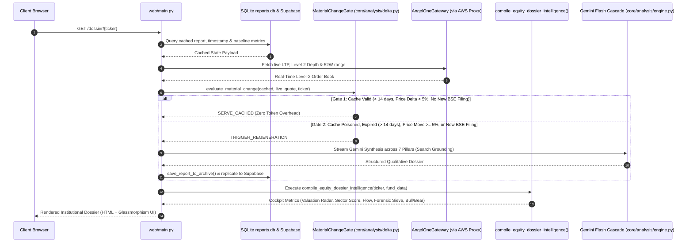
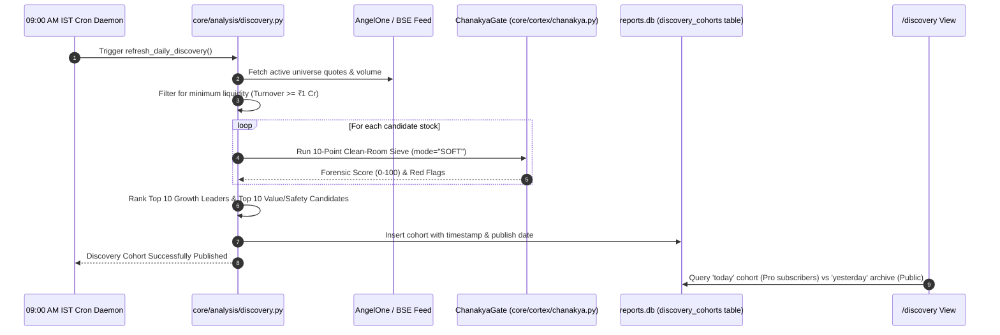
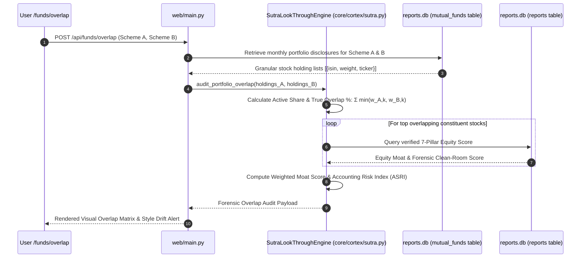

# Multi-Asset Institutional Report Evaluation Frameworks, Data Sources & Operational Flows Specification

**Document Identifier:** `docs/REPORT_EVALUATION_FRAMEWORKS.md`  
**Document Version:** 3.0.0 | **Effective Date:** 2026-10-10  
**Target System:** `Stock Research App` (`main` branch)  
**Compliance Standards:** 
* SEBI (Research Analysts) Regulations, 2014 Section 2(u) — Factual Non-Advisory Safe Harbor
* SEBI (Mutual Funds) Regulations, 1996 & SEBI Categorization Circulars
* SEBI (Issue and Listing of Non-Convertible Securities) Regulations, 2021 & OBPP Master Directions
* SEBI (Real Estate Investment Trusts) Regulations, 2014 & SEBI (SM REITs Amendment) Regulations, 2024
* Reserve Bank of India (RBI) Financial Benchmark India (FBIL) & NBFC-P2P Master Directions, 2024
* Income Tax Act, 1961 (Sections 50AA, 112A, 111A, 115UA, and 47(viic))

---

## Executive Summary & System Philosophy

Historically, the platform's evaluation framework was confined strictly to the **7 Pillars of Fundamental Equity Analysis** (evaluating business compounding, economic moats, governance, and cash flow durability). 

As the platform evolved into an **Autonomous Multi-Asset Research Platform**, the evaluation methodology expanded across **11 distinct report types** spanning Equities, Curated Discovery, Mutual Funds, Corporate Debt, Sovereign Benchmark Yields, Commercial REITs/InvITs, Index ETFs, Post-Tax Inflation Deflators, Cross-Asset Safety Radars, Peer Comparators, and the Investor Copilot.

This document serves as the **authoritative engineering and audit specification** defining:
1. **Data Sources & Ingestion Provenance** for every report created on the site.
2. **Operational End-to-End Generation & Invalidation Flows** detailing the deterministic life cycle of each report.
3. **Comprehensive Evaluation Criteria & Mathematical Formulations** across all 11 reports, including the 7 statutory equity pillars and all 12 analytical/cortex engines.

---

## 1. Master Data Sources & Provenance Matrix

Every numerical metric, order book depth, corporate filing, and regulatory disclosure on the platform is bound to cryptographically verifiable or official exchange/statutory sources:

| Report Type / Domain | Primary Ingestion Gateway | Protocol & Routing Mechanism | Secondary Fallback | Update Frequency & TTL | Legal & SEBI Provenance Status |
| :--- | :--- | :--- | :--- | :--- | :--- |
| **1. Equity Research Dossier** (`/dossier/{sym}`) | **Angel One SmartAPI Gateway** (`core/ingestion/angel_one.py`) | HTTPS REST + WebSockets via **AWS Lightsail Static Proxy** (`13.54.76.134:8888`), authenticated with pure Python RFC 6238 TOTP | **BSE Direct API** (`bse_master.py`) + `yfinance` fast_info fallback | Live L2 Depth on demand; 14-day TTL for qualitative synthesis (invalidated on $\ge 5\%$ price jump or new BSE filing) | 🟢 **STATUTORY & LICENSED**<br>Broker API session under personal client agreement + BSE public filing repository. |
| **2. Morning Discovery Screening** (`/discovery`) | **BSE India Active Scrip Master** + **Angel One Quotes** | Daily batch cron at 09:00 AM IST via AWS Static IP Proxy | Cached NSE/BSE Universe (`bse_scrips_cache.json`) | 24 Hours (re-generated daily at 09:00 AM IST prior to market open) | 🟢 **STATUTORY**<br>Official BSE/NSE master universe with deterministic Chanakya filter. |
| **3. Mutual Fund Schemes & Overlap** (`/funds`, `/funds/compare/overlap`) | **AMFI India Daily NAV API** (`NAVAll.txt`) | HTTP streaming download from `portal.amfiindia.com` (~1.5 MB text feed) | AMC Monthly Portfolio Disclosures (SEBI mandated `.xls` / `.csv`) | NAV updated daily at 23:15 IST; constituent holdings updated monthly (30-day TTL) | 🟢 **OFFICIAL STATUTORY UTILITY**<br>AMFI is the SEBI-mandated statutory authority. 100% legal immunity. |
| **4. Corporate Debt & NCDs** (`/debt`, `/debt/{sym}`) | **BSE / NSE Debt Reporting Platform** + Credit Rating Agencies (CRAs) | Direct public parser for BSE Debt Bhavcopy; CRA press releases (CRISIL, ICRA, CARE) | MCA Charge Filings & SEBI OBPP Public Registers | Daily EOD for secondary yields; immediate upon CRA rating action publication | 🟢 **REGULATORY DISCLOSURES**<br>Public CRA rating actions and exchange trade reporting logs. No private OBPP scraping. |
| **5. Sovereign Benchmark & Macro** (`/sovereign`) | **CCIL (Clearing Corp of India)** & **RBI DBIE** | FBIL daily benchmark rate sheets + MOSPI Open Data Portal (`api.mospi.gov.in`) | Hardcoded Nelson-Siegel 1Y–30Y baseline benchmark anchors | Daily at 18:00 IST upon publication of FBIL clearing cut-offs | 🟢 **SOVEREIGN PUBLIC RECORD**<br>Direct Govt of India and RBI gazette data. Zero copyright friction. |
| **6. Commercial REITs & InvITs** (`/reits`) | **BSE Listed Equities** + **AMC NDCF Filings** | Direct extraction from BSE corporate quarterly compliance reports & annual NDCF filings | SEBI Registered Valuer semi-annual reports | Quarterly upon earnings release; 90-day TTL | 🟢 **STATUTORY DISCLOSURES**<br>Mandatory SEBI REIT Regulations 2014 & SM REIT Regs 2024 disclosures. |
| **7. Index ETFs Matrix** (`/etfs`) | **NSE / BSE Exchange Live Quotes** + **AMFI Scheme Master** | Angel One SmartAPI Level-2 book + AMFI NAV feed | yfinance Fast Info | Live intraday quotes; EOD NAV for tracking error computation | 🟢 **LICENSED & STATUTORY** |
| **8. Net Real Post-Tax Deflator** (`/calculator/tax`) | **MOSPI CPI Inflation Index** + **Income Tax Department** | Direct statutory formula computation based on Finance Act 2024 / Sec 50AA, 112A | Static 2024–2025 Central Board of Direct Taxes (CBDT) tax brackets | Real-time parametric calculations (client & server-side) | 🟢 **STATUTORY FORMULA** |
| **9. Institutional Safety Radar** (`/safety-radar`) | **Cross-Asset Capital Structure Matrix** (`core/cortex/setu.py`) | Synthesized across Sovereign, Corporate Debt, REIT, and Equity registries | Internal relational DB mapping | Continuous synchronization with debt/equity databases | 🟢 **DETERMINISTIC DIAGNOSTIC** |
| **10. Equity Peer Comparator** (`/compare`) | **Dual-Binding Database** (`reports.db` + Supabase) | Multi-entity relational query with dynamic 3-axis disparity gating | Live Angel One quote enrichment | Instant cached query (< 15ms) | 🟢 **FACTUAL COMPARISON** |
| **11. Investor Copilot Drawer** (`/api/copilot/chat`) | **Google Gemini 2.5 Flash / 3.5 Flash** (via `google-genai` SDK) | REST API via HTTPS, grounded in active page context + pre-computed Cortex packets | Perplexity `sonar-pro` API fallback; rule-based deterministic fallback | Ephemeral multi-turn context; stateless server execution | 🟢 **SAFE HARBOR SECTION 2(u)**<br>Deterministic refusal of Buy/Sell inquiries; factual diagnostics only. |

---

## 2. Operational Generation & Invalidation Flows

The generation of all reports follows deterministic, audited process flows to guarantee data freshness, cost efficiency, and sub-second rendering latencies.

### 2.1 Equity Research Dossier Flow (`GET /dossier/{ticker}`)


### 2.2 Morning 9:00 AM Discovery Screening Pipeline


### 2.3 Mutual Fund 7-Pillar Look-Through & Overlap Flow


---

## 3. Comprehensive Evaluation Criteria & Formulations by Report Type

---

### Report 1: Equity Research Dossier (`/dossier/{ticker}`)

The Equity Research Dossier is the platform's flagship intelligence asset. It evaluates equities across **Two Interlocking Tiers**: (A) The Statutory 7-Pillar Qualitative Synthesis, and (B) The Deterministic Institutional Cockpit & Cortex Engines.

#### Part A: The Statutory 7-Pillar Qualitative Synthesis
Every generated equity dossier structures its narrative strictly across 7 statutory pillars to ensure zero regulatory ambiguity and eliminate hallucination:

```
┌────────────────────────────────────────────────────────────────────────────────────────┐
│                        7-PILLAR EQUITY RESEARCH SYNTHESIS                              │
└────────────────────────────────────────────────────────────────────────────────────────┘
          │                                                               │
  [PILLAR 1: MACRO & SECTOR]                                      [PILLAR 2: MOAT & POSITION]
  Geopolitical, Commodity & Demand Overlays                       Barriers to Entry, Pricing Power & TAM
          │                                                               │
  [PILLAR 3: PROMOTER & GOVERNANCE]                               [PILLAR 4: DROP DIAGNOSTIC]
  Pledging, Skin-in-the-Game & Board Integrity                    Structural vs. Temporary Drawdown
          │                                                               │
  [PILLAR 5: VALUATION & SAFETY]                                  [PILLAR 6: TECHNICAL OVERLAY]
  Historical Multiples & DCF Margin of Safety                     50-DMA, PEAD Drift & Momentum Sieve
          │                                                               │
  └───────────────────────────────► [PILLAR 7: ESG IMPACT] ◄──────────────┘
                                   Environmental, Social & Governance Audit
```

1. **Pillar 1: Macro-Economic, Geopolitical & Environmental Overlays**
   * *Objective:* Contextualizes company revenue sensitivity to interest rate corridors (RBI repo rate), currency fluctuations (USD/INR), and input raw material inflation.
   * *Diagnostic Classifications:* `[Stable | Headwinds | Neutral]`.
2. **Pillar 2: Industry Dynamics & Competitive Positioning (Economic Moat)**
   * *Objective:* Determines whether the company possesses a sustainable competitive advantage based on switching costs, network effects, cost advantages, or intangible assets (patents/brands).
   * *Diagnostic Classifications:* `[Wide Moat | Moderate Moat | Narrow / No Moat]`.
3. **Pillar 3: Promoter Quality & Fundamental Health**
   * *Objective:* Forensic audit of promoter pledging trajectory, related-party transactions (RPTs), institutional shareholding changes (FII/DII), and auditor tenure.
   * *Diagnostic Classifications:* `[Clean | Caution | High Risk]`.
4. **Pillar 4: The "Structural vs. Temporary" Drop Diagnostic**
   * *Objective:* Evaluates material share price drawdowns ($\ge 20\%$ from 52-week high) to categorize whether the impairment is a transient cyclical industry headwind or a permanent thesis break (e.g., fraud, obsolescence, loss of key customer).
   * *Diagnostic Classifications:* `[Temporary Drawdown | Structural Thesis Break | Neutral | N/A]`.
5. **Pillar 5: Valuation & Margin of Safety**
   * *Objective:* Evaluates trailing and forward valuation multiples relative to historical 5-year medians and cash flow generation.
   * *Diagnostic Classifications:* `[Undervalued | Fair Valuation | Stretched | Loss-Making]`.
6. **Pillar 6: Technical & Momentum Overlay**
   * *Objective:* Benchmarks current price relative to 50-Day and 200-Day Moving Averages, Relative Strength Index (RSI), and 60-day Post-Earnings Announcement Drift (PEAD).
   * *Diagnostic Classifications:* `[Bullish Momentum | Consolidating | Bearish Breakdown]`.
7. **Pillar 7: ESG Impact Scorecard**
   * *Objective:* Standardized 3-variable scoring table:
     * *Environmental (0-100):* Resource efficiency, emissions compliance, green transitions.
     * *Social (0-100):* Labor relations, employee turnover, community impact.
     * *Governance (0-100):* Board independence, statutory compliance, audit qualifications.
   * *Compliance Boundary:* All narrative generation strictly concludes after Pillar 7. Zero buy/sell/hold ratings, target prices, or portfolio recommendations.

---

#### Part B: Institutional Cockpit & Cortex Engines

Prior to any LLM execution, 12 high-speed deterministic engines execute against primary exchange data:

##### 1. Chanakya Clean-Room Forensic Filter (`core/cortex/chanakya.py`)
Executes 10 deterministic accounting clean-room tests, returning a Clean-Room Score ($0-100$):
1. **$CFO / EBITDA$ Realization Ratio:**
   $$\text{Realization} = \frac{\text{Cash Flow from Operations}}{\text{EBITDA}} \ge 0.35$$
   Flags aggressive revenue recognition or uncollected paper profits.
2. **Statutory Tax Drag Wedge:**
   $$\text{Effective Tax Rate} = \frac{\text{Income Tax Expense}}{\text{Profit Before Tax}} \ge 15.0\%$$
   Flags phantom profits generated through tax-exempt accounting maneuvers.
3. **Promoter Pledge Surge:**
   $$\text{Pledge Total} \le 20.0\%, \quad \Delta \text{Pledge}_{\text{QoQ}} < 3.0\%$$
   Sudden pledging spikes trigger a severe governance red flag.
4. **Auditor Stability Sieve:**
   $$\text{Auditor Replacements in Trailing 36 Months} \le 1$$
   Mid-term auditor resignations under SEBI LODR Reg 30 are penalized with a $-25$ score reduction.
5. **Contingent Liabilities Drag:**
   $$\text{Contingent Liabilities Ratio} = \frac{\text{Contingent Liabilities}}{\text{Total Tangible Net Worth}} < 50.0\%$$
6. **Related-Party Transactions (RPT) Leakage:**
   $$\text{RPT Leakage Ratio} = \frac{\text{Total Volume of Related Party Transactions}}{\text{Total Consolidated Revenues}} < 15.0\%$$
7. **Receivables vs Sales Divergence (DSO Expansion):**
   $$\Delta \text{DSO} = \text{DSO}_{\text{Current}} - \text{DSO}_{\text{Prior}} < 30 \text{ Days}$$
8. **Solvency & Coverage Health:**
   $$\text{Interest Coverage Ratio (ICR)} = \frac{\text{EBIT}}{\text{Interest Expense}} \ge 1.75\times, \quad \text{Debt-to-Equity} \le 2.0\times$$
9. **Retained Earnings & Capital Preservation:**
   $$\text{Total Tangible Net Worth} > 0 \quad (\text{Strict rejection of negative equity capital deficits})$$
10. **Institutional Market Capitalization Threshold:**
    $$\text{Market Capitalization} \ge ₹25.0 \text{ Crores}$$

##### 2. Varan Multi-Year XBRL & 3-Stage DuPont ROE Engine (`core/cortex/varan.py`)
Decomposes corporate Return on Equity (ROE) into operating efficiency, asset utilization, and financial leverage:
$$\text{ROE} = \left( \frac{\text{Net Income}}{\text{Revenue}} \right) \times \left( \frac{\text{Revenue}}{\text{Total Assets}} \right) \times \left( \frac{\text{Total Assets}}{\text{Shareholders' Equity}} \right)$$
$$\text{ROE} = \text{Net Profit Margin} \times \text{Asset Turnover} \times \text{Equity Multiplier}$$
* *Diagnostic Significance:* Detects whether rising ROE is driven by genuine margin expansion/efficiency or dangerous debt leverage.
* *Cash Conversion Cycle (CCC):*
  $$\text{CCC} = \text{Days Inventory Outstanding (DIO)} + \text{Days Sales Outstanding (DSO)} - \text{Days Payable Outstanding (DPO)}$$

##### 3. Setu Cross-Asset Capital Hierarchy & Inversion Detector (`core/cortex/setu.py`)
Audits the pricing of common equity relative to the issuer's senior debt instruments:
$$\text{Equity Free Cash Flow Yield} = \frac{\text{FCFF}}{\text{Market Capitalization}}$$
* **Capital Structure Inversion Diagnostic:**
  $$\text{If } \text{Equity FCF Yield} < \text{Senior Secured NCD Yield} \implies \text{CAPITAL STRUCTURE INVERSION ALERT}$$
  *Meaning: Investors are accepting lower cash yield on junior equity than institutional lenders demand on senior secured collateralized bonds.*

##### 4. Garuda Event-Driven BSE Micro-Snapshot Sieve (`core/cortex/garuda.py`)
Ingests real-time BSE corporate disclosures, classifying announcements via deterministic regex taxonomy to specific 7-Pillar targets (Pillar 1 to Pillar 7) without re-generating entire dossiers.

##### 5. Valuation Radar Engine (`core/analysis/valuation_radar.py`)
Triangulates intrinsic fair value range combining three independent valuation paradigms:
$$\text{Fair Value} = 0.35 \cdot V_{\text{Historical PE}} + 0.40 \cdot V_{\text{2-Stage DCF}} + 0.25 \cdot V_{\text{Graham EPV}}$$
1. **5-Year Historical Median P/E Multiple ($V_{\text{Historical PE}}$):**
   $$V_{\text{Historical PE}} = \text{EPS}_{\text{TTM}} \times \text{Median}(\text{PE}_{5\text{Y}})$$
2. **2-Stage Discounted Cash Flow ($V_{\text{2-Stage DCF}}$):**
   $$V_{\text{DCF}} = \sum_{t=1}^5 \frac{\text{FCF}_0 \cdot (1 + g_1)^t}{(1 + r)^t} + \frac{\text{FCF}_5 \cdot (1 + g_2)}{(r - g_2) \cdot (1 + r)^5}$$
   * *Clamping Rules:* $r = \max(0.10, \text{WACC})$, $g_2 = \min(0.05, \text{Terminal Growth})$, Spread $(r - g_2) \ge 0.015$.
3. **Graham Earnings Power Value ($V_{\text{Graham EPV}}$):**
   $$V_{\text{EPV}} = \frac{\text{Normalized Operating Earnings} \cdot (1 - T)}{\text{Cost of Capital}}$$
* **Margin of Safety (%):**
  $$\text{Margin of Safety} = \frac{\text{Fair Value} - \text{Current Market Price (CMP)}}{\text{Fair Value}} \times 100\%$$
  * *Undervalued:* $\text{Margin of Safety} \ge +15.0\%$
  * *Fair Value:* $-15.0\% < \text{Margin of Safety} < +15.0\%$
  * *Overvalued / Stretched:* $\text{Margin of Safety} \le -15.0\%$

##### 6. Sector-Native Scoring Engine (`core/analysis/sector_scoring.py`)
Replaces uniform ratios with sector-specialized diagnostic weights:
* **BFSI (Banks & NBFCs):** Net Interest Margin (NIM $\ge 3.5\%$), Return on Assets (RoA $\ge 1.2\%$), Gross NPA ($\le 3.0\%$), Capital Adequacy Ratio (CAR $\ge 15.0\%$).
* **IT Services:** FCF-to-PAT realization ($\ge 85\%$), Return on Capital Employed (ROCE $\ge 25\%$), LTM Attrition Rate ($\le 18\%$), Offshore-Onsite Revenue Spread.
* **Capital Goods & Infrastructure:** Asset Turnover ($\ge 1.2\times$), Order Book-to-Bill Ratio ($\ge 2.5\times$), Working Capital Days ($\le 90$).
* **Pharma & Life Sciences:** US FDA Form 483 Inspection Status (Zero Official Action Indicated - OAI), R&D Spend as % of Sales ($\ge 6.0\%$).
* **FMCG & Consumer:** Gross Margin Durability ($\ge 45\%$), Advertising-to-Sales ($\ge 7.0\%$), Working Capital Cycle ($\le 15\text{ Days}$).

##### 7. Institutional Flow Sieve (`core/analysis/institutional_flow.py`)
Ingests live Level-2 (5-tier best bid/ask) order books from Angel One SmartAPI:
* **Order Book Imbalance Ratio:**
  $$\text{Imbalance Ratio} = \frac{\sum_{i=1}^5 Q_{\text{Bid}, i} - \sum_{i=1}^5 Q_{\text{Ask}, i}}{\sum_{i=1}^5 Q_{\text{Bid}, i} + \sum_{i=1}^5 Q_{\text{Ask}, i}}$$
  * $\text{Ratio} > +0.20 \implies$ Institutional Accumulation Pressure
  * $\text{Ratio} < -0.20 \implies$ Institutional Distribution Pressure
* **True Bid-Ask Spread (basis points):**
  $$\text{Spread (bps)} = \frac{\text{Best Ask Price} - \text{Best Bid Price}}{\text{Best Bid Price}} \times 10,000$$
  * *Liquid Institutional Standard:* $\text{Spread} \le 15\text{ bps}$.
* **Circuit Freeze Buffer (%):**
  $$\text{Lower Buffer} = \frac{\text{LTP} - \text{Lower Circuit}}{\text{LTP}} \times 100\%, \quad \text{Upper Buffer} = \frac{\text{Upper Circuit} - \text{LTP}}{\text{LTP}} \times 100\%$$

##### 8. 60-Second Institutional Bull / Bear Scenario Engine (`core/analysis/bull_bear.py`)
Synthesizes a strictly balanced dual-scenario thesis:
* **Institutional Bull Case:** Catalyst 1 (Operating leverage), Catalyst 2 (Valuation multiple mean-reversion), Catalyst 3 (Market share expansion).
* **Forensic Bear Case:** Risk 1 (Input margin compression), Risk 2 (Governance / contingent liability overhang), Risk 3 (Valuation de-rating).

---

### Report 2: Morning 9:00 AM Discovery Screening Report (`/discovery`)

The Discovery report runs daily at 09:00 AM IST prior to the opening of the Indian capital markets (NSE/BSE).

* **Screening Universe:** Top 500 active Indian equities by market capitalization.
* **Pre-Screening Liquidity Gate:**
  * Median 30-Day Daily Trading Volume $\ge 50,000$ shares.
  * Daily Average Turnover $\ge ₹1.0 \text{ Crore}$.
* **Scoring & Ranking Methodology:**
  1. **Chanakya Clean-Room Soft Sieve:** Excludes companies with Clean-Room Score $< 60$ or active auditor resignations.
  2. **Capital Efficiency Score:** $\text{ROCE} \ge 15.0\%$ and $\text{ROE} \ge 14.0\%$.
  3. **Growth Velocity Score:** 3-Year Compounded Annual Revenue Growth ($\ge 12.0\%$) and EPS Growth ($\ge 15.0\%$).
  4. **Post-Earnings Drift Acceleration:** Standardized Unexpected Earnings (SUE) $> 1.0$.
* **Access Control Gate:**
  * **Today's Discovery Cohort:** Reserved exclusively for active Pro subscribers.
  * **Yesterday's Archive:** 100% accessible to public guests to showcase screening accuracy.

---

### Report 3: Mutual Fund Dossier & Overlap Report (`/funds/{key}`, `/funds/overlap`)

Evaluates mutual funds not as black-box historical performance vehicles, but through the **6-Pillar Look-Through & Fiduciary Matrix**:

```
┌────────────────────────────────────────────────────────────────────────────────────────┐
│                        6-PILLAR MUTUAL FUND LOOK-THROUGH MATRIX                        │
└────────────────────────────────────────────────────────────────────────────────────────┘
          │                                                               │
  [PILLAR 1: ASSET DECOMPOSITION]                                 [PILLAR 2: TRUE OVERLAP]
  Equity 7-Pillar + Debt 5-Pillar                                 Active Share & Cross-Scheme Dupes
          │                                                               │
  [PILLAR 3: RISK-ADJUSTED ALPHA]                                 [PILLAR 4: DOWNSIDE RESILIENCE]
  Sortino, Rolling Consistency & Hurst                            Downside Capture & Max Drawdown
          │                                                               │
  └───────────────────────────────► [PILLAR 5: COST & CHURN] ◄────────────┘
                                  Direct vs. Regular TER & Turnover Ratio
                                                  │
                                  [PILLAR 6: FIDUCIARY DRIFT]
                                  AUM Capacity Trap & Mandate Creep
```

1. **Pillar 1: Underlying Constituent Look-Through Score**
   $$\text{Fund Health Score} = W_E \sum_{i=1}^{N_E} w_i \cdot S_{\text{Equity}, i} + W_D \sum_{j=1}^{N_D} w_j \cdot S_{\text{Debt}, j} + W_C \cdot S_{\text{Cash}}$$
   * $S_{\text{Equity}, i}$: 7-Pillar Equity Score from `reports.db`.
   * $S_{\text{Debt}, j}$: 5-Pillar Credit Score from `corporate_debt` database.
2. **Pillar 2: True Diversification & Active Share**
   * **Active Share ($\text{AS}$):**
     $$\text{AS} = \frac{1}{2} \sum_{k=1}^N |w_{\text{Fund}, k} - w_{\text{Benchmark}, k}| \ge 60\% \quad (\text{Genuine Active Fund})$$
   * **Cross-Scheme Portfolio Overlap Metric (`/funds/overlap`):**
     $$\text{Overlap}(A, B) = \sum_{k} \min(w_{A, k}, w_{B, k}) \times 100\%$$
     * $\text{Overlap} \ge 65.0\% \implies$ Illusory diversification warning (paying double management fees for identical stocks).
   * **Top 10 Concentration Risk:** Combined weight $> 60.0\%$ in a multi-cap scheme triggers a concentration alert.
3. **Pillar 3: Risk-Adjusted Alpha & Consistency**
   * **Sortino Ratio (Downside Volatility Only):**
     $$\text{Sortino} = \frac{R_p - R_f}{\sigma_{\text{down}}}, \quad \sigma_{\text{down}} = \sqrt{\frac{1}{T}\sum_{t=1}^T \min(0, R_t - \tau)^2}$$
   * **Rolling 3-Year Outperformance Consistency:**
     $$\text{Consistency} = \frac{\text{Count of Rolling 3Y Windows Outperforming Benchmark}}{\text{Total Rolling Windows Evaluated}} \ge 70.0\%$$
   * **Hurst Exponent ($H$):** $H > 0.5$ indicates persistent compounding skill; $H < 0.5$ indicates mean-reverting luck.
4. **Pillar 4: Downside Capture & Crisis Resilience**
   * **Downside Capture Ratio ($\text{DCR}$):**
     $$\text{DCR} = \frac{R_{\text{Fund, Down Months}}}{R_{\text{Benchmark, Down Months}}} \times 100\% \le 75.0\%$$
   * **Upside Capture Ratio ($\text{UCR}$):** Target $\ge 100.0\%$. Capture spread $\text{UCR} - \text{DCR}$ must be positive.
5. **Pillar 5: Expense Drag & Intermediary Friction**
   * **Direct vs Regular Plan Compounded Wealth Loss:**
     $$\text{Loss}_{\text{Friction}}(t) = A_0 \left[ (1 + r - \text{TER}_{\text{Regular}})^t - (1 + r - \text{TER}_{\text{Direct}})^t \right]$$
   * **Portfolio Turnover Ratio (PTR):** $\text{PTR} > 100\%$ flags excessive trading churn.
6. **Pillar 6: Scale & Style Drift Surveillance**
   * Small-Cap Fund $\text{AUM} > ₹25,000 \text{ Cr} \implies$ Illiquidity Capacity Warning.
   * Large-Cap funds must maintain $\ge 80\%$ in top 100 stocks (SEBI Mandate).

---

### Report 4: Corporate Debt & NCD Dossier (`/debt/{symbol}`)

Fixed income analysis inverts the equity upside paradigm. The upside is contractually capped at the yield, while the downside is a 100% loss of principal.

```
┌────────────────────────────────────────────────────────────────────────────────────────┐
│                        5-PILLAR CREDIT & SOLVENCY MATRIX                               │
└────────────────────────────────────────────────────────────────────────────────────────┘
          │                                                               │
  [PILLAR 1: QUALITY]                                             [PILLAR 2: SENIORITY]
  Credit Agency Rating & Drift                                    Capital Hierarchy & Asset Cover
          │                                                               │
  [PILLAR 3: SOLVENCY]                                            [PILLAR 4: DURATION]
  Cash Coverage (ICR, DSCR, Net Debt/EBITDA)                      Macaulay, Mod Duration & Curve
          │                                                               │
  └───────────────────────────────► [PILLAR 5: RECOVERY] ◄────────────────┘
                                  Liquidity, RFQ Volumes & Pool Health
```

1. **Pillar 1: Credit Quality & Rating Drift**
   * CRA Scale: $\text{AAA} \succ \text{AA+} \succ \text{AA} \succ \text{AA-} \succ \text{A+} \succ \text{A} \succ \text{BBB} \succ \text{Below Investment Grade / D}$.
   * Credit Spread over Risk-Free Sovereign:
     $$\text{Spread} = \text{YTM}_{\text{Instrument}} - Y_{\text{G-Sec}(T)}$$
     Spread $< 100\text{ bps}$ on non-AAA paper indicates uncompensated risk; $> 500\text{ bps}$ triggers solvency distress check.
2. **Pillar 2: Capital Hierarchy & Seniority Cover**
   * Seniority Waterfall: (1) Senior Secured, (2) Senior Unsecured, (3) Subordinated Tier-II, (4) Additional Tier-1 (AT1) Perpetual.
   * **Asset Cover Ratio (ACR):**
     $$\text{ACR} = \frac{\text{Market Value of Pledged Collateral}}{\text{Total Outstanding Secured Debt}} \ge 1.25\times$$
3. **Pillar 3: Cash Flow Solvency & Coverage**
   * $\text{Interest Coverage Ratio (ICR)} = \frac{\text{EBIT}}{\text{Interest Expense}} \ge 1.80\times$.
   * $\text{Debt Service Coverage Ratio (DSCR)} = \frac{\text{FCFF} + \text{Cash Reserves}}{\text{Interest} + \text{Principal Maturing in 12M}} \ge 1.20\times$.
   * $\text{Leverage} = \frac{\text{Net Debt}}{\text{TTM EBITDA}} \le 4.0\times$.
4. **Pillar 4: Duration & Interest Rate Sensitivity**
   * Macaulay Duration ($D_{\text{mac}}$) and Modified Duration ($D_{\text{mod}} = \frac{D_{\text{mac}}}{1 + y/k}$).
   * Rate Shock Capital Impact: $\frac{\Delta P}{P} \approx -D_{\text{mod}} \cdot \Delta y + \frac{1}{2} C (\Delta y)^2$.
5. **Pillar 5: Recovery Reality & Pool Health**
   * Historical IBC recovery rates by sector; First Loss Default Guarantee (FLDG) buffer for Securitized Debt Instruments (SDIs).

---

### Report 5: Sovereign Benchmark & Macro Yield Curve (`/sovereign`)

* **Nelson-Siegel Yield Curve Interpolation:**
  $$y(m) = \beta_0 + \beta_1 \left( \frac{1 - e^{-m/\tau}}{m/\tau} \right) + \beta_2 \left( \frac{1 - e^{-m/\tau}}{m/\tau} - e^{-m/\tau} \right)$$
  Fits the continuous Indian sovereign yield curve across 91D, 182D, 364D, 2Y, 5Y, 10Y, and 30Y points.
* **Term Premium Spread:**
  $$\text{Curve Slope} = Y_{\text{10Y G-Sec}} - Y_{\text{91D T-Bill}}$$
  Inversion ($\text{Slope} < 0$) indicates acute economic slowdown or liquidity squeeze.
* **State Development Loan (SDL) Disparity Matrix:**
  Audits 10-year SDL yields against state fiscal deficits and Debt-to-GSDP ratios.
* **Real Post-Inflation Yield:**
  $$\text{Real Yield} = Y_{\text{10Y G-Sec}} - \text{MOSPI CPI Inflation}$$

---

### Report 6: Commercial REITs & InvITs Dossier (`/reits`)

Evaluates listed commercial real estate under the SEBI REIT Regulations and March 2024 SM REIT framework:

| Evaluation Pillar | Primary Metric | Regulatory / Institutional Benchmark | Diagnostic Significance |
| :--- | :--- | :--- | :--- |
| **1. Asset Completion & Occupancy** | Operating Portfolio Occupancy % | $\ge 90.0\%$ (SM REIT mandate $\ge 95\%$) | Eliminates construction/execution delivery risk. |
| **2. Payout Purity (NDCF)** | Upstreaming Ratio | $\ge 90.0\%$ of Net Distributable Cash Flow | Guarantees contractual quarterly rental distributions. |
| **3. Tenant Moat & WALE** | Weighted Average Lease Expiry | $\text{WALE} \ge 4.5 \text{ Years}$; Top 3 Tenants $< 40\%$ | Guards against sudden multi-floor vacancy shock. |
| **4. Leverage Headroom** | Loan-to-Value (LTV) Ratio | $\text{LTV} \le 49.0\%$ (SEBI ceiling) | Protects equity unitholders from rising interest costs. |
| **5. Cap Rate Spread** | Net Capitalization Rate vs 10Y G-Sec | $\text{Cap Rate} \ge Y_{\text{10Y G-Sec}} + 150 \text{ bps}$ | Enforces positive risk premium over sovereign debt. |

* **Section 115UA 4-Part Post-Tax Distribution Waterfall:**
  Breaks distributions into 4 statutory components:
  1. *Interest:* Taxable at investor's marginal slab rate.
  2. *Dividend:* Tax-exempt if SPV did not opt for Sec 115BAA; else slab rate.
  3. *Rental Income:* Taxable at investor's marginal slab rate.
  4. *Repayment of Capital:* Subject to Section 56(2)(xii) tax on excess distribution over issue price.

---

### Report 7: Index ETF Matrix Report (`/etfs`)

* **Tracking Error ($\text{TE}$):**
  $$\text{TE} = \sqrt{\frac{1}{n-1} \sum_{t=1}^n (R_{\text{ETF}, t} - R_{\text{Index}, t} - \overline{\Delta})^2} \le 0.25\%$$
* **Tracking Difference ($\text{TD}$):**
  $$\text{TD} = R_{\text{ETF, Period}} - R_{\text{Index, Period}}$$
* **Intraday NAV Spread:**
  $$\text{NAV Spread (bps)} = \frac{|\text{CMP} - \text{iNAV}|}{\text{iNAV}} \times 10,000 \le 25\text{ bps}$$

---

### Report 8: Net Real Post-Tax Return Deflator (`/calculator/tax`)

Calculates purchasing power preservation factoring in inflation and statutory tax codes:
$$R_{\text{real}} = \frac{1 + R_{\text{nominal}} \cdot (1 - T)}{1 + \pi_{\text{CPI}}} - 1$$
Where:
* $T_{\text{Debt}}$: Marginal Slab Rate up to $39.0\%$ under Section 50AA.
* $T_{\text{Equity LTCG}}$: $12.5\%$ above ₹1.25 Lakh exemption under Section 112A.
* $T_{\text{Equity STCG}}$: $20.0\%$ under Section 111A.
* $T_{\text{SGB}}$: $0.0\%$ capital gains tax at maturity under Section 47(viic) $+ 2.5\%$ annual coupon (taxed at slab).
* $\pi_{\text{CPI}}$: Current MOSPI Consumer Price Index inflation rate.

---

### Report 9: Institutional Safety Radar Report (`/safety-radar`)

Classifies assets across a **6-Tier Capital Seniority Waterfall**:
1. *Tier 1: Sovereign Debt (T-Bills, G-Secs, SGBs)* — Sovereign guarantee, 0% default probability, liquidation rank #1.
2. *Tier 2: Senior Secured Corporate NCDs* — Tangible asset charge with MCA, recovery rank #2.
3. *Tier 3: Securitized Debt Instruments (SDIs) & Insured Bank FDs* — Bankruptcy-remote pool / DICGC insurance up to ₹5 Lakh.
4. *Tier 4: Commercial REITs & InvITs* — Contractual rental NDCF upstreaming; max 49% debt ceiling.
5. *Tier 5: Debt Mutual Funds* — Open-ended pooled credit risk with duration/mark-to-market exposure.
6. *Tier 6: Common Equity* — Residual cash flow claim; 100% principal at risk in bankruptcy.

---

### Report 10: Multi-Company Comparator Report (`/compare`)

Enforces **3-Axis Disparity Gates** to prevent comparing structurally mismatched companies:
1. **Sector/Business Model Gate:** Mismatched sectors (e.g., Banking vs SaaS) suppress non-comparable multiples (EV/EBITDA, P/B) and highlight universal cash metrics: Return on Invested Capital (ROIC), Free Cash Flow Yield, and 3-Year Revenue CAGR.
2. **Lifecycle Stage Gate:** Flags comparing unprofitable high-burn growth assets ($P/E < 0$) against mature dividend-paying blue chips.
3. **Scale Divergence Gate:** Flags a $\ge 100\times$ divergence in market cap.

---

### Report 11: Investor Copilot Drawer (`/api/copilot/chat`)

* **Grounded Context Ingestion:** Interrogates active screen metrics, 7-pillar qualitative matrices, and Cortex packets.
* **Deterministic Fallback:** If upstream LLM experiences 403 or quota limits, falls back to structured rule-based financial explanations.
* **SEBI Section 2(u) Mandatory Deflection:** Intercepts explicit "Should I buy/sell?" queries, deflecting into Pre-Mortem inversion diagnostics and risk factor evaluations.

---

## 4. Maintenance & Audit Verification Protocol

1. **Audit Traceability:** Every change to these evaluation criteria must update the Version Header of this document and add an entry in `docs/MASTER_ENGINEERING_MANUAL.md`.
2. **Regression Assertions:** All mathematical thresholds must be verified continuously by running the adversarial stress suite:
   ```bash
   python3 -m unittest discover -s tests
   ```
3. **Rollback & Checkpoint Verification:**
   ```bash
   ./run.sh check
   ./run.sh backup
   ./run.sh checkpoint
   ```
