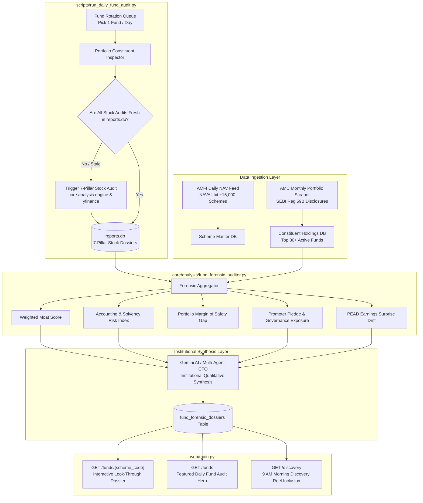

# Mutual Fund Forensic Look-Through Architecture & Daily Autonomous Audit Engine

**Document Identifier:** `docs/mutual_fund_forensic_lookthrough_architecture.md`  
**Architectural Scope:** Mutual Fund Portfolio Decomposition, 7-Pillar Stock Look-Through Synthesis, Daily Rotating Fund Audit Worker, and AMC Disclosure Scraping  
**Status:** Institutional Design Specification & Implementation Roadmap  
**Target Audience:** Fundamental Researchers, Mutual Fund Allocators, Wealth Managers & Platform Engineers  

---

## 1. Executive Summary & Problem Diagnosis

### The Commodity "Data-Based" Trap in Mutual Fund Research
Traditional Indian platforms (Value Research, Moneycontrol, Morningstar India, Groww, Zerodha Coin) treat mutual funds as black-box performance vehicles. They report trailing 1Y/3Y/5Y returns, Sharpe ratios, sector percentages, and list the top 10 holdings with static weights. This quantitative reporting creates severe blind spots:
1. **Blindness to Underlying Accounting & Forensic Risk:** A mutual fund can appear to have outstanding 3-year returns while heavily exposed to aggressive revenue recognition, unhedged promoter pledging, or severe corporate governance vulnerabilities (e.g. historic fund holdings in Zee, DHFL, Yes Bank, IL&FS, Paytm, or Adani Group during peak scrutiny).
2. **The "Nominal Mandate Mirage":** A fund marketed as a "Conservative Value Fund" may actually hold frothy, momentum-driven equities trading at 90x P/E with negative free cash flows, while an "Aggressive Growth Fund" may be quietly hugging the Nifty 50 benchmark (Closet Indexing).
3. **Disconnection from Deep Equity Research:** While our platform has built a rigorous **7-Pillar Forensic Audit Engine** (evaluating Economic Moat, Capital Allocation, Forensic Solvency/Beneish M-Score, Industry Tailwinds, Margin of Safety, Technical/PEAD 60-day drift, and Management Integrity), the mutual fund module currently treats stocks as hardcoded baseline scores (e.g. `score = 82`) rather than leveraging our deep equity dossiers!
4. **Universe Constriction (Only 6 Funds Seeded):** AMFI's statutory `NAVAll.txt` feed provides ~15,000 daily scheme NAVs, but **zero constituent holdings**. Because portfolio holdings are published separately by AMCs on a monthly basis under SEBI Regulation 59B, our local repository previously only seeded 6 hand-compiled benchmark funds.

---

## 2. The Core Solution: Forensic Look-Through & Daily Fund Audit Engine

We bridge the gap between fund-level macro data and company-level forensic audits:
- **Expand the Portfolio Universe:** Seed **30+ marquee Indian equity, hybrid, and ELSS funds** across the top 12 fund houses (PPFAS, HDFC, SBI, ICICI Prudential, Mirae, Nippon India, Kotak, Axis, Quant, Motilal Oswal, DSP, Bandhan) and engineer an automated monthly AMC portfolio disclosure scraper.
- **True 7-Pillar Portfolio Look-Through:** Traverse constituent holdings and compute weighted forensic metrics using real equity dossiers from `reports.db`:
  - **Weighted Economic Moat Index:** % of fund capital in Wide Moat vs. No Moat businesses.
  - **Portfolio Forensic Solvency & Accounting Risk:** Weighted Beneish M-Score risk, Cash Flow quality, and debt service coverage.
  - **Intrinsic Value Margin of Safety Gap:** Aggregated intrinsic DCF discount vs. market price froth.
  - **Promoter Pledging & Governance Exposure:** % of fund capital exposed to high-pledge or qualified auditor entities.
  - **PEAD Earnings Drift Momentum:** Net Standardized Unexpected Earnings (SUE) direction across top 10 holdings.
- **The "One Fund a Day" Autonomous Audit Worker:**
  - An autonomous background worker runs daily at midnight (or on-demand).
  - It selects the next scheduled fund on the audit queue.
  - Recursively verifies that all constituent stocks have fresh 7-pillar audits (triggering the stock engine if missing).
  - Synthesizes an institutional, zero-condescension **"Mutual Fund Forensic Dossier"** using Gemini AI and multi-agent CFO analysis.
  - Archives the synthesized dossier in `reports.db` (`fund_forensic_dossiers`) and publishes it as the **Featured Daily Fund Audit** on `/funds` and `/discovery`.

---

## 3. System Architecture & Information Flow

---

## 4. Mathematical & Forensic Formulation

Let a mutual fund $F$ possess constituent holdings $\{H_1, H_2, \dots, H_N\}$ with weights $w_i \in (0, 100]$ such that $\sum_{i=1}^N w_i = 100\%$.

### 1. Covered Equity Weight
Let $\mathcal{E}$ be the set of domestic equity holdings for which a verified 7-Pillar report exists in `reports.db`:
$$W_{\mathcal{E}} = \sum_{i \in \mathcal{E}} w_i$$
A look-through audit requires $W_{\mathcal{E}} \ge 75\%$ of the fund's equity sleeve to be grounded in verified forensic dossiers before generating institutional synthesis.

### 2. Weighted Forensic Health Score
Let $S_i \in [0, 100]$ be the composite 7-Pillar Health Score of company $i$:
$$\bar{S}_{\text{fund}} = \frac{\sum_{i \in \mathcal{E}} w_i S_i}{W_{\mathcal{E}}}$$

### 3. Portfolio Accounting & Solvency Risk Index (ASRI)
Let $\alpha_i \in [0, 100]$ represent the forensic accounting manipulation risk of company $i$ derived from Beneish M-Score, CFO-to-EBITDA divergence, and auditor qualifications:
$$\text{ASRI} = \sum_{i \in \mathcal{E}} w_i \times \mathbb{I}(\alpha_i \ge \text{Risk Threshold})$$
- $\text{ASRI} \le 5\%$: **Institutional Prudence** (Minimal accounting or solvency vulnerability).
- $5\% < \text{ASRI} \le 15\%$: **Moderate Exposure** (Monitor specific mid-cap debt/governance flags).
- $\text{ASRI} > 15\%$: **Fiduciary Warning** (Elevated portfolio capital exposed to distressed or aggressive accounting entities).

### 4. Portfolio Margin of Safety vs. Intrinsic Value
Let $\text{MoS}_i = \frac{V_{\text{intrinsic}, i} - P_{\text{market}, i}}{P_{\text{market}, i}} \times 100\%$ be the DCF intrinsic value discount:
$$\bar{\text{MoS}}_{\text{fund}} = \frac{\sum_{i \in \mathcal{E}} w_i \text{MoS}_i}{W_{\mathcal{E}}}$$
- Positive $\bar{\text{MoS}}_{\text{fund}}$ indicates the fund manager is buying businesses at a discount to intrinsic value.
- Negative $\bar{\text{MoS}}_{\text{fund}} < -25\%$ indicates significant valuation froth, where unitholders are paying for speculative momentum.

### 5. Promoter Pledging & Governance Risk Exposure
Let $\text{Pledge}_i$ be the percentage of promoter shares pledged as collateral:
$$\text{GovRisk}_{\text{pledge}} = \sum_{i \in \mathcal{E}} w_i \times \mathbb{I}(\text{Pledge}_i > 10\%)$$
Detects hidden promoter leverage and margin call liquidity risks within fund portfolios.

---

## 5. The "One Fund a Day" Audit Workflow

### Daily Rotation Schedule
1. **Selection:** The system maintains a queue of all active funds in `mutual_fund_schemes`. Every day at 00:30 IST, it selects the fund with the oldest audit timestamp (`last_forensic_audit_at`).
2. **Constituent Deep-Dive:**
   - Retrieves the fund's top 30 holdings.
   - For every equity ticker $T_i$, queries `reports.db`. If a report is absent or older than 30 days, triggers `analyze_equity(T_i)` to generate a full 7-pillar model and store it in `reports.db`.
3. **Forensic Look-Through Computation:**
   - Aggregates Weighted Moat, ASRI, Margin of Safety, Promoter Pledging, and PEAD earnings momentum.
4. **Qualitative Multi-Agent / Gemini AI Synthesis:**
   - Calls the synthesis engine with the aggregated portfolio metrics and constituent dossiers.
   - Generates 4 structured analytical sections:
     - **Section A: Mandate vs. Reality Audit:** Does the fund manager's stated style (e.g. Value, Growth, Quality) match the portfolio's actual forensic characteristics?
     - **Section B: Hidden Concentration & Vulnerability Vector:** Identifies the top 3 most vulnerable holdings in the fund by accounting or solvency risk.
     - **Section C: True Active Share vs. Fee Drag:** Evaluates whether the fund's Active Share justifies its Direct and Regular Total Expense Ratio (TER).
     - **Section D: Pre-Mortem Scenario Analysis:** Identifies the macro or regulatory shock that would trigger catastrophic underperformance for this specific portfolio.
5. **Publishing & Notifications:**
   - Commits the completed audit to `fund_forensic_dossiers`.
   - Surfaces it on the homepage `/funds` banner as the **"Featured Daily Fund Audit"**.
   - Archives the audit in the 9 AM Discovery Reel.

---

## 6. Expanded Curated Universe (30+ Marquee Funds)

To ensure the directory immediately covers India's most popular funds, we expand the universe across all core SEBI categories:

| Category | Fund Code / Identifier | Scheme Name | Flagship Manager |
| :--- | :--- | :--- | :--- |
| **Flexi Cap** | `PPFAS_FLEXICAP_DIR` | Parag Parikh Flexi Cap Fund | Rajeev Thakkar |
| **Flexi Cap** | `HDFC_FLEXICAP_DIR` | HDFC Flexi Cap Fund | Roshi Jain |
| **Flexi Cap** | `KOTAK_FLEXICAP_DIR` | Kotak Flexicap Fund | Harsha Upadhyaya |
| **Large Cap** | `MIRAE_LARGECAP_DIR` | Mirae Asset Large Cap Fund | Gaurav Misra |
| **Large Cap** | `ICICI_BLUECHIP_DIR` | ICICI Prudential Bluechip Fund | Anish Tawakley |
| **Large Cap** | `NIPPON_LARGECAP_DIR`| Nippon India Large Cap Fund | Sailesh Raj Bhan |
| **Large & Mid Cap** | `SBI_LARGEMID_DIR` | SBI Large & Midcap Fund | Saurabh Pant |
| **Large & Mid Cap** | `MOTILAL_LARGEMID_DIR`| Motilal Oswal Large and Midcap Fund | Ajay Khandelwal |
| **Mid Cap** | `HDFC_MIDCAP_DIR` | HDFC Mid-Cap Opportunities Fund | Chirag Setalvad |
| **Mid Cap** | `KOTAK_EMERGING_DIR` | Kotak Emerging Equity Fund | Pankaj Tibrewal |
| **Mid Cap** | `MOTILAL_MIDCAP_DIR` | Motilal Oswal Midcap Fund | Niket Shah |
| **Small Cap** | `SBI_SMALLCAP_DIR` | SBI Small Cap Fund | R. Srinivasan |
| **Small Cap** | `NIPPON_SMALLCAP_DIR`| Nippon India Small Cap Fund | Samir Rachh |
| **Small Cap** | `HDFC_SMALLCAP_DIR` | HDFC Small Cap Fund | Chirag Setalvad |
| **Multi Cap** | `NIPPON_MULTICAP_DIR`| Nippon India Multi Cap Fund | Sailesh Raj Bhan |
| **Multi Cap** | `ICICI_MULTICAP_DIR` | ICICI Prudential Multicap Fund | Sankaran Naren |
| **Focused** | `SBI_FOCUSED_DIR` | SBI Focused Equity Fund | R. Srinivasan |
| **Focused** | `HDFC_FOCUSED_DIR` | HDFC Focused 30 Fund | Roshi Jain |
| **Value / Contra** | `SBI_CONTRA_DIR` | SBI Contra Fund | Dinesh Balachandran |
| **Value / Contra** | `ICICI_VALUE_DIR` | ICICI Prudential Value Discovery Fund | Sankaran Naren |
| **ELSS (Tax Saver)**| `MIRAE_ELSS_DIR` | Mirae Asset ELSS Tax Saver Fund | Neelesh Surana |
| **ELSS (Tax Saver)**| `QUANT_ELSS_DIR` | Quant ELSS Tax Saver Fund | Sandeep Tandon |
| **Hybrid (BAF)** | `ICICI_BAF_DIR` | ICICI Prudential Balanced Advantage | Sankaran Naren |
| **Hybrid (BAF)** | `EDELWEISS_BAF_DIR` | Edelweiss Balanced Advantage Fund | Bhavesh Jain |
| **Arbitrage** | `KOTAK_ARBITRAGE_DIR`| Kotak Equity Arbitrage Fund | Hiten Shah |
| **Corporate Debt**| `ABSL_CORPBOND_DIR` | Aditya Birla Sun Life Corporate Bond | Kaustubh Gupta |
| **Banking & PSU** | `HDFC_BANKPSU_DIR` | HDFC Banking and PSU Debt Fund | Anil Bamboli |
| **Liquid / Money**| `SBI_LIQUID_DIR` | SBI Liquid Fund | Ardhendu Bhattacharya |

---

## 7. Phased Implementation Roadmap

### Phase 1: Database Expansion & Model Architecture
- Create database migration `v021_fund_forensic_dossiers` in `core/db/connection.py` creating:
  - `fund_forensic_dossiers` (stores synthesized AI qualitative reports, weighted moat score, ASRI index, intrinsic MoS gap, last audit date).
- Expand `DEFAULT_MUTUAL_FUNDS` in `core/db/mutual_funds.py` with the 28 new marquee funds and their constituent portfolios.

### Phase 2: Forensic Look-Through Engine (`core/analysis/fund_forensic_auditor.py`)
- Build `compute_fund_forensic_lookthrough(scheme_code)`:
  - Traverses holdings, queries `reports.db` for each stock's 7-pillar report.
  - Extracts and computes weighted Moat, Beneish M-Score risk, Intrinsic Valuation discount, and Promoter Pledge %.
  - Identifies top 3 risky constituents and top 3 anchor quality compounders.

### Phase 3: Daily Fund Audit Worker & Gemini AI Synthesis
- Build `audit_single_fund_daily(scheme_code=None)` in `core/analysis/fund_forensic_auditor.py` and CLI script `scripts/run_daily_fund_audit.py`.
- Formulate prompt template for Gemini AI producing institutional qualitative synthesis.
- Expose admin endpoint `POST /api/admin/run-fund-audit` allowing manual triggering or specific scheme auditing.

### Phase 4: UI & Template Overhaul
- Update `web/templates/fund_dossier.html`:
  - Surfacing the new **Forensic Look-Through Workspace** (Weighted Moat bar, ASRI Accounting Risk meter, Intrinsic MoS gap).
  - Rendering the narrative AI-synthesized audit report (Mandate vs Reality, Hidden Vulnerabilities, Fee Justification).
- Update `web/templates/fund_directory.html`:
  - Highlighting the **Featured Daily Fund Audit** hero card.
  - Adding category tabs for the expanded 30+ universe.
- Create automated test suite `tests/test_fund_forensic_auditor.py`.
