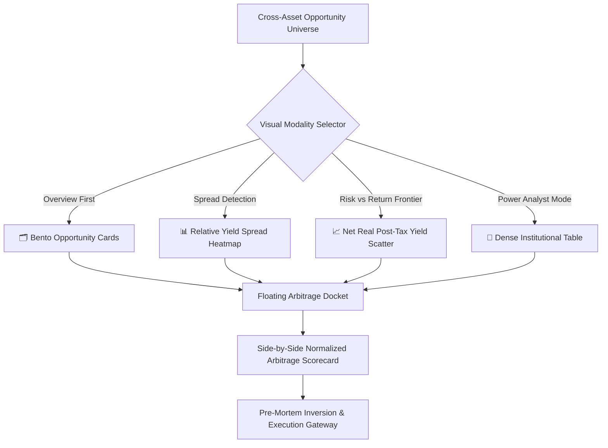

# Multi-Asset Opportunity Consumption Architecture & Visual Discovery Terminal

**Document Identifier:** `docs/opportunity_consumption_architecture.md`  
**Architectural Scope:** Platform-Wide Opportunity Discovery, Visual Hierarchy, Multi-Asset Normalization & Cognitive Ergonomics  
**Status:** Institutional Design Specification & Implementation Roadmap  
**Target Audience:** Fundamental Researchers, Family Office Allocators, HNI Investors & Platform Engineers  

---

## Executive Summary & Problem Formulation

### The "Plain Jane List" Pathology in Modern Wealth Platforms
Traditional Indian financial platforms (such as stock screeners, bond portals, and mutual fund aggregators) treat investment discovery as a database query problem, outputting undifferentiated, flat tabular lists. While flat lists work adequately for a homogeneous universe of 20 stocks, they completely break down in a multi-asset environment spanning:
1. **Listed Equities:** 7-Pillar forensic health scores, PEAD 60-day drift corridors, intrinsic value margins of safety.
2. **Corporate Bonds & Securitized Debt (SDIs):** YTM, coupon schedules, Macaulay duration, seniority tiers, credit rating drift.
3. **Alternative Real Assets (SM REITs & InvITs):** NDCF cash distributions, asset occupancy, LTV leverage caps, Section 115UA tax components.
4. **Sovereign Gold Bonds (SGBs):** Secondary market discounts vs. spot 24K gold, annual coupons, Section 47(viic) 100% tax exemptions.
5. **Sovereign Par Yield Curve & T-Bills:** Risk-free term structures (91D to 50Y), RBI repo corridor, state development loan (SDL) spreads.
6. **National ETFs & Mutual Funds:** Tracking error, NAV discount/premium, AMFI rolling returns, expense ratio fee drag.

When an investor navigates across these heterogeneous instruments via flat lists:
- **Cognitive Exhaustion & List Fatigue:** The user is forced to scroll through hundreds of rows, squinting across disparate column headers with no visual cues for risk or relative magnitude.
- **The "False Equivalence" & Tax Trap:** A 10.50% NBFC bond appears visibly superior to a 7.20% SGB or an 8.00% SM REIT in a flat table. However, under the 39% maximum marginal tax slab, the corporate bond delivers **6.40% net in hand**, while the SGB delivers **9.70% effective annualized tax-free return**, and the REIT delivers a blended **7.40% post-tax return** via Return of Capital (RoC). Flat lists mask this statutory reality.
- **Inability to Assess the Cross-Asset Risk Frontier:** Users cannot visually determine whether an extra 150 bps of yield requires taking senior secured mortgage risk, unsecured subordinated risk, or equity duration risk.

---

## Behavioral UI/UX Framework: Cognitive Prosthetics

In strict adherence to the platform's behavioral research foundation (`docs/Equity Researcher Behavioral UI_UX.md`), the Opportunity Terminal is engineered around **Ben Shneiderman’s Visual Information-Seeking Mantra**:
> *"Overview first, zoom and filter, then details-on-demand."*



### Cognitive Interventions Applied
1. **De-Anchoring from Nominal Yield:** The terminal dynamically recalculates and displays **Net Real Return** (Nominal Yield minus Personal Slab Tax minus MOSPI CPI Inflation) using live interactive sliders.
2. **Color Scarcity:** Base user interfaces maintain a dark, low-luminescence canvas (`#0f172a`, `#1e293b`). Saturated colors are strictly reserved for statutory alerts (Amber for rating drift, Red for capital breach / negative spread, Emerald for tax-free sovereign alpha).
3. **Tabular Lining Numerals (`tnum`):** All financial figures, basis point spreads, and percentages enforce fixed-width alignment, eliminating horizontal eye jitter.

---

## The Four Core Visual Modalities

The user can toggle between four views with a single keystroke (`1`, `2`, `3`, `4`) or header switchers, without page reload or state loss.

### 1. 🗂️ Bento Opportunity Cards (High-Density Grid View)
Designed for scanning and high visual comprehension. Each card represents an instrument encapsulated in an information-dense bento module.

```
+-----------------------------------------------------------------------+
| [🛡️ Senior Secured]  [AAA Crisil]         [📌 Pin to Docket] [⚡ Audit] |
| NTPC GREEN ENERGY 7.45% 2028 (INE003A08012)                           |
+-----------------------------------------------------------------------+
| Gross YTM: 7.75%  |  Spread over 10Y G-Sec: +65 bps  | Min: ₹10,000   |
+-----------------------------------------------------------------------+
| In-Cell Yield Waterfall Sparkbar:                                     |
| [████████████████████████████████████████] Gross: 7.75%               |
| [██████████████████████░░░░░░░░░░░░░░░░░░] Post-Tax (30%): 5.42%      |
| [██████████░░░░░░░░░░░░░░░░░░░░░░░░░░░░░░] Real (Net of 4.5% CPI): 0.92% |
+-----------------------------------------------------------------------+
| Recovery Recourse: 1.25x First Pari-Passu Charge on Renewable Assets  |
| Liquidity Tier: NSE RFQ Active (T+1) | Duration: 3.12 Yrs             |
+-----------------------------------------------------------------------+
```

#### In-Card Elements:
- **Header Badges:** Instrument Subtype, Seniority Tier, Statutory Rating, 1-Click Pinning button.
- **Yield Waterfall Sparkbar:** An SVG micro-chart visually breaking down:
  $$\text{Nominal YTM} \longrightarrow \text{Tax Drag (User Slab)} \longrightarrow \text{Net Real Return (Adjusted for CPI)}$$
- **Forensic Highlights:** Collateral security cover, statutory tax statute, duration risk, and redemption mechanism.

---

### 2. 📊 Multi-Asset Yield Spread Heatmap Matrix
Designed for 3-second anomaly detection across the fixed-income, debt, real asset, and equity universe.

```
       [ 0-1 Yr ]      [ 1-3 Yrs ]      [ 3-5 Yrs ]      [ 5-10 Yrs ]     [ 10Y+ ]
+-----------------------------------------------------------------------------------+
| Sovereign    | T-Bills 91D    | G-Sec 2027     | G-Sec 2029     | G-Sec 10Y      | G-Sec 40Y      |
| Benchmark    | 6.48% (0 bps)  | 6.82% (+12 bps)| 7.02% (+8 bps) | 7.10% (BENCH)  | 7.28% (+18 bps)|
+-----------------------------------------------------------------------------------+
| Sovereign    | SGB 2025-I     | SGB 2027-IV    | SGB 2029-I     | SGB 2032-VI    | --             |
| Gold Bonds   | 8.85% (+237 bps| 8.20% (+138 bps| 7.95% (+93 bps)| 7.60% (+50 bps)| Tax-Free Sec47 |
+-----------------------------------------------------------------------------------+
| PSU AAA      | REC 3M CP      | PFC 7.20% 2027 | IRFC 7.40% 2029| NHAI 7.65% 2034| NTPC Perp      |
| Bonds        | 6.95% (+47 bps)| 7.42% (+60 bps)| 7.58% (+56 bps)| 7.72% (+62 bps)| 8.10% (+100 bps|
+-----------------------------------------------------------------------------------+
| Senior Priv. | Bajaj Fin CP   | Muthoot 8.25%  | L&T Fin 8.40%  | Shriram 8.90%  | Piramal 9.20%  |
| Corporate    | 7.40% (+92 bps)| 8.15% (+133 bps| 8.35% (+133 bps| 8.80% (+170 bps| 9.15% (+205 bps|
+-----------------------------------------------------------------------------------+
| SM REITs &   | --             | Strata Prime   | PropShare Plat | Embassy REIT   | IndiGrid InvIT |
| Real Assets  |                | 8.80% (+198 bps| 9.10% (+208 bps| 7.45% (+35 bps)| 10.20% (+310bps|
+-----------------------------------------------------------------------------------+
| SDIs (Asset- | Grip LeaseX    | Wint InvoiceX  | Finzy P2P Pool | --             | --             |
| Backed)      | 10.50% (+402bps| 11.20% (+438bps| 12.00% (+498bp|                |                |
+-----------------------------------------------------------------------------------+
```

#### Heatmap Mechanics:
- **Color Temperature Gradient:** Spread over 10Y G-Sec (+0 bps = Deep Slate, +100 bps = Soft Indigo, +250 bps = Amber, +450 bps = Violet, Negative Spread = Warning Rose).
- **Instant Anomaly Flagging:** If an instrument with lower seniority (e.g. Subordinated Tier-II) offers a lower spread than an adjacent Senior Secured PSU bond, it is outlined with an amber alert box (Negative Risk Compensation).

---

### 3. 📈 Risk vs. Net Real Post-Tax Yield Scatter Frontier
An interactive, dynamic Chart.js canvas plotting all investment opportunities on a unified risk-reward landscape.

```
Net Real Post-Tax Yield (%)
  ^
10|                                  [Wint InvoiceX SDI]
  |
 8|            [SGB 2027-IV]                       [IndiGrid InvIT]
  |              (Tax-Free)
 6|                                  [Shriram Fin NCD]    [Strata SM REIT]
  |    [T-Bills 364D]  [NTPC Green]
 4|          [G-Sec 10Y]
  |
 2|------------------------------------------------------- [HDFC Flexicap MF]
  |                                                          (Equity Risk)
 0+------------------------------------------------------------------------>
  0             1             2             3             4             5
 Sovereign    AAA PSU     Senior Sec    Sub/Tier-II    SM REIT      Equities
                         [ Capital Seniority & Risk Tier ]
```

#### Interactive Canvas Parameters:
1. **X-Axis:** Seniority & Risk Tier (Tier 0: Sovereign / RBI Direct $\to$ Tier 1: AAA PSU / Quasi-Sovereign $\to$ Tier 2: Senior Secured Corporate $\to$ Tier 3: Subordinated Tier-II / SDIs $\to$ Tier 4: SM REITs / InvITs $\to$ Tier 5: Direct Equities).
2. **Y-Axis:** Net Real Post-Tax Yield:
   $$Y_{\text{net\_real}} = Y_{\text{gross}} \times (1 - T_{\text{eff}}) - \pi_{\text{CPI}}$$
   - Where $T_{\text{eff}}$ is determined by the selected tax regime and statutory statute:
     - SGBs: $T_{\text{eff}} = 0\%$ (Section 47(viic)) on redemption capital gains; annual 2.5% coupon at slab.
     - SM REITs / InvITs: $T_{\text{eff}}$ calculated via Section 115UA waterfall (Interest + Dividend + RoC blended).
     - Corporate Bonds & SDIs: $T_{\text{eff}} = T_{\text{slab}}$ (Section 50AA unlisted/listed debt rules).
     - Equities & Equity MFs: Long-term capital gains at 12.5% under Section 112A.
3. **Bubble Diameter:** Sized logarithmically by Minimum Ticket Size:
   - ₹100 (Mutual Funds / ETFs) $\longrightarrow$ Compact Dot
   - ₹10,000 (Democratized Bonds) $\longrightarrow$ Medium Bubble
   - ₹10,00,000 (SEBI SM REITs) $\longrightarrow$ Prominent Disk
4. **Live Controls:**
   - Tax Bracket Switcher: `0%` | `20%` | `30%` | `39% (HNI Surcharge)`
   - Inflation Adjuster Slider: `3.0%` to `7.0%` (Default: MOSPI CPI 4.5%)
   - Tenure Filter: `All` | `< 1 Yr` | `1–3 Yrs` | `3–5 Yrs` | `5+ Yrs`

---

### 4. 📑 Dense Institutional Table (Power Analyst Mode)
For power users who demand sub-second data sorting and custom multi-column filtering.

#### Table Features:
- **Sticky Column Headers:** Symbol, Instrument, Asset Class, Gross Yield, Net Post-Tax Yield, Spread (bps), Duration, Rating, Min Ticket.
- **Tabular Lining Typography:** Clean numerical comparisons without jagged alignment.
- **Column Customizer Drawer:** Enable/disable columns (e.g. hide ISIN, show NDCF Payout, show Amihud Liquidity).
- **Export Capabilities:** 1-Click export to CSV or JSON with active filter state preserved.

---

## The Cross-Asset Arbitrage Docket (Persistent Bottom Tray)

When navigating any of the four views, each deal card or row features a `[📌 Pin to Docket]` button. Pinned opportunities are collected in a non-intrusive floating docket at the bottom of the screen.

```
+----------------------------------------------------------------------------------------------+
| 📌 ARBITRAGE DOCKET (3 Selected)                                    [Clear] [Compare Side-by-Side] |
| 1. SGB 2027-IV (8.20% Net)  | 2. NTPC Green 2028 (5.42% Net)  | 3. Strata Platina SM REIT (7.80% Net) |
+----------------------------------------------------------------------------------------------+
```

### Side-by-Side Normalized Arbitrage Scorecard Modal
When the user clicks `[Compare Side-by-Side]`, a full-screen comparison modal renders:

| Diagnostic Dimension | SGB 2027-IV (Sovereign Gold) | NTPC Green 7.45% 2028 (Bond) | Strata Platina SM REIT | HDFC Flexicap (Mutual Fund) |
| :--- | :--- | :--- | :--- | :--- |
| **Asset Category** | Sovereign Precious Metal | Corporate Fixed Income | Fractional Commercial CRE | Diversified Equity |
| **Statutory Framework** | RBI Government Securities Act | SEBI ₹10K Face Value Framework | SEBI (REIT) Amendment 2024 | SEBI Mutual Fund Regulations |
| **Gross Yield / CAGR** | 8.20% YTM (incl. Gold parity) | 7.75% YTM | 8.80% Net Distribution Yield | 14.20% 5Y Trailing CAGR |
| **Net Post-Tax (30% Slab)** | **8.20%** (100% Tax-Free Capital) | **5.42%** (Slab Taxed) | **7.15%** (Blended Sec 115UA) | **12.42%** (Sec 112A 12.5% LTCG) |
| **Inflation Spread (4.5% CPI)**| **+3.70%** Real Alpha | **+0.92%** Real Alpha | **+2.65%** Real Alpha | **+7.92%** Variable Equity Alpha |
| **Capital Hierarchy Seniority** | Sovereign Guarantee (RBI/GoI) | Senior Secured (1.25x Asset Charge)| Real Asset Equity Ownership | Residual Common Equity |
| **Recovery / Recourse** | Unconditional Sovereign Credit | Fixed Asset Mortgage Trustee | Direct SPV Land Title Ownership | Zero Recourse |
| **Minimum Ticket** | ~₹7,400 (1 Unit) | ₹10,000 | ₹10,00,000 (₹10 Lakhs) | ₹100 |
| **Secondary Liquidity** | NSE Capital Market (Medium) | BSE/NSE RFQ (High) | Semi-Annual Window / Demat | Daily AMFI Net NAV (High) |
| **Pre-Mortem Failure Mode** | Gold price drops globally | Issuer default / Refinancing spike | Tenant vacancy > 15% | Prolonged equity bear market |

---

## Curated Allocator Personas & Playbooks

To accelerate discovery without manual filtering, the terminal introduces one-click **Curated Allocator Personas**:

```
[ 🛡️ Capital Preservation & Tax-Free Alpha ]   [ 💰 Quarterly Cash Flow Stream ]
[ 🏢 HNI Commercial Real Assets (₹10L+) ]      [ 🚀 Asymmetric Compounding Engine ]
```

### 1. 🛡️ Capital Preservation & Tax-Free Alpha
- **Universe Filtered:** Sovereign Gold Bonds trading at secondary discounts, 91D/364D Treasury Bills, Sovereign Green Bonds, Liquid Arbitrage Mutual Funds.
- **Target Audience:** Conservative allocators, treasuries, and individuals seeking zero credit risk and tax optimization.
- **Guiding Benchmark:** 10Y G-Sec Par Yield (7.10%).

### 2. 💰 Quarterly Cash Flow Stream
- **Universe Filtered:** Senior Secured AAA/AA+ Corporate NCDs, PowerGrid/IndiGrid Infrastructure InvITs, Embassy/Mindspace Commercial REITs.
- **Target Audience:** Retirees, cash-flow-dependent investors, family offices seeking predictable payouts.
- **Guiding Metric:** Weighted Annual Cash Distribution Yield and Payout Purity.

### 3. 🏢 HNI Commercial Real Assets
- **Universe Filtered:** SEBI SM REIT schemes (PropShare Platina, Strata Prime), Mainboard REITs, Road/Power Concession InvITs (Minimum Ticket $\ge$ ₹10 Lakhs).
- **Target Audience:** High-Net-Worth Individuals transitioning from illiquid physical real estate to regulated institutional fractional assets.
- **Guiding Metric:** Occupancy Rate ($\ge 95\%$), NDCF Payout ($\ge 95\%$), LTV ($\le 49\%$).

### 4. 🚀 Asymmetric Compounding Engine
- **Universe Filtered:** High-Moat Equities with Margin of Safety $> 20\%$, Nifty 50 / Next 50 ETFs, Top-Decile Flexicap Active Mutual Funds.
- **Target Audience:** Long-term wealth builders seeking capital appreciation.
- **Guiding Metric:** 7-Pillar Health Score, ROCE $> 18\%$, SUE Earnings Surprise.

---

## Technical & Software Architecture

### 1. Unified Universe Normalization Schema (`OpportunityItem`)
A shared domain model in `core/analysis/opportunity_terminal.py` normalizes disparate assets into an identical schema:

```python
class OpportunityItem(BaseModel):
    id: str                       # ISIN or Ticker (e.g., 'INE003A08012', 'INFY', 'EMBASSY')
    symbol: str                   # Human readable display ticker
    name: str                     # Full legal instrument name
    asset_class: str              # 'BOND', 'REIT', 'INVIT', 'SGB', 'EQUITY', 'MF', 'ETF', 'SOVEREIGN'
    category_label: str           # e.g., 'Senior Secured NCD', 'SM REIT Scheme', 'Sovereign Gold'
    
    # Financial Mathematics & Yields
    gross_yield_pct: float        # YTM, Dividend Yield, Distribution Yield, or Trailing CAGR
    net_yield_pct: float          # Post-tax yield dynamically computed against user's tax slab
    real_yield_pct: float         # Net yield minus MOSPI CPI inflation
    spread_vs_10y_gsec_bps: int   # Spread over benchmark in basis points
    
    # Risk & Structural Attributes
    seniority_tier: str           # 'SOVEREIGN', 'AAA_PSU', 'SENIOR_SECURED', 'SUBORDINATED', 'REAL_ASSET', 'EQUITY'
    seniority_rank: int           # 0 (Safest) to 5 (Highest Capital Risk)
    credit_rating: Optional[str]  # e.g., 'AAA', 'AA+', 'SOVEREIGN'
    macaulay_duration_years: float# Duration or investment horizon
    tenure_bucket: str            # '<1Y', '1-3Y', '3-5Y', '5-10Y', '10Y+'
    
    # Barriers & Liquidity
    min_ticket_inr: float         # Minimum investment (e.g., ₹100, ₹10,000, ₹10,00,000)
    liquidity_tier: str           # 'INSTANT_T1', 'EXCHANGE_ACTIVE', 'PERIODIC_WINDOW', 'ILLIQUID'
    
    # Behavioral & Governance
    tax_statute: str              # 'Sec 47(viic) 100% Tax-Free', 'Sec 115UA Blended', 'Sec 50AA Slab', 'Sec 112A LTCG'
    recovery_recourse: str        # e.g., '1.25x First Pari-Passu Mortgage', 'Direct SPV Title', 'Sovereign'
    primary_failure_mode: str     # Pre-Mortem failure risk
    detail_url: str               # Canonical link to full dossier
```

### 2. Frontend State Machine & Zero-Dependency Execution
- **Rendering Strategy:** Server-Side Rendered (SSR) initial bento cards with responsive progressive hydration.
- **Client State:** A lightweight, dependency-free vanilla JavaScript controller (`OpportunityTerminalController` in `web/static/js/opportunity_terminal.js`):
  - Manages active view modality (`cards`, `heatmap`, `scatter`, `table`).
  - Manages user's personal tax slab (`0`, `20`, `30`, `39`) and inflation rate.
  - Updates yield sparkbars and scatter chart in real time via DOM micro-updates.
  - Manages `ArbitrageDocket` state stored in `localStorage` across page reloads.
- **Chart.js Integration:** Reuses existing global `Chart.js 4.4.4` loaded in `web/templates/base.html` for zero-overhead scatter plots and sparklines.

---

## Phased Implementation Roadmap

### Phase 1: Normalization Engine & Backend Aggregator
- Create `core/analysis/opportunity_terminal.py` aggregating existing database repositories:
  - `core.db.debt.get_all_debt_securities()`
  - `core.db.reits.get_all_reit_securities()`
  - `core.db.reits.get_all_sgb_securities()`
  - `core.db.sovereign.get_sovereign_yield_benchmarks()`
  - `core.db.funds.get_all_mutual_funds()`
  - `core.db.etfs.get_tracked_etfs()`
- Implement tax waterfall calculation algorithms:
  - Slab tax (Sec 50AA / general income).
  - SGB Sec 47(viic) capital gains exemption.
  - REIT Sec 115UA component breakdown (Interest, Dividend, RoC).
  - Equity Sec 112A (12.5% LTCG, 20% STCG).
- Expose REST endpoint `GET /api/opportunities/universe`.

### Phase 2: Opportunity Terminal Template & View Modalities
- Create `web/templates/opportunity_terminal.html` mounting at route `/opportunities`.
- Implement view switchers:
  - **Bento Card Partial:** `web/templates/partials/opportunity_bento_grid.html`.
  - **Heatmap Partial:** `web/templates/partials/opportunity_heatmap.html`.
  - **Scatter Frontier Partial:** `web/templates/partials/opportunity_scatter.html`.
  - **Dense Table Partial:** `web/templates/partials/opportunity_table.html`.
- Style via `web/static/css/style.css` using theme variables and tabular lining numerals (`tnum`).

### Phase 3: Persistent Arbitrage Docket & Side-by-Side Modal
- Implement floating tray `#arbitrageDocket` in `web/templates/partials/arbitrage_docket.html`.
- Wire `pinOpportunity(id)` and `unpinOpportunity(id)` in `opportunity_terminal.js`.
- Build `#arbitrageModal` rendering the normalized comparison scorecard across any 2 to 4 instruments.
- Embed 1-click Pre-Mortem inversion triggers directly from the comparison modal.

### Phase 4: Cross-Page Integration & Quality Verification
- Embed view switchers into existing category pages (`/debt`, `/reits`, `/funds`, `/etfs`).
- Write comprehensive test suite in `tests/test_opportunity_terminal.py`:
  - Unit tests for tax waterfall calculations and post-tax normalization.
  - Integration tests for `/api/opportunities/universe` and `/opportunities`.
  - Edge cases (zero inflation, highest HNI tax surcharge, zero coupon tranches).
- Verify 100% test pass rate across the full project test suite.
- Update `audit_findings.md` to reflect full delivery.

---

## Summary of Architectural Benefits

1. **Elimination of Cognitive Paralysis:** Replaces overwhelming text tables with visually scannable bento cards and an intuitive spread heatmap.
2. **True Statutory Transparency:** Solves the "Nominal Yield Mirage" by calculating net in-hand returns under India's actual taxation laws (Sec 47(viic), Sec 115UA, Sec 50AA).
3. **Cross-Asset Arbitrage:** Empowers investors to compare fundamentally different assets (e.g. SGB vs. Corporate NCD vs. SM REIT) on equal, normalized terms.
4. **Behavioral Guardrails:** Integrates Pre-Mortem failure analysis and risk hierarchy ranking into the primary browsing experience.
